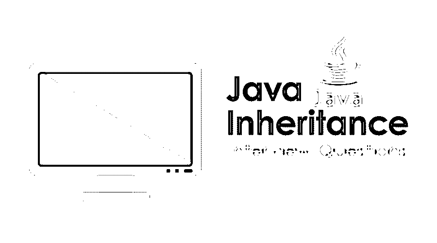

# Java 继承面试问题

> 原文：<https://www.educba.com/java-inheritance-interview-questions/>

## Java 继承介绍面试问答

继承是 Java 等面向对象编程的主要概念，通过继承，我们可以从一个类到另一个类继承方法、属性等属性。从一个类派生出来的类称为子类，从一个类派生出子类的类称为超类。在任何时候，一个子类只能有一个超类，而一个超类可以有多个子类。子类可以继承超类的属性和方法。让我们考虑一个例子，交通工具是一个超类，而汽车，摩托车，卡车等。是子类，而汽车、摩托车、卡车可以继承车辆的属性，并且[继承在编程和代码重用中非常有用](https://www.educba.com/inheritance-in-php/)。

继承也有一些限制，比如子类不能从超类继承属性，如果它们是用私有作用域和构造函数声明的，子类不能继承初始化器，每个子类只能有一个超类。Java 继承是面向对象编程中最重要的话题，在编程相关面试问题中也很重要。因此，我们将以不同的方式和背景来简要了解一下[继承面试问题](https://www.educba.com/inheritance-interview-questions/)。

<small>网页开发、编程语言、软件测试&其他</small>

如果是找 Java 继承相关的工作，需要准备 2022 年 Java 继承面试题。根据不同的职位描述，每次面试都是不同的。在这里，我们准备了重要的 Java 继承面试问题，帮助你在面试中取得成功。

在这篇 2022 Java 继承面试问题的文章中，我们将介绍 10 个最重要和最常用的 Java 继承面试问题。这些面试问题分为以下两部分:

### 第 1 部分——Java 继承面试问题(基础)

第一部分涵盖了基本的 Java 继承面试问题和答案。

#### Q1 **。**Java 中的继承和组合有什么区别？

**回答:**
[Java](https://www.educba.com/what-is-java-interface/) 既支持组合，也支持继承，但两者在很多方面都不一样。复合对象通过松散绑定的关系来引用复合类，并且在类之间有关系。利用这一点，我们可以使用单个类，这些类可以在多个类中组合，并在依赖注入中使用，组合是对象之间的关系，而继承是类之间的关系，它是类之间的关系，使用继承的[派生类对象携带基类定义，因此它是一种紧密绑定的关系。它主要用于运行时多态，在这种情况下，一个类只能继承一个类。](https://www.educba.com/inheritance-in-python/)

#### Q2。Java 编程语言中有多少种类型的继承？

**回答:**
在[Java 编程语言](https://www.educba.com/java-programming-language-features/)中，有如下五种类型的继承:

单一继承、多级继承、分级继承、混合继承和多重继承。

*   **单一继承:**在这个类中只有一个类继承或扩展。
*   **混合遗传:** [混合遗传](https://www.educba.com/hybrid-inheritance-in-c-plus-plus/)是单级、多级和等级遗传的组合。
*   **多级继承:**多级继承中，一个类扩展一个类。该扩展类或子类被另一个类扩展，并在类之间形成一个多级继承的关系链。
*   **层次继承:**在这个继承中，一个类被扩展到多个类。
*   **多重继承:**在这个继承中，一个类扩展了多个类，Java 不支持。

让我们转到下一个 Java 继承面试问题。

#### Q3。Java 中的 Super 关键字是什么？

**回答:**
Java 中的 [super 关键字是对直接父类对象的引用变量，即每当创建一个子类的实例时，都会隐式地创建一个父类的实例，也就是被 super 关键字或 super 引用变量所引用。super 关键字有不同的目的和用途，作为 super 关键字可以用来引用直接父类变量，](https://www.educba.com/super-keyword-in-java/) [super()用来引用直接](https://www.educba.com/super-in-python/)父类构造函数，super 用来调用直接父类方法。

#### Q4。继承和封装有什么区别？

**答案:**
以上是面试中常见的 Java 继承面试问题。继承是类和面向对象概念之间的关系。在编程时实现代码的责任是很有用的。我们可以通过扩展到派生类或子类来使用基类的属性，派生类或子类也有多态性的基础。而[封装在 Java](https://www.educba.com/encapsulation-in-java/) 中也是一个面向对象的概念，用于隐藏类的内部细节，如方法、属性。它只有一个可见的声明，而没有像 Hash-map 那样封装如何存储和计算哈希值的定义。

#### Q5。什么是 Java 中的方法重载？

**答:**
[Java 中的方法重载](https://www.educba.com/method-overloading-in-java/)定义为两个方法用相同的名字但是不同的签名声明，比如一个方法可以接受两个参数，而另一个方法可以只接受一个参数或者三个参数等等。比如 System.out.println 就是 Java 中的一个[重载方法。我们可以使用它打印不同的数据类型，方法重载将在 Java 编译时解决。](https://www.educba.com/overloading-vs-overriding/)

### 第 2 部分——Java 继承面试问题(高级)

现在让我们来看看高级 Java 继承面试问题和答案。

#### Q6。什么是 Java 中的方法覆盖？

**答案:**
[Java 中的方法覆盖](https://www.educba.com/method-overriding-in-java/)定义为会有两个方法具有相同的名称和签名，但代码或逻辑不同，两个方法需要在同一个子类中。它基于运行时多态性，因为方法调用是在 Java 中基于实际对象的运行时解析的。

#### Q7。在 Java 中有可能覆盖私有方法吗？

**答:**
不，我们不能在 Java 中重写私有方法，因为私有方法的作用域仅限于那个特定的类，它们在那个类之外是不可见的，所以它们在派生类或子类中也是不可见的。因此私有方法不会被覆盖。

让我们转到下一个 Java 继承面试问题。

#### Q8。Java 中方法重载的规则？

**答案:**
Java 中方法重写的规则是重写方法不能抛出比被重写方法更高的异常，并且对于被检查的异常是适用的或真的，重写方法不能改变被重写方法的范围，即如果一个方法在基类中是公共的，那么它在子类中也应该是公共的。

#### Q9。在 Java 中，构造函数覆盖是可能的？

**答案:**
这是在面试中被问到的最流行的 Java 继承面试问题。在 Java 中，构造函数重写是不可能的，因为构造函数不被继承，因为重写总是发生在子类或子类上，但是构造函数名称与类名相同，所以构造函数重写是不可能的，但是构造函数重载是可能的。

#### Q10。Java 中一个类可以实现多个接口吗？可能吗？

**答案:**
在 Java 中，是的，单个类可以实现多个接口。在 Java 中，一个类可以同时是可灭菌的和可比较的。这也是接口在编程中多用于此目的的原因之一，我们可以在编程时使用类作为多态角色。

最后是对 Java 继承面试问题的总结。我希望你为面试做好了充分的准备，这篇 Java 继承面试问题文章将进一步帮助你做好面试准备。我希望你为你的面试准备和面试付出最大的努力。

### 推荐文章

这是 Java 继承面试问题列表的指南。这里我们列出了最有用的 10 组面试问题，这样求职者就能轻松应对面试。你也可以看看下面的文章来了解更多。

1.  [Java 面试问题](https://www.educba.com/java-interview-questions/)
2.  [数据结构 Java 面试题](https://www.educba.com/data-structure-java-interview-questions/)
3.  [Javascript 面试问题](https://www.educba.com/javascript-interview-questions/)
4.  [Java 测试面试问题](https://www.educba.com/java-testing-interview-questions/)

