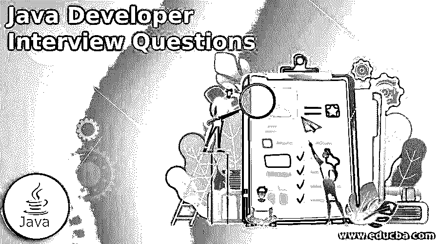

# Java 开发人员面试问题

> 原文：<https://www.educba.com/java-developer-interview-questions/>

## Java 开发人员面试问答介绍

Java 是现代工具和复杂语言之母，是应用程序开发人员、数据科学家和机器学习爱好者的首选。这就是为什么拥有 Java 技能集是一件好事，因为有很多公司都需要这种技能集。你是不是很快就要去参加一个 Java 开发人员的面试了，并且正在为很可能会被问到的问题而焦虑不安？那这就是让你信誓旦旦的文章。

因此，如果你最终找到了 Java 开发人员的理想工作，但不知道如何应对 2022 年的 Java 开发人员面试，以及可能的 Java 开发人员面试问题，那么每个面试都是不同的，工作范围也是不同的。牢记这一点，我们设计了最常见的 Java 开发人员面试问题和答案，以帮助您在面试中取得成功。

<small>网页开发、编程语言、软件测试&其他</small>

以下是 2022 年 Java 开发者面试中经常被问到的 10 个重要问题和答案。这些问题分为如下几个部分:

### 第 1 部分——Java 开发人员面试问题(基础)

第一部分包括基本的面试问题和答案

#### 1.JVM、JDK 和 JRE 之间有什么区别？

**回答:**
**JVM:** JVM 代表‘Java 虚拟机’是 Java 对机器的抽象。这是执行 Java 字节码所必需的抽象环境。每当在命令提示符下执行 java 命令时，就会接收到虚拟机的运行时实例。JRE 或“JAVA 运行时环境”就是这样一个环境，它通过提供用于在运行时运行字节码的类文件和库来实现 JVM。本质上，这是 JVM 的一个软件实例，与 JVM 不同，它有一个物理存在。
**JDK** 是这里的超集，它吞没并包含 JRE，实际上是一个框架，Java 程序的编译和文档在这个框架中被打包执行。

#### 2.解释 java 的“平台独立性”属性。

**回答:**
Java 平台独立性的本质在于代码的存储、解析和编译方式——字节码。由于这些字节码可以在任何系统上运行，而与底层操作系统无关，因此 Java 真正是一种平台无关的编程语言。

#### 3.根据内存的使用、基本特性和有效性来区分 Java 中的堆内存和栈内存。

**答案:**

| 微分参数 | 栈存储器 | 许多 |
| 内存使用 | 执行中的单个线程使用堆栈内存。这样，存储在堆栈内存中的对象不能被所有其他线程访问。 | 堆内存由应用程序的各种模块和组件使用。所有线程和其他结构都可以访问存储在堆中的各种对象。 |
| 使用寿命和有效期 | 专用于特定线程的堆栈内存只有在该线程持续使用时才有效。 | 堆可以全局使用，因此它的可用活动生存期是程序执行期间的全部时间。 |
| 总体使用 | 每当为特定线程创建对象时，本地原语和引用变量都与该对象相关联。这些变量存储在堆栈存储器中。 | 在整个程序执行过程中创建的任何对象都存储在堆中。这可能不限于单个线程，而是所有正在创建和调用的并发或后续线程。 |

#### 4.解释 java 中 static 关键字的含义和用法。

**回答:**
以上是面试中被问到的基本 Java 开发者面试问题。Static 是一个常用的关键字，在 java 中与变量、方法和嵌套类相关联。关键字的真正用途是对这些结构进行内存管理，下面将详细介绍。

**1。java 中的静态变量:**当一个变量在 Java 中被创建为静态变量时，它只获得一次分配给它的内存，当声明它的类被加载时也是如此。这就是为什么这些变量被用来声明它们之间共享的其他变量的属性，并且不会改变。

**2。java 中的静态方法:**Java 中的方法也可以声明为静态的，这样，这些方法就可以连接到整个类，而不局限于类中的任何一个对象。调用这种声明为 static 的方法不需要类的实例，这些方法可以处理类的静态数据，甚至可以更新静态常量和变量的值。

这也是为什么 java 中的 main 函数在默认情况下是静态的，因此不需要对象来调用它，这导致了更好的内存管理。

### 第 2 部分——Java 开发人员面试问题(高级)

现在让我们来看看高级面试问题。

#### 5.解释 java 中“this”关键字的用法

**答案:**
‘this’关键字在所有 java 代码和脚本中都被广泛观察到，它实际上是一个引用变量，程序员用它来引用当前使用的对象。可以使用“this”关键字适当地调用当前类的方法。如果不指定关键字，java 编译器会隐式地将关键字添加到方法中。

#### 6.解释什么是指针，详细说明是否可以在 java 中使用？

**回答:**
指针是一类特殊的变量，在很多编程结构中都可以使用，比如 C++。它们用于引用内存中的特定位置，这是显式内存分配、管理和遍历大量内存单元的一种非常强大的方式。
然而，java 中不支持或不提供指针，因为在 Java 中分离堆栈和堆内存时，指针会变得非常复杂。

让我们转到下一个 Java 开发人员面试问题。

#### 7.解释对象克隆的概念以及它在 java 中是如何使用的？

**答案:**
以上是高级 Java 开发人员面试中被问到的问题。有时候，我们需要使用对象的精确副本来实现特定的目的，而不需要以任何方式改变实际的对象。在这种情况下，选项是创建另一个类似的对象，这将需要花费更多的内存，这就是 java 提供的对象克隆的构造证明是有益的地方。
object 类的 clone()方法实现对象克隆，并要求实现 java.lang.A 您试图创建其克隆的 object 类的可克隆接口。如果没有这一点，类的 clone()方法会生成 CloneNotSupportedException。

### 推荐文章

这是一个 Java 开发人员面试问题和答案列表的指南，以便候选人可以轻松地解决这些 Java 开发人员面试问题。你也可以看看下面的文章来了解更多。

1.  [TSQL 面试问题](https://www.educba.com/tsql-interview-questions/)
2.  [卡珊德拉面试问题](https://www.educba.com/cassandra-interview-questions/)
3.  [Django 面试问题](https://www.educba.com/django-interview-question/)
4.  [二叉树面试问题](https://www.educba.com/binary-tree-interview-questions/)

