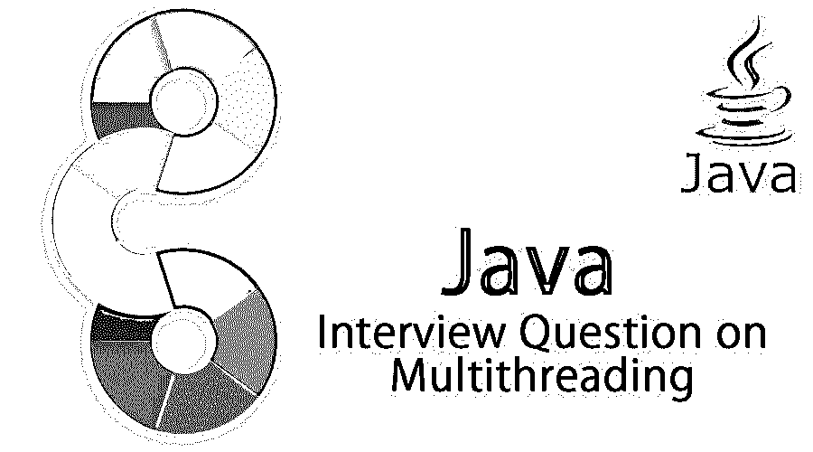
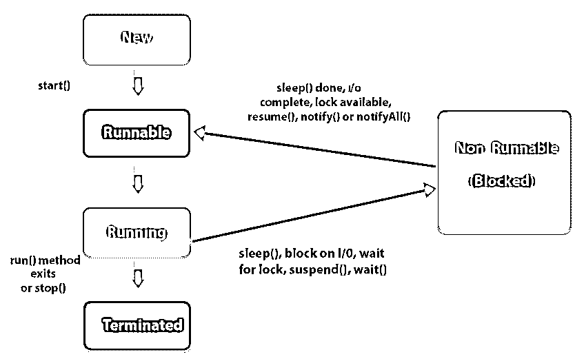

# 关于多线程的 Java 面试问题

> 原文：<https://www.educba.com/java-interview-question-on-multithreading/>




## 多线程 Java 面试问答简介

在进入关于多线程的 Java 面试问题之前，让我们讨论一些关于多线程的事实。

<small>网页开发、编程语言、软件测试&其他</small>

### 什么是线程？

它是处理特定工作的最小单位，称为线程。它是轻量级的，所以很容易使用。现在我们想到了为什么我们需要它，多线程是用来实现多任务的。多任务处理也可以通过另一种方式实现，这就是众所周知的多重处理。

然而，多线程更受欢迎，并且在多处理上使用它是有效的，因为线程具有使用共享内存区域的属性，而在多进程的情况下，它消耗大量内存和其他资源，这不是有效的。

因此，同时执行多个线程来完成某项工作的过程称为多线程。

**使用多线程的一些优点:**

*   线程独立工作，因此它独立于系统中的其他操作，因此可以同时执行多个操作。
*   由于可以同时执行许多操作，因此使用多线程会减少时间消耗。
*   正如已经讨论过的，线程是独立的，所以发生在单个线程中的异常不会干扰其他线程的操作。
*   两个线程之间的通信成本很低。

**我们可以通过以下两种方式实现多任务:**

*   基于进程的多任务处理(多重处理)
*   基于线程的多任务处理(多线程)

**NOTE:** As we are discussing multithreading so we will focus on Thread based Multitasking.

### 线程的生命周期

*   新的
*   可追捕的
*   运转
*   不可运行(阻塞)
*   终止的

**NOTE:** For your reference and better understanding, go through the below image carefully.


### 线程是如何创建的？

这是最重要的一点，也是我们创建线程的第一点。有两种创建线程的方法，讨论如下:

*   通过扩展线程类
*   通过实现 Runnable 接口

**注:**

创建新线程时，将执行以下任务:

1.  在新的调用堆栈中，将创建一个线程。
2.  线程将其状态从 New 更改为 Runnable。
3.  当线程启动时，它会找到 run()方法，然后执行。

**举例:**

```
By extending Thread class
class MyThread extends Thread
{
public void run()
{
System.out.println("thread is running...");
}
public static void main(String args[])
{
MyThread  t1=new MyThread  ();
t1.start();
}
}
```

**举例:**

```
By implementing Runnable interface
class MyThread  implements Runnable
{
public void run()
{
System.out.println("thread is running...");
}
public static void main(String args[])
{
MyThread  m1=new MyThread  ();
Thread t1 =new Thread(m1);
t1.start();
}
}
```

**NOTE:** Please mind the difference in the above two examples. The main difference in the above two examples is that if we do not extend Thread, rather we try to create Thread by implementing the Runnable interface and class the start () method to start the thread, then the Tread will not be created in a new call stack as it will not be identified as a Thread. So to make it identify as Thread, we have to pass the instance of the class where we have implemented the Runnable Interface as an argument to the constructor of the Thread class, and then we have to call the start () method.

### 线程调度

众所周知，时间表意味着在特定的时间做一个计划一项任务。线程调度是一种调度特定线程的类似机制，它维护一些协议。

Java 中线程调度有两种不同的工作方式。

1.  抢先调度
2.  时间切片。

#### 抢先调度

JMV 决定最高优先级的任务，并开始执行，直到它进入等待或停滞状态，或者一个更高优先级的任务出现。

#### 时间分片

JVM 开始执行一个特定的线程一段时间，然后将同一个线程移动到池中，并根据优先级和其他执行因素选择其他线程。这个过程一直持续到所有线程结束它的进程。

现在，如果你想找一份与 Java 多线程相关的工作，你需要准备 2022 年 Java 面试关于多线程的问题。的确，每个面试都因不同的职位而不同。在这里，我们准备了关于多线程的重要 Java 面试问题和答案，将帮助你在面试中取得成功。

在这篇 2022 年关于多线程的 Java 面试问题的文章中，我们将介绍 10 个最重要和最常见的关于多线程的 Java 面试问题。这些面试问题分为以下两部分:

### 第 1 部分——关于多线程的 Java 面试问题(基础)

第一部分涵盖了多线程的基本面试问题和答案。

#### Q1。区分进程和线程？

**答案:**

进程是程序或应用程序，而线程是在进程中执行的单个任务。线程是轻量级的，而进程是重量级的。线程需要更少的资源，而进程需要更多的资源；因此，它本质上被称为重量级的。

#### Q2。区分用户线程和守护线程？

**答案:**

用 java 创建的线程被称为用户线程。守护线程总是在后台运行，它的完整生命周期依赖于主线程。后台运行的守护线程不会阻止 JVM 终止它。从守护线程创建的子线程也将是守护线程。

让我们转到下一个关于多线程的 Java 面试问题。

#### Q3。在 Java 中创建线程的不同方式？

**答案:**

Java 中的线程可以通过两种方式创建:

*   通过扩展线程类。
*   通过实现 Runnable 接口。

#### Q4。线程的生命周期是什么？

**答案:**

面试中常见的关于多线程的 Java 面试问题。以下是线程的生命周期:

*   新的
*   可运行。
*   跑步。
*   受阻。
*   终止。

#### Q5。如果我们调用一个线程类的 run()方法会怎么样？

**答案:**

直接调用 run()方法会成功编译并执行程序，但是同一个程序不会被当作线程处理，因为不会创建新的调用栈，程序在运行 main 的同一个调用栈中开始执行。

为了创建一个应该使用新的调用堆栈运行的线程，必须使用 Thread 类的 start()方法。

### 第 2 部分——关于多线程的 Java 面试问题(高级)

现在让我们来看看多线程高级面试问答。

#### Q6。我们可以在特定的时间暂停一个线程的执行吗？

**答案:**

是的，这可以在 java 中通过调用 Thread 类的 sleep()来实现。sleep()方法还接受一个以毫秒表示时间的参数。

#### Q7。如何在 java 中实现线程的调度？

**答案:**

是的，java 中的线程调度是可能的。Java 中的线程有两种调度方式，即时间片和抢占式调度。

让我们转到下一个关于多线程的 Java 面试问题。

#### Q8。一个线程可以启动两次吗？

**答案:**

不，一个线程不能启动两次。如果我们尝试启动一个线程两次，就会抛出“Java . lang . illegalthreadstateexception”。

#### Q9。Java 中的关机钩子是什么？

**答案:**

这是 Java 面试中最常见的关于多线程的面试问题。关闭挂钩是一种机制，用于在 JVM 正常或突然关闭时清理资源。

#### Q10。什么是易挥发？

**答案:**

Volatile 是 java 中的一个关键字，可以和变量一起使用。如果一个变量被声明为 volatile，所有的线程将从主内存而不是从缓存中读取同一个变量的值；因此，当多个线程在其操作中使用同一个变量时，它可以防止错误读取。

### 推荐文章

这是一个关于多线程的 Java 面试问题和答案列表的指南，以便候选人可以轻松地解决这些多线程面试问题。在这篇文章中，我们研究了在面试中经常被问到的关于多线程的 Java 面试问题。您也可以阅读以下文章，了解更多信息——

1.  [数据结构 Java 面试题](https://www.educba.com/data-structure-java-interview-questions/)
2.  [哎呀 Java 面试问题](https://www.educba.com/oops-java-interview-questions/)
3.  [Java 多线程面试问题](https://www.educba.com/multithreading-interview-questions-in-java/)
4.  [Java 测试面试问题](https://www.educba.com/java-testing-interview-questions/)


