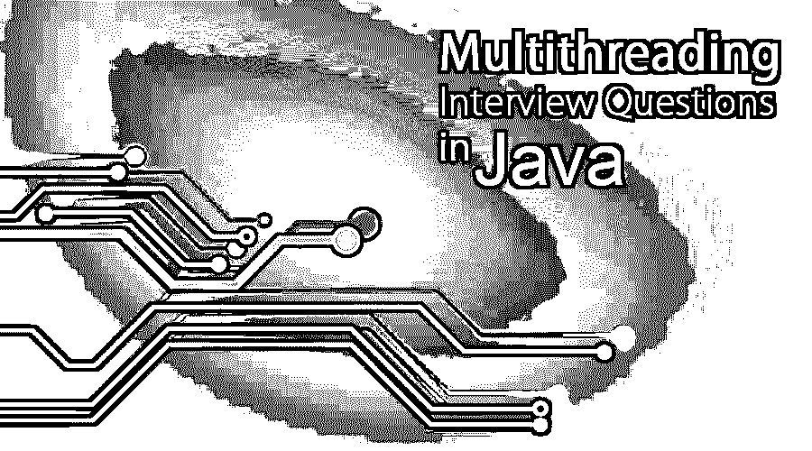

# Java 中多线程面试问题

> 原文：<https://www.educba.com/multithreading-interview-questions-in-java/>

## Java 多线程面试问答介绍

在 Java 中，多线程被定义为同时执行两个或多个线程的过程。它用于根据系统容量加快处理速度。它用于并行处理最小的单元，以快速实现事情，并使过程更快。它有助于节省内存空间和时间。它主要用于动画、游戏和大型应用程序。

现在，如果你想找一份与 java 多线程相关的工作，你需要准备 2022 年 Java 多线程面试题。的确，每个面试都因不同的职位而不同。在这里，我们准备了 Java 中重要的多线程面试问题及其答案，帮助你在面试中获得成功。

<small>网页开发、编程语言、软件测试&其他</small>

在这篇 2022 Java 多线程面试问题的文章中，我们将介绍 10 个最重要和最常见的 Java 多线程面试问题。这些面试问题分为以下两部分:

### 第 1 部分 Java 中的多线程面试问题(基础)

这第一部分涵盖了 Java 中的基本面试问题和答案。

#### Q1。解释线程的不同状态？

**答案:**
线程的状态也称为线程的生命周期。下面是线程的不同状态:

*   **New:** 表示线程处于新的状态，需要在调用 start 方法之前创建线程类的实例。
*   **Runnable:** 调用 start 方法后，线程处于可运行状态，调度器没有将其选为运行线程。
*   **运行:**选择线程调度器时，处于运行状态。
*   阻塞:也称为不可运行。当线程不符合运行条件，但线程仍处于活动状态时。
*   **终止:**这是退出 run 方法或处于 dead 状态时的状态。

#### Q2。java 中的线程是什么？

**答案:**
线程指的是一个小单元，它执行起来花费的时间更少。它主要独立于执行路径。这是利用机器中多个可用 CPU 的方法之一。在多线程的帮助下，CPU 任务的处理变得更快。Java 主要用于提供对多线程的支持。

#### Q3。解释一下 JAVA 中线程和进程的区别？

**答案:**
线程是进程内执行的最小任务。该进程是具有一个以上线程或多个线程的自含式执行环境。线程是进程的细分。线程直接访问进程的数据段，而进程拥有自己的数据段副本。线程主要共享进程创建的地址，而进程有自己的地址。

线程很容易创建，而进程创建需要做很多事情。线程可以很容易地与其他线程通信，而进程可以很容易地与子进程通信，但是进程间通信很困难。线程有自己的堆栈，而进程共享内存资源，如堆内存等。如果在线程中进行了任何更改，它将影响所有线程，但在该进程中，它不会影响其他进程。

#### Q4。解释一下 Java 内存模型？

**答案:**
以上是面试中常见的 Java 多线程面试问题。在当前的 IT 行业中，多线程测试人员通常需要履行几项职责。

Java 内存模型有一套特定的规则供 Java 程序遵循，以便在所有多内存体系结构、CPU 和操作系统中以特定的方式运行，这在多线程中起着重要的作用。Java 内存模型有助于区分一个线程中所做的更改，并且该更改对其他线程也应该是可见的。这个 mod 是一个程序顺序，表示每个线程的动作发生在程序顺序中每个线程之后。

#### Q5。解释一下 Java 多线程中 Volatile 变量的使用？

**答:**
volatile 关键字或变量用于确保每当多线程做出改变时，共享或实例变量不断更新。它是一个特殊的修饰符，只能用于实例变量。该关键字不能与方法一起使用。如果 java 中的字段被声明为 volatile，那么 Java 内存模型会确保所有线程都应该拥有该变量的一致值。volatile 变量的值总是从主内存中读取。它还降低了内存一致性错误的风险。作为对象引用的 Java volatile 变量可以为空。如果变量跨多个线程使用，则需要使用 volatile 关键字。

### 第 2 部分 Java 多线程面试问题(高级)

现在让我们来看看 Java 中的高级面试问答。

#### Q6。解释线程中的竞争条件？

**答案:**
当多线程之间存在竞争时，就会出现竞争情况。这种竞争情况主要是由于一些编程错误或错误造成的。需要执行的线程最初在竞争中失败，然后执行第二个和一些代码行为的变化，这被称为非确定性错误。由于线程的随机性，它成为难以发现和重现的错误之一。

#### Q7。解释 Java 中的 fork-join 框架？

**答案:**
JDK 7 中引入了 fork-join 框架。对于 Java 开发人员来说，它是一个强大的工具，可以利用当今服务器的多处理器优势。它主要是为可以分成更小块的工作而设计的。主要目标是利用可用的处理能力来提高应用程序的性能。它主要使用工作窃取算法。

#### Q8。解释一下线程池及其在 Java 中的用途？

**答案:**
线程的池称为线程池。该线程通常被称为工作线程。线程的创建在许多方面都是昂贵的，如时间和资源。如果在请求进程时创建线程，通常会降低处理器的响应时间，并且只能创建有限数量的线程。因此，由于这两个主要问题，线程池被创建了。在 Java 中，Java API 允许我们创建不同类型的线程池，就像单个线程池一样，每次只占用一个进程。另一种是采用固定数量线程的固定线程池。还有一个缓存线程池，一个可扩展的线程池，主要适用于许多任务。

#### Q9。如何在线程之间共享数据？

**答案:**
以上是面试中被问到的 Java 中最常见的多线程面试问题。当前 IT 行业流行的一些测试案例。

借助于使用共享对象或并发数据结构(如阻塞队列),可以在线程之间共享数据。它主要遵循生产者-消费者模式，使用 wait 和 notifies 方法在两个线程之间共享一个对象。

#### Q10。线程在堆栈和堆内存中是如何分配的？

**答案:**
在 Java 中，每个线程都有自己的栈，用来存储局部变量、方法参数、调用栈。堆内存是由所有线程共享的公共内存。

### 推荐文章

这是一个 java 多线程面试问题和答案列表的指南，以便考生可以轻松地用 Java 破解这些面试问题。在这篇文章中，我们研究了 Java 中常见的多线程面试问题。您也可以阅读以下文章，了解更多信息——

1.  [多线程面试问题](https://www.educba.com/multithreading-interview-questions/)
2.  [Java Servlet 面试问题](https://www.educba.com/java-servlet-interview-questions/)
3.  [JSP 面试问题](https://www.educba.com/jsp-interview-questions/)
4.  [QlikView 面试问题](https://www.educba.com/qlikview-interview-questions/)

