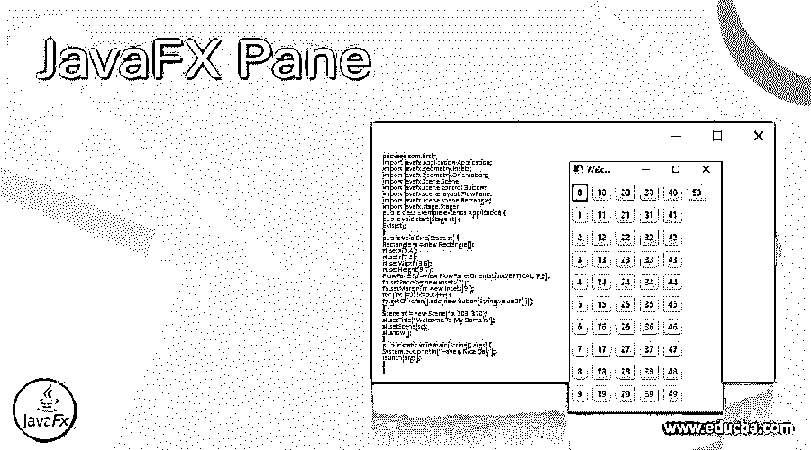
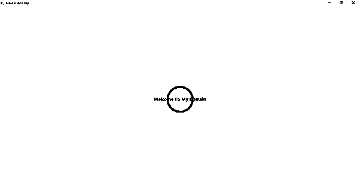
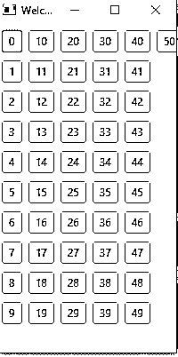
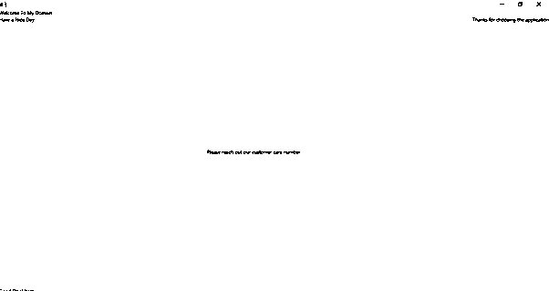

# JavaFX 窗格

> 原文：<https://www.educba.com/javafx-pane/>




## JavaFX 窗格简介

JavaFX 窗格被定义为用于从基类派生子类的类之一。它包含一些 UI 相关的东西，比如表单、布局、面板等等。，对于每个子类。可以添加和修改到 UI 面板里的东西。pane 类继承了它们的父类，这些父类与它们的宽度、高度等部分相关，这些部分可用于表单布局、数据绑定、表格行和列。它是通过在颜色、位置、大小和其他默认的 UI 相关元素中使用这些来手动配置的。

### 句法

javafx 窗格是基于 java 技术的 UI，可以用于表单布局、水平和垂直框等。对于每个 UI 元素都有自己的实例和属性来执行应用程序。同样，JavaFX 窗格有 n 种类型，用于创建更复杂的应用程序。

<small>网页开发、编程语言、软件测试&其他</small>

```
import javafx.*;
class class name{
method()
{
Creatingpaneclass reference= Creatingpaneclass() // the pane class will be of any type like stackpane, hbox, vbox etc.
reference.default methods();
---some java logics---
}
pubic static void main(String args[])
{
method(); // call the method which is already running on the pane class operations
----some logics---
}
}
```

上面的代码是创建 java fx pane 类的基本语法，它用在应用程序的不同场景中。

### JavaFX 窗格功能如何工作？

javafx pane 是基于 java 的 ui 小部件类之一。它有 n 个子类型类，广泛用于应用程序前端。pane 类还满足并执行动画效果、图像等。在 java 版本的开始，他们使用小程序；swing 是基于 ui 的类和包，用于创建前端代码。组合 swing 是 javafx 窗格的一种类型；大约有 n 种类型的 java fx 窗格。格里德潘，3 岁。波德潘，4 岁。FlowPane，5。TilePane 和 6。锚定平面。这些是一些类型的窗格，用于创建更复杂的用户界面。

堆栈窗格是其中一个窗格，它主要用于允许许多区域的节点，如应用程序的顶部、底部、左侧、右侧和中间页面。就像数据结构中的栈概念；窗格的第一个节点放在底部，下一个节点放在顶部。GridPane 就像桌子的概念；节点是完全网格化的，也就是说，它可以排列在行和列的集合中。网格窗格看起来更舒适，与其他类型的窗格相比，这种窗格的对齐方式很好。还计算了数据的水平和垂直差距，并在表单布局中表示出来。

边框窗格看起来像边框概念；它覆盖了应用程序的所有区域，如从上到下、从左到右，并且每个位置的中间位置都被覆盖；默认方法是在类的帮助下调用。流窗格是 java fx 窗格的附加优势之一，因为多个节点被组合到一个表单中，所以数据流对于应用程序中的用户输入来说应该更容易。

当我们使用这个类时，一些行间距和文本对齐被计算。平铺窗格允许所有的节点按照表单的顺序排列，其数据值在表单中被统一排列。锚定窗格是已经计算出的与表单布局窗格的距离的类型；同样，JavaFX 窗格有许多类型，如 HBox、VBox 等。这些类型包含在 java 的 UI 面板中，包括独立的和基于 web 的应用程序。

### JavaFX 窗格的示例

JavaFX 窗格的不同示例如下:

#### 示例#1

**代码:**

```
package com.first;
import javafx.application.Application;
import javafx.collections.ObservableList;
import javafx.geometry.Insets;
import javafx.scene.Scene;
import javafx.scene.layout.StackPane;
import javafx.scene.paint.Color;
import javafx.scene.shape.Circle;
import javafx.scene.shape.Rectangle;
import javafx.scene.shape.Sphere;
import javafx.scene.text.Font;
import javafx.scene.text.FontWeight;
import javafx.scene.text.Text;
import javafx.stage.Stage;
public class Example extends Application {
public void start(Stage st) {
Rectangle cr = new Rectangle();
cr.setX(2.3);
cr.setY(3.4);
cr.setWidth(4.5);
cr.setHeight(5.6);
Sphere sp = new Sphere(51);
Text tx = new Text("Welcome To My Domain");
tx.setFont(Font.font(null, FontWeight.BOLD, 17));
tx.setFill(Color.GREEN);
tx.setX(33);
tx.setY(62);
StackPane stp = new StackPane();
stp.setMargin(cr, new Insets(33, 43, 53, 63));
ObservableList ob = stp.getChildren();
ob.addAll(cr, sp, tx);
Scene sc = new Scene(stp);
st.setTitle("Have a Nice Day");
st.setScene(sc);
st.show();
}
public static void main(String args[]){
System.out.println("Thanks user for clicking this boxes");
launch(args);
}
}
```

**输出:**




#### 实施例 2

**代码:**

```
package com.first;
import javafx.application.Application;
import javafx.geometry.Insets;
import javafx.geometry.Orientation;
import javafx.scene.Scene;
import javafx.scene.control.Button;
import javafx.scene.layout.FlowPane;
import javafx.scene.shape.Rectangle;
import javafx.stage.Stage;
public class Example extends Application {
public void start(Stage st) {
Exts(st);
}
public void Exts(Stage st) {
Rectangle rt = new Rectangle();
rt.setX(5.4);
rt.setY(7.5);
rt.setWidth(8.6);
rt.setHeight(9.7);
FlowPane fp = new FlowPane(Orientation.VERTICAL, 7,9);
fp.setPadding(new Insets(7));
fp.setMargin(rt, new Insets(9));
for (int j=0; j<=50; j++) {
fp.getChildren().add(new Button(String.valueOf(j)));
}
Scene sc = new Scene(fp, 203, 370);
st.setTitle("Welcome To My Domain");
st.setScene(sc);
st.show();
}
public static void main(String[] args) {
System.out.println("Have a Nice Day");
launch(args);
}
}
```

**输出:**




#### 实施例 3

**代码:**

```
package com.first;
import javafx.application.Application;
import javafx.scene.Scene;
import javafx.scene.control.Label;
import javafx.scene.layout.*;
import javafx.stage.Stage;
import javafx.scene.shape.Rectangle;
public class Example extends Application {
public void start(Stage st) throws Exception {
Rectangle rt1 = new Rectangle();
rt1.setX(5.4);
rt1.setY(7.5);
rt1.setWidth(8.6);
rt1.setHeight(9.7);
BorderPane br = new BorderPane();
br.setTop(new Label("Welcome To My Domain"));
br.setLeft(new Label("Have a Nice Day"));
br.setRight(new Label("Thanks for choosing the application"));
br.setCenter(new Label("Please reach out our customer care number"));
br.setBottom(new Label("Good Day Users"));
Scene sc = new Scene(br,543,743);
st.setScene(sc);
st.setX(6.5);
st.setY(8.6);
st.setWidth(9.7);
st.setHeight(10.8);
st.show();
}
public static void main(String[] args) {
System.out.println("Have a nice Weekend");
launch(args);
}
}
```

**输出:**




### 结论

在结论部分，JavaFX 是在独立应用程序中创建 UI 元素的一个很好的特性。如果我们创建类的实例，它可以与后端方法相协调。当我们在应用程序中使用 JavaFX 导入类时，Start 方法是初始和默认的方法。

### 推荐文章

这是一个 JavaFX 面板指南。在这里，我们讨论 JavaFX Pane 函数的工作原理和示例，以及代码和输出。您也可以看看以下文章，了解更多信息–

1.  [JavaFX WebView](https://www.educba.com/javafx-webview/)
2.  [JavaFX 图像](https://www.educba.com/javafx-image/)
3.  [JavaFX 游戏](https://www.educba.com/javafx-game/)
4.  [JavaFX 控制器](https://www.educba.com/javafx-controller/)


