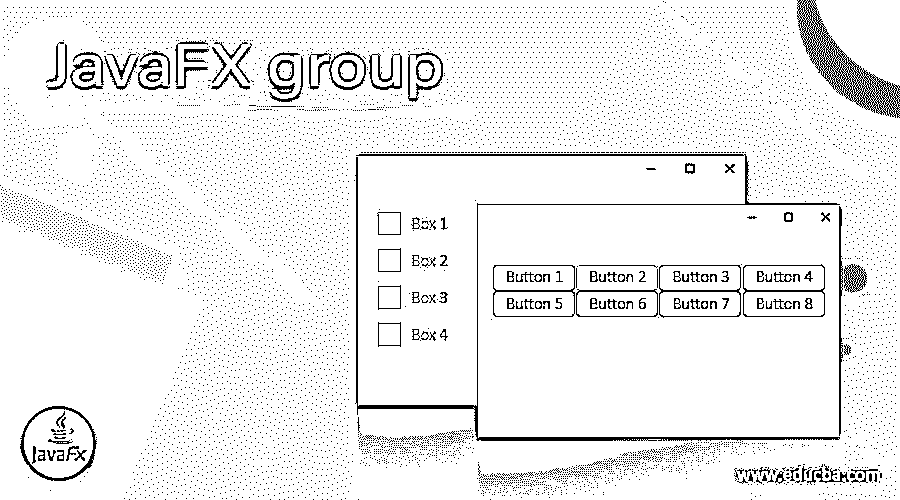
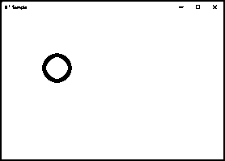
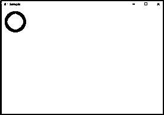

# JavaFX 组

> 原文：<https://www.educba.com/javafx-group/>




## JavaFX 组简介

在 JavaFX 中，组是一个容器组件，它不对子组件应用任何特殊布局。这里，每个子组件或节点将保持在位置 0，0。通常，这个组组件主要用于将控制集的变换或效果放在一起——也就是说，作为一个组。假设对组内可用的孩子进行布局；然后，它可以嵌套在布局组件中，并将它们添加到组中。它由 javafx.scene.Group 类表示。

**语法**

<small>网页开发、编程语言、软件测试&其他</small>

下面是 JavaFX 中 Group 组件的语法

```
Group group = new Group();
```

### JavaFX 中的 group 是如何工作的？

创建组的主要任务是向组中添加组件。这是通过获取孩子的列表并将他们添加到列表中来完成的。例如，可以将孩子添加到组中，如下所示。

```
Button b1 = new Button("Button 1");
Button b2 = new Button("Button 2");
Group gp = new Group();
gp.getChildren().add(b1);
gp.getChildren().add(b2);
```

这里，首先创建两个按钮。然后，在创建一个组之后，检索这些组的子组，并使用 add()方法将它们全部添加到组中。

### 构造器

下面是该类的两个构造函数。

*   **Group():** 可以构造一个新的组。
*   **组(集合 c):** 可以用提到的节点构造一个新的组。
*   **组(节点… c):** 可以用提到的节点构造一个新的组。

### 常用方法

不同的常用方法如下:

*   **getChildren():** 将检索特定组的子组。
*   **minHeight(double w):** 将返回节点的最小高度，以用于布局的计算。
*   **minWidth(double h):** 将返回节点的最小宽度，以用于布局的计算。
*   **isAutoSizeChildren():** 将检索 AutoSizeChildren 属性的值。
*   **prefHeight(double w):** 该组将定义一个首选高度，简单地说就是布局边界高度。
*   **prefWidth(double h):** 该组将首选宽度定义为布局边界高度。
*   **setAutoSizeChildren():** 将设置 AutoSizeChildren 属性的值。

### 例子

下面提到了不同的例子:

#### 示例#1

JavaFX 程序在一组的帮助下创建两个按钮。

**代码:**

```
import javafx.application.Application;
import javafx.scene.Group;
import javafx.scene.Scene;
import javafx.scene.control.Button;
import javafx.stage.Stage;
//main class
public class GroupProgram extends Application  {
//<u>stasrt</u> stage
@Override
public void start(Stage st) throws Exception {
//set title
st.setTitle("Sample");
//create button one
Button bt = new Button("This is Button one");
//create button two
Button btn = new Button("Button two");
//create group
Group gp = new Group();
//add children
gp.getChildren().add(bt);
gp.getChildren().add(btn);
//create scene
Scene sc = new Scene(gp, 200, 100);
//set the scene
st.setScene(sc);
//display
st.show();
}
//main method
public static void main(String[] args) {
Application.launch(args);
}
} Output:  In this program, two buttons are created and then added to the group using the method add(). On executing the code, two buttons are displayed.
```

#### 实施例 2

JavaFX 程序使用组创建一个圆。**代码:**

```
import javafx.application.Application;
import javafx.scene.Group;
import javafx.scene.Scene;
import javafx.scene.control.Button;
import javafx.stage.Stage;
import javafx.scene.control.*;
import javafx.scene.layout.*;
import javafx.event.ActionEvent;
import javafx.event.EventHandler;
import javafx.scene.canvas.*;
import javafx.scene.web.*;
import javafx.scene.shape.*;
//main class
public class GroupProgram extends Application  {
//start stage
@Override
public void start(Stage st) throws Exception {
//set title
st.setTitle("Sample");
//create a circle
Circle c = new Circle(150, 150, 40);
//create group
Group gp = new Group();
//add children
gp.getChildren().add(c);
//create scene
Scene sc = new Scene(gp, 600, 400);
//set the scene
st.setScene(sc);
//display
st.show();
}
//main method
public static void main(String[] args) {
Application.*launch*(args);
}
}
```

**输出:**




在这个程序中，首先导入必要的类。然后，创建一个圆，然后使用 add()方法将它添加到组中。执行代码时，会显示圆形。

#### 实施例 3

JavaFX 程序使用 authorizing 设置为 true 的组创建一个圆。

**代码:**

```
import javafx.application.Application;
import javafx.scene.Group;
import javafx.scene.Scene;
import javafx.scene.control.Button;
import javafx.stage.Stage;
import javafx.scene.control.*;
import javafx.scene.layout.*;
import javafx.event.ActionEvent;
import javafx.event.EventHandler;
import javafx.scene.canvas.*;
import javafx.scene.web.*;
import javafx.scene.shape.*;
//main class
public class GroupProgram extends Application  {
//start stage
@Override
public void start(Stage st) throws Exception {
//set title
st.setTitle("Sample");
//create a circle circle
Circle c = new Circle(50, 50, 40);
//create group
Group gp = new Group();
//add children
gp.getChildren().add(c);
// set auto resize
gp.setAutoSizeChildren(true);
//create scene
Scene sc = new Scene(gp, 600, 400);
//set the scene
st.setScene(sc);
//display
st.show();
}
//main method
public static void main(String[] args) {
Application.launch(args);
}
}
```

**输出:**




与上面的程序类似，首先创建一个圆，然后使用 add 方法()将其添加到组中。不同之处在于自动调整大小选项被设置为 true。在执行代码时，显示的圆圈会调整大小。

#### 实施例 4

JavaFX 程序使用组创建一个矩形。

**代码:**

```
import javafx.application.Application;
import javafx.scene.Group;
import javafx.scene.Scene;
import javafx.scene.control.Button;
import javafx.stage.Stage;
import javafx.scene.effect.MotionBlur;
import javafx.scene.paint.Color;
import javafx.scene.shape.Rectangle;
import javafx.scene.text.Font;
import javafx.scene.text.FontWeight;
import javafx.scene.text.Text;
//main class
public class GroupProgram extends Application  {
//start stage
@Override
public void start(Stage st) throws Exception {
//set title
st.setTitle("Sample");
//create rectangle
Rectangle r = new Rectangle();
//set x value of rectangle
r.setX(20);
//set y value of rectangle
r.setY(40);
//set width of rectangle
r.setWidth(170);
//set height of rectangle
r.setHeight(90);
//fill the color as green
r.setFill(Color.GREEN);
//create a text
Text t = new Text();
//set the text
t.setText("Working . . ");
//set the color
t.setFill(Color.BLACK);
//set the font
t.setFont(Font.font("null", FontWeight.BOLD, 28));
//set the x value
t.setX(35);
//set the y value
t.setY(75);
//create group
Group gp = new Group();
//create a button
Button b = new Button("Sample Button");
//set the cache as true
gp.setCache(true);
// MotionBlur effect
MotionBlur mb = new MotionBlur();
// group effect setting
gp.setEffect(mb);
// Translation of x axis is as 50
gp.setTranslateX(50);
//add the children to group
gp.getChildren().addAll(r, b, t);
//create scene
Scene sc = new Scene(gp, 600, 400);
//set the scene
st.setScene(sc);
st.show();
}
//main method
public static void main(String[] args) {
Application.launch(args);
}
}
```

**输出:**


在这个程序中，创建了一个矩形，其中的文本是模糊的。

### 推荐文章

这是 JavaFX 组的指南。在这里，我们讨论详细的方面，如语法、工作、示例、构造函数和 JavaFX 组方法。您也可以看看以下文章，了解更多信息–

1.  [JavaFX TabPane](https://www.educba.com/javafx-tabpane/)
2.  [JavaFX 警报](https://www.educba.com/javafx-alert/)
3.  [JavaFX 游戏](https://www.educba.com/javafx-game/)
4.  [JavaFX ImageView](https://www.educba.com/javafx-imageview/)


