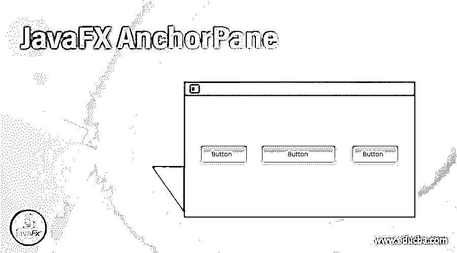
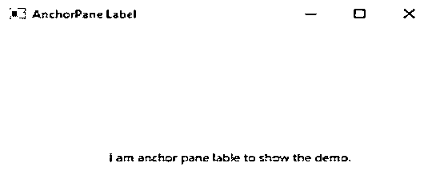
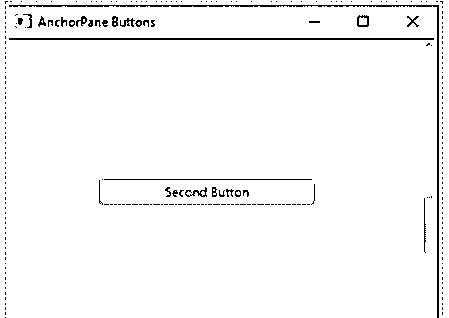
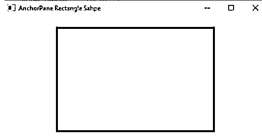

# JavaFX 锚定窗格

> 原文：<https://www.educba.com/javafx-anchorpane/>




## JavaFX 锚点窗格简介

JavaFX 锚定窗格用于通过其子节点边缘锚定到距锚定窗格边缘的偏移量。如果锚定窗格有边框或填充集，则偏移集是从 insets 的内角边缘开始测量的。锚定窗格布局子级的管理子级使可见-计算布局时不考虑属性值和非管理子级。我们可以用 JavaFX 的锚定面板添加 CSS 样式。Anchor Pane 是一个 JavaFX 类，可以在 scene.layout.AnchorPane 包中找到。我们可以应用 JavaFX 锚窗格标签，圆柱结构，矩形结构，按钮等。

### 构造器

*   **AnchorPane():** 用 new 关键字创建一个锚定窗格对象，在构造函数中没有任何参数。
*   **锚点窗格(节点 n1，节点 n2，节点 n3，…。):**用 new 关键字创建一个锚定窗格对象，并在构造函数中指定所需数量的参数。

### 常用方法

以下是常用的方法:

<small>网页开发、编程语言、软件测试&其他</small>

*   **setBottomAnchor(Node b，Double value):**setbottom anchor()方法用于设置底部锚点。
*   **getbottom anchor(Node b):**getbottom anchor()方法返回底部锚点。
*   **setLeftAnchor(Node l，Double value):** setLeftAnchor()方法用于设置左锚点。
*   **getLeftAnchor(Node l):**getLeftAnchor()方法返回左锚点。
*   **setRightAnchor(Node r，Double value):**setRightAnchor()方法用于设置右锚点。
*   **getRightAnchor(Node r):**getRightAnchor()方法返回右锚点。
*   **setTopAnchor(Node t，Double value):**setRightAnchor()方法用于设置顶部锚点。
*   **getTopAnchor(Node t):**getTopAnchor()方法返回顶部锚点。

### AnchorPane 在 JavaFX 中是如何工作的？

访问 JavaFX 特性的用户定义类必须扩展应用程序类。

1.在 JavaFX 中，创建 AnchorPane 是第一步。AnchorPane 可以使用 new 关键字实例化。

**语法:**

```
AnchorPane anchorPaneRef=new AnchorPane();
```

2.创建标签或按钮或任何 JavaFX 元素是第二步。

**语法:**

```
Label lableRef=new Label(“Any Message”);
anchorPaneRef.setTopAnchor(labelRef, value, value);
```

3.第三步是创建 VBox 或任何其他显示(如 TilePane 或 HBox，根据需要)类来添加项目。

**语法:**

```
VBox vBox=new VBox(anchorPaneRef); //Gives vertical box
```

4.第四个是应用 show 方法。

**语法:**

步骤是创建场景。

```
Scene screen = new Scene(vBox, length, width);
```

5.将场景参考屏幕添加到舞台对象参考是第五步。将输出屏幕添加到舞台。我们将从预定义的 JavaFX 方法开始获取这个 stage 对象引用。

**语法:**

```
stage.setScene(screen);
```

6.第六步是通过对场景对象应用 show()方法向最终用户显示输出。

**语法**:

```
stage.show();
```

### JavaFX AnchorPane 示例

下面是一些例子:

#### 示例#1

带标签的锚定窗格。

**代码:**

```
package com.anchorpanae;
import javafx.application.Application;
import javafx.scene.Scene;
import javafx.scene.control.Label;
//importing AnchorPane class
import javafx.scene.layout.AnchorPane;
import javafx.stage.Stage;
public class AnchorPaneLabel extends Application {
// launch method invoked this start method
public void start(Stage outStage) {
try {
// setting the tile for application
outStage.setTitle("AnchorPane Label");
// create the label for adding the text to the application
Label lableAnchor = new Label("I am anchor pane lable to show the demo.");
// creating a AnchorPane object
AnchorPane anchorPaneObject = new AnchorPane(lableAnchor);
//set the label to top anchor
AnchorPane.setTopAnchor(lableAnchor, 20.0);
//set the label to left anchor
AnchorPane.setLeftAnchor(lableAnchor, 100.0);
//set the label to right anchor
AnchorPane.setRightAnchor(lableAnchor, 20.0);
//set the label to bottom anchor
AnchorPane.setBottomAnchor(lableAnchor, 20.0);
// creating the scene to display output
Scene screen = new Scene(anchorPaneObject, 410, 310);
outStage.setScene(screen);
// display the output
outStage.show();
}
catch (Exception e) {
System.out.println(e.getMessage());
}
}
// Main Method
public static void main(String args[]) {
// invoking main method from JVM
launch(args);
}
}
```

**输出:**




#### 实施例 2

带有按钮的锚定窗格。

**代码:**

```
package com.anchorpanae;
import javafx.application.Application;
import javafx.scene.Scene;
import javafx.scene.control.Button;
import javafx.scene.control.ScrollPane;
//importing AnchorPane class
import javafx.scene.layout.AnchorPane;
import javafx.scene.layout.VBox;
import javafx.stage.Stage;
public class AnchorPaneButton extends Application {
// launch method invoked this start method
public void start(Stage outStage) {
try {
// setting the tile for application
outStage.setTitle("AnchorPane Buttons");
// creating the buttons for adding the text to the application
Button button1 = new Button("First Button");
Button button2 = new Button("Second Button");
// creating a AnchorPane object
AnchorPane anchorPaneObject1 = new AnchorPane(button1);
//set the label to top anchor
anchorPaneObject1.setTopAnchor(button1, 125.0);
//set the label to left anchor
anchorPaneObject1.setLeftAnchor(button1, 200.0);
//set the label to right anchor
anchorPaneObject1.setRightAnchor(button1, 100.0);
//set the label to bottom anchor
anchorPaneObject1.setBottomAnchor(button1, 500.0);
//anchorPaneObject.getChildren().add(button1);
anchorPaneObject1.setMinHeight(500);
anchorPaneObject1.setMinWidth(500);
// creating a AnchorPane object
AnchorPane anchorPaneObject2 = new AnchorPane(button2);
//set the label to top anchor
anchorPaneObject2.setTopAnchor(button2, 150.0);
//set the label to left anchor
anchorPaneObject2.setLeftAnchor(button2, 200.0);
//set the label to right anchor
anchorPaneObject2.setRightAnchor(button2, 100.0);
//set the label to bottom anchor
anchorPaneObject2.setBottomAnchor(button2, 500.0);
//anchorPaneObject.getChildren().add(button1);
anchorPaneObject2.setMinHeight(500);
anchorPaneObject2.setMinWidth(500)
//creating VBox for adding anchor panes
VBox vBox=new VBox();
vBox.getChildren().add(anchorPaneObject1);
vBox.getChildren().add(anchorPaneObject2);
//scrollpane for scrolling
ScrollPane scrollPnae=new ScrollPane();
scrollPnae.setContent(vBox);
// creating the scene to display output
Scene screen = new Scene(scrollPnae, 400, 300);
outStage.setScene(screen);
// display the output
outStage.show();
}
catch (Exception e) {
System.out.println(e.getMessage());
}
}
// Main Method
public static void main(String args[]) {
// invoking main method from JVM
launch(args);
}
}
```

**输出:**

**T2】**


 **


#### 实施例 3

矩形锚定窗格。

**代码:**

```
package com.anchorpanae;
import javafx.application.Application;
import javafx.scene.Scene;
//importing AnchorPane class
import javafx.scene.layout.AnchorPane;
import javafx.scene.paint.Color;
import javafx.scene.shape.Rectangle;
import javafx.stage.Stage;
public class AnchorPaneImage extends Application {
// launch method invoked this start method
public void start(Stage outStage) {
try {
// setting the tile for application
outStage.setTitle("AnchorPane Rectangle Shape");
//creating rectangle shape
Rectangle rectangleShape = new Rectangle(300,200,Color.GREEN);
rectangleShape.relocate(70,70);
// creating a AnchorPane object
AnchorPane anchorPaneObject = new AnchorPane(rectangleShape);
//set the label to top anchor
AnchorPane.setTopAnchor(rectangleShape, 20.0);
//set the label to left anchor
AnchorPane.setLeftAnchor(rectangleShape, 100.0);
//set the label to right anchor
AnchorPane.setRightAnchor(rectangleShape, 20.0);
//set the label to bottom anchor
AnchorPane.setBottomAnchor(rectangleShape, 20.0);
// creating the scene to display output
Scene screen = new Scene(anchorPaneObject, 500, 400);
outStage.setScene(screen);
// display the output
outStage.show();
}
catch (Exception e) {
System.out.println(e.getMessage());
}
}
// Main Method
public static void main(String args[]) {
// invoking main method from JVM
launch(args);
}
}
```

**输出:**




### 推荐文章

这是 JavaFX AnchorPane 的指南。这里我们讨论介绍，AnchorPane 如何在 JavaFX 中与构造函数一起工作，常用的方法和例子。您也可以看看以下文章，了解更多信息–

1.  [JavaFX 布局](https://www.educba.com/javafx-layouts/)
2.  [JavaFX 选择框](https://www.educba.com/javafx-choicebox/)
3.  [JavaFX 菜单栏](https://www.educba.com/javafx-menubar/)
4.  [JavaFX 库](https://www.educba.com/javafx-libraries/)


**