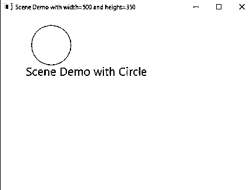

# JavaFX 场景

> 原文：<https://www.educba.com/javafx-scene/>


## JavaFX 场景介绍

JavaFX 场景类。场景对象可以说它是 JavaFX 场景图的根。这个类包含了所有的可视化 GUI 组件。该类在场景中可用。场景包。如果我们想通过导入这个包来利用它。当我们将场景对象设置为舞台对象时，JavaFX 舞台窗口是否可见。我们一次只能将一个场景对象附加到一个舞台上。如果我们试图将一个已经附加的场景附加到另一个舞台上，那么它首先会与前一个舞台分离(1 <sup>st</sup> attached stage)。同样，我们一次只能将一个舞台对象附加到一个场景。

**优势:**

<small>网页开发、编程语言、软件测试&其他</small>

*   用于添加任何 JavaFX 元素。

**常用构造函数:**

*   **场景(父根):**用 new 关键字创建一个场景对象，以 JavaFX 元素作为参数。
*   **Scene(Parent root，double width，double height):** 以 JavaFX 元素，width，height 为参数，通过 new 关键字创建一个 Scene 对象。
*   **Scene(Parent root，double width，double height，Paint fill):** 以 JavaFX 元素、宽度、高度、颜色为参数，通过 new 关键字创建一个 Scene 对象。

**常用方法:**

*   **show():**show()方法将显示输出。
*   **setScene(场景):**该方法设置场景对象。
*   **setTitle():**setTitle()设置应用程序的标题。

### JavaFX 中的场景是如何工作的？

*   访问 JavaFX 特性用户定义的类必须扩展应用程序
*   在 JavaFX 中，创建任何 JavaFX 元素都是第一步。ImageView，AnchorePane，ScrollPane，MenuBar 等。这可以通过使用 new 实例化。

```
ImageView imageView=new ImageView();
ScrollPane scrollPane=new ScrollPane();
AnchorPane anchorPaneRef=new AnchorPane ();
.
.
Etc.
```

*   第二步是创建 VBox 或任何其他显示(如 TilePane 或 HBox，根据需要)类来添加项目。

```
VBox vBox=new VBox (scrollPane or ImageView , anchorPaneRef etc.); //Gives vertical box
```

*   第三步是创建应用显示方法的场景。

```
Scene screen = new Scene(vBox, length, width);
```

将场景参考屏幕添加到舞台对象参考是第四步。将输出屏幕添加到舞台。我们将从预定义的 JavaFX 方法开始获取这个 stage 对象引用。

```
stage.setScene(screen);
```

*   第五步是通过对场景对象应用 show()方法向最终用户显示输出。

```
stage.show();
```

### 例子

下面是下面给出的例子:

#### 示例# 1–带圆圈的场景

**代码:**

```
package com.scene;
import javafx.application.Application;
import javafx.stage.Stage;
import javafx.scene.Scene;
import javafx.scene.Group;
import javafx.scene.paint.Color;
import javafx.scene.shape.Circle;
import javafx.scene.text.Text;
import javafx.scene.text.Font;
public class SceneDemo extends Application {
@Override public void start(Stage outputStage) {
//settings title to the scene application
outputStage.setTitle("Scene Demo with width=500 and height=350");
//creating a group object for adding any element
Group groupObject = new Group();
//creating scene object for adding group object
Scene sceneObject = new Scene(groupObject,500,350);
//setting scene color
sceneObject.setFill(Color.LIGHTGRAY);
//creating circle object for display on window
Circle sceneCircle = new Circle(100, 60, 40, Color.DARKORANGE);
//creating a text displayed on the window
Text sceneText = new Text(50, 120, "Scene Demo with Circle");
sceneText.setFill(Color.GREEN);
//creating font object for set the font
Font sceneFont = new Font(23);
sceneText.setFont(sceneFont);
// adding all the created elements one by one
groupObject.getChildren().add(sceneText);
groupObject.getChildren().add(sceneCircle);
outputStage.setScene(sceneObject);
outputStage.show();
}
public static void main(String[] args) {
//JVM calls start method automatically
Application.launch(args);
}
}
```

**输出:**




#### 示例 2–场景登录页面

**代码:**

```
package com.scene;
import javafx.application.Application;
import javafx.geometry.HPos;
import javafx.geometry.Insets;
import javafx.scene.Scene;
import javafx.scene.control.Button;
import javafx.scene.control.Label;
import javafx.scene.control.PasswordField;
import javafx.scene.control.TextField;
import javafx.scene.layout.BorderPane;
import javafx.scene.layout.ColumnConstraints;
import javafx.scene.layout.FlowPane;
import javafx.scene.layout.GridPane;
import javafx.scene.layout.Priority;
import javafx.scene.paint.Color;
import javafx.scene.text.Font;
import javafx.scene.text.Text;
import javafx.stage.Stage;
public class SceneLogin extends Application {
@Override
public void start(Stage outputStage) {
// setting the title
outputStage.setTitle("Login Page with Width=400 and Height=200 and Color=blue");
// creating border pane for adding login elements
BorderPane borderPaneRef = new BorderPane();
Scene loginScene = new Scene(borderPaneRef, 600, 200, Color.BLUE);
// creating grid pane to set the elements at specific location
GridPane gridpaneRef = new GridPane();
gridpaneRef.setPadding(new Insets(5));
gridpaneRef.setHgap(5);
gridpaneRef.setVgap(5);
// creating column constraints
ColumnConstraints firstColumnConstraint = new ColumnConstraints(100);
ColumnConstraints secondColumnConstraint = new ColumnConstraints(50, 150, 300);
secondColumnConstraint.setHgrow(Priority.ALWAYS);
gridpaneRef.getColumnConstraints().addAll(firstColumnConstraint, secondColumnConstraint);
// creating mail id label
Label mailIDLabel = new Label("Mail ID: ");
// creating password label
Label passwordLabel = new Label("Password: ");
// creating text fields for mail and password
TextField mailIDField = new TextField();
PasswordField passwordField = new PasswordField();
// creating button for Login
Button saveButton = new Button("Login");
// setting the grids of label and fields in Horizontal positions like
// left and right
GridPane.setHalignment(mailIDLabel, HPos.RIGHT);
GridPane.setHalignment(passwordLabel, HPos.RIGHT);
GridPane.setHalignment(mailIDField, HPos.LEFT);
GridPane.setHalignment(passwordField, HPos.LEFT);
GridPane.setHalignment(saveButton, HPos.RIGHT);
// adding labels and fields
gridpaneRef.add(mailIDLabel, 0, 0);
gridpaneRef.add(mailIDField, 1, 0);
gridpaneRef.add(passwordLabel, 0, 1);
gridpaneRef.add(passwordField, 1, 1);
gridpaneRef.add(saveButton, 1, 2);
// creating flow pane
FlowPane topBanner = new FlowPane();
topBanner.setPrefHeight(40);
// creating font
Font serif = Font.font("Times New Roman", 30);
// creating text
Text contactText = new Text("Login Page");
contactText.setFill(Color.BLACK);
contactText.setFont(serif);
// adding elements
topBanner.getChildren().addAll(contactText);
borderPaneRef.setTop(topBanner);
borderPaneRef.setCenter(gridpaneRef);
outputStage.setScene(loginScene);
// displaying output
outputStage.show();
}
public static void main(String[] args) {
//JVM calls start method automatically
launch(args);
}
}
```

**输出:**


#### 示例 3–场景光标

**代码:**

```
package com.scene;
import javafx.application.Application;
import javafx.scene.Cursor;
import javafx.scene.Scene;
import javafx.scene.control.Label;
import javafx.scene.layout.TilePane;
import javafx.stage.Stage;
public class ScenLine extends Application {
// launch the application
@Override
public void start(Stage outputStage) {
// setting the title
outputStage.setTitle("Scen Cursor Demor");
// creating tile pane object
TilePane tilepane = new TilePane();
// creating label object
Label label = new Label(
"\n\n\n\n\t\t\t Wait Cursor Demo. When we hover the cursor on to the text then waiting icon displayed");
// adding label to tile pane
tilepane.getChildren().add(label);
// creating scene with width and height
Scene scene = new Scene(tilepane, 600, 150);
// different cursor styles
// you can uncomment each style and see the difference
scene.setCursor(Cursor.WAIT);
// scene.setCursor(Cursor.CROSSHAIR);
// scene.setCursor(Cursor.DISAPPEAR);
// scene.setCursor(Cursor.MOVE);
// scene.setCursor(Cursor.CLOSED_HAND);
// setting the scene
outputStage.setScene(scene);
// displaying the output
outputStage.show();
}
public static void main(String args[]) {
// JVM calls start method directly
launch(args);
}
}
```

**输出:**


### 推荐文章

这是 JavaFX 场景指南。在这里，我们还将讨论 javafx 中的介绍和场景如何工作，以及不同的示例和代码实现。您也可以看看以下文章，了解更多信息–

1.  [JavaFX 菜单栏](https://www.educba.com/javafx-menubar/)
2.  [JavaFX 选择框](https://www.educba.com/javafx-choicebox/)
3.  [JavaFX 警报](https://www.educba.com/javafx-alert/)
4.  [JavaFX 固定窗格](https://www.educba.com/javafx-anchorpane/)


