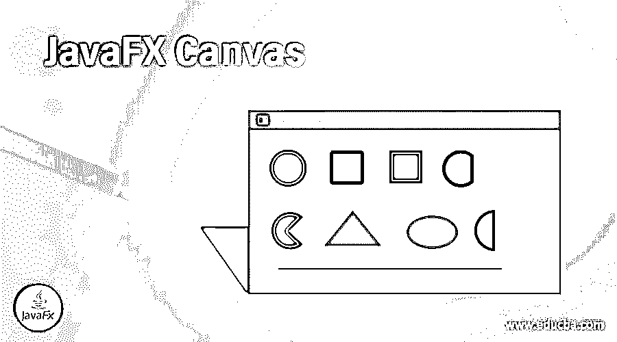
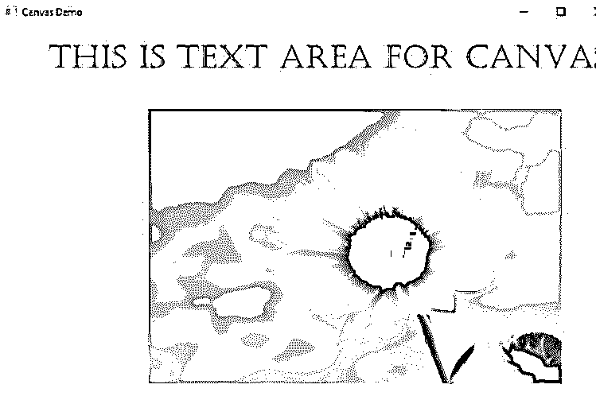
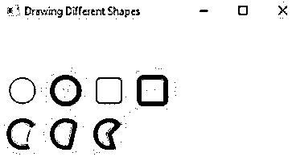
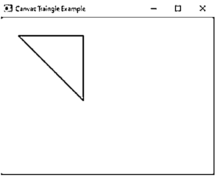

# JavaFX 画布

> 原文：<https://www.educba.com/javafx-canvas/>




## JavaFX Canvas 简介

JavaFX 中的画布通过使用 GraphicsContext 提供了丰富的图形界面。Canvas 是 JavaFX 中的一个类，用于在 JavaFX stage 窗口上绘制图像。canvas 类有特定的高度和宽度，用于决定画布的边界。简单地说，我们可以说 canvas 类用于绘制图像。canvas 类在 javafx.scene.canvas 包中可用，为了使用这个类，我们必须导入它。

### 构造器

下面给出了 JavaFX Canvas 的构造函数:

<small>网页开发、编程语言、软件测试&其他</small>

*   **Canvas():** 使用 new 关键字创建实例，不带任何参数。
*   **Canvas(double width，double height):** 使用 new 关键字创建实例，宽度和高度为参数。

### 常用方法

以下是常用的方法:

*   getgraphicscontext 2D():getgraphicscontext 2d()方法用于获取画布的 2d 图形上下文。
*   **setHeight(双 v):**Height()方法用于设置画布类的高度。
*   **getHeight():**Height()方法用于获取 canvas 类的高度。
*   **set width(double d):**Height()方法用于设置画布类的高度。
*   **getWidth():**Height()方法用于获取画布类的宽度。

### Canvas 在 JavaFX 中是如何工作的？

*   访问 JavaFX 特性用户定义的类必须扩展应用程序类。
*   创建画布类是第一步，画布类是通过使用 new 关键字创建的。

```
Canvas canvasRef=new Canvas(width, height);
```

*   创建 GraphicsContext 是将图像添加到图形上下文的引用对象的第 2 个<sup>和</sup>步骤。

```
GraphicsContext graphicContext = canvasObject.getGraphicsContext2D();
```

*   创建一个图像类是使用 drwImage()方法将图像添加到图形上下文对象的第三步。

```
Image image= new Image("image url");
```

*   创建组元素是第 4 个<sup>个</sup>，用于添加画布对象。

```
GroupgroupRef = new Group(canvasRef);
```

*   5 <sup>第</sup>步是创建应用 show 方法的场景。

```
Scene screen = new Scene(groupRef, length, width);
```

*   将场景参考屏幕添加到舞台对象参考是第 6 个<sup>将输出屏幕添加到舞台。我们将从预定义的 JavaFX 方法开始获取这个 stage 对象引用。</sup>

```
stage.setScene(screen);
```

*   7 <sup>第</sup>步是通过在场景对象上应用 show()方法向最终用户显示输出。

```
stage.show();
```

### JavaFX 画布示例

下面是一些例子:

#### 示例#1

带有图像和文本的画布。

**代码:**

```
package com.canvas;
import javafx.application.Application;
import javafx.scene.Group;
import javafx.scene.Scene;
import javafx.scene.canvas.Canvas;
import javafx.scene.canvas.GraphicsContext;
import javafx.scene.image.Image;
import javafx.scene.paint.Color;
import javafx.scene.text.Font;
import javafx.scene.text.FontWeight;
import javafx.stage.Stage;
public class CanvasTextImage extends Application {
public void start(Stage stageOutput) {
// setting the title to the application
stageOutput.setTitle("Canvas Demo");
// creating group object
Group groupRef = new Group();
// creating scene object and add the group
Scene sceneRef = new Scene(groupRef);
stageOutput.setScene(sceneRef);
// Creating canvas object for add an image
Canvas canvasRef = new Canvas(750, 500);
groupRef.getChildren().add(canvasRef);
// adding 2d graphics to the canvas object
GraphicsContext graphicCOntext = canvasRef.getGraphicsContext2D();
// adding color to the graphic
graphicCOntext.setFill(Color.BLUE);
// adding stroke color to graphic
graphicCOntext.setStroke(Color.BROWN);
// adding line width
graphicCOntext.setLineWidth(3);
// setting font
Font theFont = Font.font("Castellar", FontWeight.BOLD, 38);
graphicCOntext.setFont(theFont);
// adding text to the application
graphicCOntext.fillText("This is Text Area for Canvas", 61, 52);
// creating an image object
Image sunFlowerImage = new Image("sf1.jpeg");
// used to drawing sun flower image
graphicCOntext.drawImage(sunFlowerImage, 182, 102);
// Display the output
stageOutput.show();
}
public static void main(String args[]) {
// JVM calls start method automatically
launch(args);
}
}
```

**输出:**




#### 例 2——用画布画出不同的形状。

**代码:**

```
package com.canvas;
import javafx.application.Application;
import javafx.scene.Group;
import javafx.scene.Scene;
import javafx.scene.canvas.Canvas;
import javafx.scene.canvas.GraphicsContext;
import javafx.scene.paint.Color;
import javafx.scene.shape.ArcType;
import javafx.stage.Stage;
public class CanvasShapes extends Application {
@Override
public void start(Stage outStageObject) {
//setting the title for canvas application
outStageObject.setTitle("Drawing Different Shapes");
//creating group object for adding canvas object to it
Group groupObject = new Group();
//creating canvas object
Canvas canvasRef = new Canvas(350, 270);
//creating GraphicsContext for drawing the image
GraphicsContext graphicContext = canvasRef.getGraphicsContext2D();
//setting the color to shapes
graphicContext.setFill(Color.DARKKHAKI);
//setting the shadow color to the shape
graphicContext.setStroke(Color.DARKVIOLET);
//setting line width
graphicContext.setLineWidth(6);
//setting oval shape with some values
graphicContext.fillOval(11, 61, 31, 31);
//setting oval shape shadow with some values
graphicContext.strokeOval(61, 61, 31, 31);
//setting rectangle shape with some values
graphicContext.fillRoundRect(111, 61, 31, 31, 11, 11);
//setting rectangle shape shadow with some values
graphicContext.strokeRoundRect(161, 61, 31, 31, 11, 11);
//setting arc shape with some values and open type
graphicContext.fillArc(11, 111, 31, 31, 46, 241, ArcType.OPEN);
//setting arc shape shadow with some values and Open type
graphicContext.strokeArc(11, 111, 31, 31, 46, 241, ArcType.OPEN);
//setting arc shape with some values and Chord type
graphicContext.fillArc(61, 111, 31, 31, 46, 241, ArcType.CHORD);
//setting arc shape shadow with some values and Chord type
graphicContext.strokeArc(61, 111, 31, 31, 46, 241, ArcType.CHORD);
//setting arc shape with some values and round type
graphicContext.fillArc(110, 111, 31, 31, 46, 241, ArcType.ROUND);
//setting arc shape shadow with some values and round type
graphicContext.strokeArc(111, 111, 31, 31, 46, 241, ArcType.ROUND);
groupObject.getChildren().add(canvasRef);
//creating scene object
Scene sceneObject=new Scene(groupObject);
outStageObject.setScene(sceneObject);
//Displaying output to the user
outStageObject.show();
}
public static void main(String[] args) {
// JVM calls start method automatically
launch(args);
}
}
```

**输出:**




#### 实施例 3

带画布的三角形。

**代码:**

```
package com.canvas;
import javafx.application.Application;
import javafx.scene.Scene;
import javafx.scene.canvas.Canvas;
import javafx.scene.canvas.GraphicsContext;
import javafx.scene.layout.Pane;
import javafx.scene.paint.Color;
import javafx.stage.Stage;
public class CanvasTrainle extends Application {
@Override
public void start(Stage outStageObject) {
// setting the title for canvas application
outStageObject.setTitle("Canvas Traingle Example");
// creating pane object
Pane paneObject = new Pane();
Canvas canvasRef = new Canvas(300, 300);
GraphicsContext graphicsContext = canvasRef.getGraphicsContext2D();
graphicsContext.beginPath();
// Below lines are for shaping Triangle
graphicsContext.moveTo(35, 35);
graphicsContext.lineTo(155, 35);
graphicsContext.lineTo(155, 155);
graphicsContext.lineTo(35, 35);
graphicsContext.stroke();
paneObject.getChildren().add(canvasRef);
Scene sceneObject = new Scene(paneObject, 300, 250, Color.CHARTREUSE);
outStageObject.setScene(sceneObject);
outStageObject.show();
}
public static void main(String[] args) {
// JVM calls start method automatically
launch(args);
}
}
```

**输出:**




### 结论

画布就像在 windows 环境下绘画一样。它用于通过使用图形上下文对象来绘制图像。我们可以用 canvas 类创建任意数量的形状。

### 推荐文章

这是一个 JavaFX 画布指南。这里我们讨论 JavaFX Canvas 的介绍，包括常用的构造函数和方法，以及 Canvas 在 JavaFX 中是如何工作的。您也可以看看以下文章，了解更多信息–

1.  [JavaFX FileChooser](https://www.educba.com/javafx-filechooser/)
2.  [JavaFX 警报](https://www.educba.com/javafx-alert/)
3.  [JavaFX 组合框](https://www.educba.com/javafx-combobox/)
4.  [JavaFX 列表视图](https://www.educba.com/javafx-listview/)


