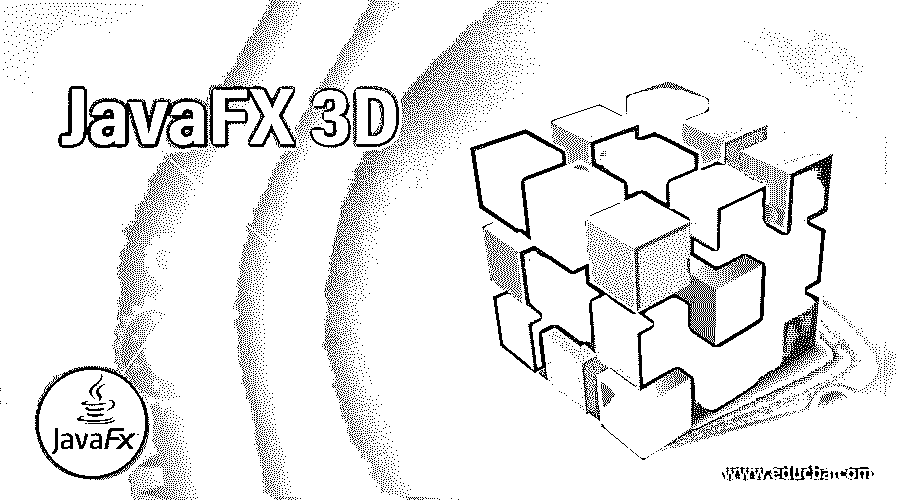
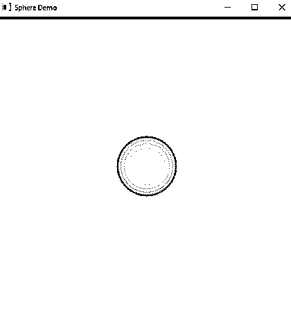
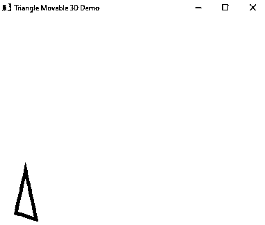
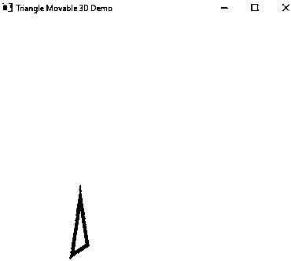
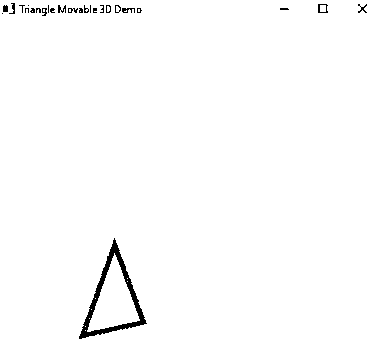
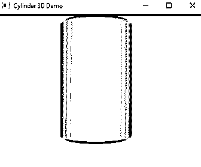

# JavaFX 3D

> 原文：<https://www.educba.com/javafx-3d/>




## JavaFX 3D 简介

JavaFX 中的 3D 形状是可以同时在 X、Y 和 Z 平面上表示的几何图形。x 平面代表长度或深度，Y 平面代表高度，Z 平面代表宽度。一般的 3D 形状有立方体、长方体、圆柱体、圆锥体、球体等。3D 形状包含在 Shape3D 类中，所有形状都包含在 Shape 类中(2D 和 3D 形状)。Shape3D 是所有形状的基类。Shape 类在场景中可用。形状包。我们可以通过导入这个包来利用它。

### 创建三维形状

1.  为所需的 3D 形状创建对象。
2.  添加所有必需的属性。
3.  将 3D 形状对象引用添加到任何 JavaFX 元素，如 Group、VBox、HBox、Pane 等。

#### 常用形状

以下是常用的形状及其描述

<small>网页开发、编程语言、软件测试&其他</small>

**1。长方体**

*   长方体是一个三维形状，有长(深)、宽和高。
*   长方体有长度、高度和宽度的三维形状。这在 Box 中可用 Box 类在 javafx.scene.shape 包中。

**2。气缸**

*   圆柱体是一个封闭的实体，在顶部和底部有两个平行的圆底。
*   圆柱体具有高度和半径属性。每个圆都有相同的半径。气缸内有一个气缸
*   该圆柱体类在场景中可用。形状包。

**3。球体**

*   球体是一个类似圆形的结构，它有一组点，这些点保持在半径为“r”的相等距离上。
*   球体存在于球体内部
*   该球体类在场景中可用。形状包。

### 构造器

*   **Box():** 用一个新的关键字创建一个盒子对象。
*   **Cylinder():** 用一个新的关键字创建圆柱体对象。
*   **Sphere():** 用一个新的关键字创建球体对象。

#### 重要精选面属性

剔除意味着移除 3D 或 2D 对象形状的不正确对齐的部分。通过应用这个剔除属性，我们可以使这些部分在形状视图区域不可见。我们可以通过 setCullFace(CullFace)来设置 cull face 属性。类型)

该方法由 3 个参数组成:

*   **无:**这是默认属性。它没有任何精选面。
*   **正面:**去除所有正面多边形部分。
*   **背面:**去除所有背面多边形部分。

#### 常用方法

*   **设置半径(双 r):** 设置半径。
*   **settranslate(int x):**设置这个视图相对于左边位置的水平位置。
*   **setTranslateY(int y):** 设置这个视图相对于右边位置的垂直位置。
*   **setTranslateZ(int z):** 设置该视图相对于左右位置的水平或垂直位置。
*   **设置宽度(双 w):** 设置宽度。
*   **设置高度(双 h):** 设置高度。
*   **setDepth(doubled):** 设置深度。
*   **setMaterial():** 用于设置形状的渲染。

### 3D 形状在 JavaFX 中是如何工作的？

1.访问 JavaFX 特性用户定义的类必须扩展应用程序。创建长方体或球体或圆柱体等类是 1 <sup>st</sup> 这个类可以通过使用 new 关键字来创建。

**语法#1**

```
Box cuboidRef=new Box();
```

或者

```
Sphere sphereRef=new Sphere();
```

或者

```
Cylinder cylinderRef=new Cylinder();
```

2.创建一个组元素是第二个<sup>和第一个</sup>，它用于添加画布对象。

**语法#2**

```
Group groupRef = new Group(cuboidRef or sphereRef or cylinderRef );
```

3.第三步是创建应用显示方法的场景。

**语法#3**

```
Scene screen = new Scene(groupRef, length, width);
```

4.将场景参考屏幕添加到舞台对象参考是第 4 个<sup>将输出屏幕添加到舞台。我们将从开始预定义的 JavaFX 方法中获取这个 stage 对象引用。</sup>

**语法#4**

```
stage.setScene(screen);
```

5.5 <sup>第</sup>步是通过对场景对象应用 show()方法向最终用户显示输出。

**语法#5**

```
stage.show();
```

### 实施 JavaFX 3D 的示例

下面是一些例子:

#### 示例#1

背景色为绿色的球体

**代码:**

```
package com.shapes;
import javafx.application.Application;
import javafx.scene.Camera;
import javafx.scene.Group;
import javafx.scene.PerspectiveCamera;
import javafx.scene.Scene;
import javafx.scene.input.KeyEvent;
import javafx.scene.paint.Color;
import javafx.scene.shape.Sphere;
import javafx.stage.Stage;
public class SphereDemo extends Application {
@Override
public void start(Stage outputStageObject) {
//setting the title to the application
outputStageObject.setTitle("Sphere Demo");
//creating sphere object
Sphere sphereObject = new Sphere(50);
//creating group object
Group groupObject = new Group();
groupObject.getChildren().add(sphereObject);
//creating camera object
Camera perspectiveCamera = new PerspectiveCamera();
//creating scene object for adding group object
Scene sceneObject = new Scene(groupObject, 500, 500);
sceneObject.setFill(Color.GREEN);
sceneObject.setCamera(perspectiveCamera);
//setting translate property for sphere object
sphereObject.translateXProperty().set(500 / 2);
sphereObject.translateYProperty().set(500 / 2);
//Key pressed event handler
outputStageObject.addEventHandler(KeyEvent.KEY_PRESSED, eventHandler -> {
switch (eventHandler.getCode()) {
//increase the sphere size if we press A
case A:
sphereObject.translateZProperty().set(sphereObject.getTranslateZ() + 300);
break;
//decrease the sphere size if we press B
case B:
sphereObject.translateZProperty().set(sphereObject.getTranslateZ() - 300);
break;
}
});
outputStageObject.setScene(sceneObject);
//displaying output
outputStageObject.show();
}
public static void main(String[] args) {
// JVM calls start method automatically
launch(args);
}
}
```

**输出:**




#### 实施例 2

用户定义的三角形

**代码:**

```
package com.shapes;
import javafx.animation.Animation;
import javafx.animation.RotateTransition;
import javafx.application.Application;
import javafx.scene.Group;
import javafx.scene.PerspectiveCamera;
import javafx.scene.PointLight;
import javafx.scene.Scene;
import javafx.scene.paint.Color;
import javafx.scene.shape.MeshView;
import javafx.scene.shape.TriangleMesh;
import javafx.scene.transform.Rotate;
import javafx.stage.Stage;
import javafx.util.Duration;
public class UserDefinedShapes extends Application {
public MeshView createMeshView() {
// Points for triangle
float[] allPoints = { 50, 0, 0, 45, 10, 0, 55, 10, 0 };
// coordinates for triangle
float[] coordinatesValues = { 0.5f, 0.5f, 0.0f, 1.0f, 1.0f, 1.0f };
// face values of triangle
int[] faceValues = { 0, 0, 2, 2, 1, 1, 0, 0, 1, 1, 2, 2 };
// Creating triangle mesh demo
TriangleMesh mesh = new TriangleMesh();
mesh.getPoints().addAll(allPoints);
mesh.getTexCoords().addAll(coordinatesValues);
mesh.getFaces().addAll(faceValues);
// Creating mesh view
MeshView meshView = new MeshView();
meshView.setMesh(mesh);
return meshView;
}
@Override
public void start(Stage stageOutObject) {
// Set the Title of the Stage
stageOutObject.setTitle("Triangle Movable 3D Demo");
// creating mesh view object
MeshView createMeshView = this.createMeshView();
createMeshView.setTranslateX(100);
createMeshView.setTranslateY(150);
createMeshView.setTranslateZ(500);
// scaling the mesh view to visible larger then usual size
createMeshView.setScaleX(11.0);
createMeshView.setScaleY(11.0);
createMeshView.setScaleZ(11.0);
// Create camera object to view 3d shapes clearly
PerspectiveCamera cameraPerspective = new PerspectiveCamera(false);
cameraPerspective.setTranslateX(100);
cameraPerspective.setTranslateY(-150);
cameraPerspective.setTranslateZ(500);
// create rotation object for rotating the triangle for certain duration
RotateTransition rotateShape = new RotateTransition(Duration.seconds(3), cameraPerspective);
rotateShape.setCycleCount(Animation.INDEFINITE);
rotateShape.setFromAngle(-40);
rotateShape.setToAngle(40);
rotateShape.setAutoReverse(true);
rotateShape.setAxis(Rotate.Y_AXIS);
rotateShape.play();
// Creating a point light object for setting color to the shape
PointLight colorLight1 = new PointLight();
colorLight1.setColor(Color.CHARTREUSE);
colorLight1.setTranslateX(350);
colorLight1.setTranslateY(250);
colorLight1.setTranslateZ(500);
// Creating a point light object for setting color to the shape
PointLight colorLight2 = new PointLight();
colorLight2.setColor(Color.GREEN);
colorLight2.setTranslateX(300);
colorLight2.setTranslateY(250);
colorLight2.setTranslateZ(550);
// Create group object for adding elements
Group groupObject = new Group(createMeshView, colorLight1, colorLight2);
// Rotate the triangle with 90 degrees
groupObject.setRotationAxis(Rotate.Y_AXIS);
groupObject.setRotate(90);
// creating scene object for adding group object
Scene scene = new Scene(groupObject, 450, 400, true);
scene.setCamera(cameraPerspective);
stageOutObject.setScene(scene);
// Display the output
stageOutObject.show();
}
public static void main(String[] args) {
// JVM calls start method
Application.launch(args);
}
}
```

**输出:**










#### 实施例 3

圆筒

**代码:**

```
package com.shapes;
import javafx.application.Application;
import javafx.scene.Group;
import javafx.scene.PerspectiveCamera;
import javafx.scene.Scene;
import javafx.scene.paint.Color;
import javafx.scene.shape.Cylinder;
import javafx.stage.Stage;
public class CylinderDemo extends Application {
@Override
public void start(Stage outputStageObject) throws Exception {
// setting title for cylinder application
outputStageObject.setTitle("Cylinder 3D Demo");
// Creating cylinder object
Cylinder cylinderObject = new Cylinder();
cylinderObject.setRadius(65);
cylinderObject.setHeight(200);
cylinderObject.setTranslateX(200);
cylinderObject.setTranslateY(140);
// creating camera object for adding 3d shapes
PerspectiveCamera perspectveCamera = new PerspectiveCamera();
perspectveCamera.setTranslateX(10);
perspectveCamera.setTranslateY(10);
perspectveCamera.setTranslateZ(30);
// setting group and stage
Group groupObject = new Group();
groupObject.getChildren().addAll(cylinderObject);
// creating scene object for adding group object
Scene scene = new Scene(groupObject, 400, 300, Color.DARKORCHID);
scene.setCamera(perspectveCamera);
outputStageObject.setScene(scene);
// display the output
outputStageObject.show();
}
public static void main(String[] args) {
// JVM calls strat method automatically
launch(args);
}
}
```

**输出:**




### 结论

JavaFX 3D 形状存在于 javafx.scene.Shape 类中。圆柱体、长方体、球体、三维三角形等。变成了三维的形状。这些 3D 形状用于空间应用、土木工程应用、航空应用等。

### 推荐文章

这是 JavaFX 3D 的指南。在这里，我们将讨论三维形状、构造函数、JavaFX 3D 的工作原理以及实现示例，以便更好地理解。您也可以浏览我们的其他相关文章，了解更多信息——

1.  [JavaFX 矩形](https://www.educba.com/javafx-rectangle/)
2.  [JavaFX 选择框](https://www.educba.com/javafx-choicebox/)
3.  [JavaFX 饼图](https://www.educba.com/javafx-pie-chart/)
4.  [JavaFX 条形图](https://www.educba.com/javafx-bar-chart/)


