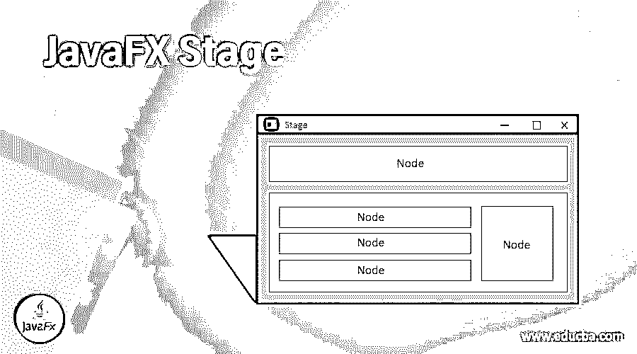
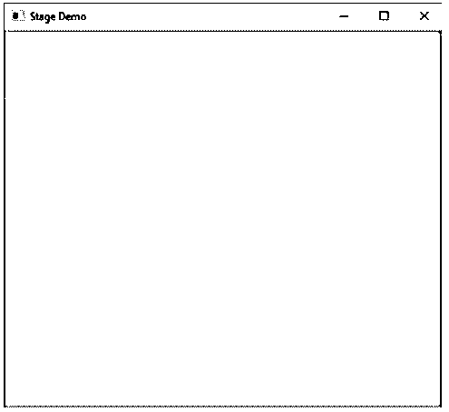

# JavaFX 阶段

> 原文：<https://www.educba.com/javafx-stage/>




## JavaFX Stage 简介

JavaFX Stage 是一个向用户显示 JavaFX 输出的桌面屏幕，也就是说 Stage 是窗口。在 JavaFX Stage 中，我们插入了一个 JavaFX 元素场景，它显示了窗口中的内容，或者我们可以说是 Stage 中的内容。当从应用程序内部调用 main 方法时，launch()方法调用自动开始()。此 start 方法有一个参数是 Stage object，它创建主 Stage 对象。

此主要阶段对象创建一个窗口，在输出中显示用户创建的功能。如果您的需求不止一个阶段，那么我们可以创建任意多的阶段对象。JavaFX Stage 类在 javafx.stage.Stagepackage 中可用。因此，如果我们想要使用 Stage，则必须导入此包。它从阶段窗口向最终用户显示输出。

<small>网页开发、编程语言、软件测试&其他</small>

### 构造器

下面给出了构造函数:

*   **Stage():** 这个 Stage()构造函数通过 new 关键字创建一个实例，不带任何参数。
*   **Stage(Node n):** 这个 Stage()构造函数通过 new 关键字创建一个实例，使用任何 JavaFX 元素作为参数。

### 常用方法

以下是常用的方法:

**1。show():**show()方法将显示输出。

**2。setScene(场景):**set Scene()方法设置场景对象。

**3。setTitle():**setTitle()设置应用程序的标题。

**4。setX(int value):**setX()方法设置应用程序左上角的位置。

**5。setY(int value):**setY()方法设置应用程序左上角的位置。

**6。setWidth(int width):**setWidth()方法设置舞台窗口的宽度。

**7。set height(int height):**set height()方法设置舞台窗口的高度。

**8。showAndWait():**showAndWait()方法将显示输出，但是在 stage 关闭之前，对象仍然是活动的。

**9。init modality():**init modality 必须在使阶段可见之前完成。

它具有以下常量值:

*   **无**:默认值。
*   **WINDOW_MODAL:** 该值使 stage 阻止所有窗口从其所有者到其根对象的输入事件。
*   **APPLICATION_MODAL:** 该值使 stage 阻止来自同一应用程序的所有窗口的输入事件。

10。init owner():init owner()方法设置应用程序的所有者。

**11。init style():**init style()方法设置舞台窗口的样式。

它具有以下常量值:

*   **未装饰:**该值给出没有任何装饰的白色背景。
*   **透明:**该值给出透明背景。
*   **统一:**该值不赋予装饰区域和主要内容区域之间的任何边界。
*   **效用:**这个值给你最少的装饰。

### JavaFX 中的 Stage 是如何工作的？

*   访问 JavaFX 功能用户定义的类必须扩展应用程序类。
*   在 JavaFX 中，创建任何 JavaFX 元素都是第一步。ImageView，AnchorePane，ScrollPane，MenuBar 等。
*   这可以通过使用 new 关键字来实例化。

**语法:**

```
ImageViewimageView=new ImageView();
ScrollPanescrollPane=new ScrollPane();
AnchorPaneanchorPaneRef=new AnchorPane ();
.
.
Etc.
```

*   第二步是创建 VBox 或任何其他显示(如 TilePane 或 HBox，根据需要)类来添加项目。

**语法:**

```
VBoxvBox=new VBox (scrollPane or ImageView ,anchorPaneRef etc.); //Gives vertical box
```

*   第三步是创建应用显示方法的场景。

**语法:**

```
Scene screen = new Scene(vBox, length, width);
```

*   将场景参考屏幕添加到舞台对象参考是第四步。将输出屏幕添加到舞台。我们将从预定义的 JavaFX 方法开始获取这个 stage 对象引用。

**语法:**

```
stage.setScene(screen);
```

*   第五步是通过对场景对象应用 show()方法向最终用户显示输出。

**语法**:

```
stage.show();
```

### JavaFX Stage 的示例

下面是一些例子:

#### 示例# 1–没有任何 JavaFX 元素

**代码:**

```
package com.stage;
import javafx.application.Application;
import javafx.scene.Group;
import javafx.scene.Scene;
import javafx.scene.paint.Color;
import javafx.stage.Stage;
public class StageDemo extends Application {
@Override
public void start(Stage outStage) throws Exception {
// setting the title for our application
outStage.setTitle("Stage Demo");
// creating a group object for adding it to the scene
Group group = new Group();
// creating a scene object with width and height
Scene sceneOut = new Scene(group, 520, 520);
// setting AQUA color to the scene object
sceneOut.setFill(Color.AQUA);
// Adding scene object to the stage object
outStage.setScene(sceneOut);
// showing the output to the user
outStage.show();
}
public static void main(String args[]) {
// JVM calls start method automatically
launch(args);
}
}
```

**输出:**




#### 示例 2–带载物台的设备

**代码:**

```
package com.stage;
import javafx.application.Application;
import javafx.stage.Modality;
import javafx.stage.Stage;
public class ModalityDemo extends Application {
@Override
public void start(Stage primaryStage) {
// Adding a tile to the application
primaryStage.setTitle("Modality Demo");
//Creating another stage other than primary default stage
Stage stage = new Stage();
stage.setTitle("Secondary Stage");
//Set the width and height of the other stage window
stage.setWidth(400);
stage.setHeight(400);
//setting modality to APPLICATION_MODAL
stage.initModality(Modality.APPLICATION_MODAL);
// stage.initModality(Modality.WINDOW_MODAL);
// stage.initModality(Modality.NONE);
//Set the width and height of the primary stage window
primaryStage.setWidth(500);
primaryStage.setHeight(500);
//It will show the output
primaryStage.show();
//It will show the output until stage object closed
stage.showAndWait();
}
public static void main(String args[]) {
// JVM calls start method automatically
launch(args);
}
}
```

**输出:**


#### 示例 3–带标签的舞台风格

**代码:**

```
package com.stage;
import javafx.application.Application;
import javafx.scene.Scene;
import javafx.scene.control.Label;
import javafx.scene.layout.VBox;
import javafx.stage.Modality;
import javafx.stage.Stage;
import javafx.stage.StageStyle;
public class StageStyleDemo extends Application {
@Override
public void start(Stage primaryStage) {
// Adding a tile to the application
primaryStage.setTitle("Stage Style Demo");
// It applies the styles to window
// stage.initStyle(StageStyle.UNDECORATED);
// stage.initStyle(StageStyle.TRANSPARENT);
primaryStage.initStyle(StageStyle.UNIFIED);
// stage.initStyle(StageStyle.UTILITY);
// creating a label object
Label label = new Label("\n\n\t\t\tHello, Hi I am Stage Demo Content");
// creating vbox object
VBoxvBox = new VBox(label);
// creating a scene object
Scene scene = new Scene(vBox,400,400);
primaryStage.setScene(scene);
// It will show the output
primaryStage.show();
}
public static void main(String args[]) {
// JVM calls start method automatically
launch(args);
}
}
```

**输出:**


### 结论

JavaFX Stage 是一个独立的应用程序显示窗口。阶段是第一要素。我们可以添加任意多个阶段，但是我们只有一个主要阶段。我们不能在初级阶段应用模态。

### 推荐文章

这是 JavaFX Stage 的指南。在这里，我们将讨论简介、常用方法、stage 如何在 JavaFX 中工作，并举例说明，以便更好地理解。您也可以看看以下文章，了解更多信息–

1.  [JavaFX 选择框](https://www.educba.com/javafx-choicebox/)
2.  [Java FX 中的表格视图](https://www.educba.com/tableview-in-javafx/)
3.  [JavaFX 矩形](https://www.educba.com/javafx-rectangle/)
4.  [JavaFX 列表视图](https://www.educba.com/javafx-listview/)


