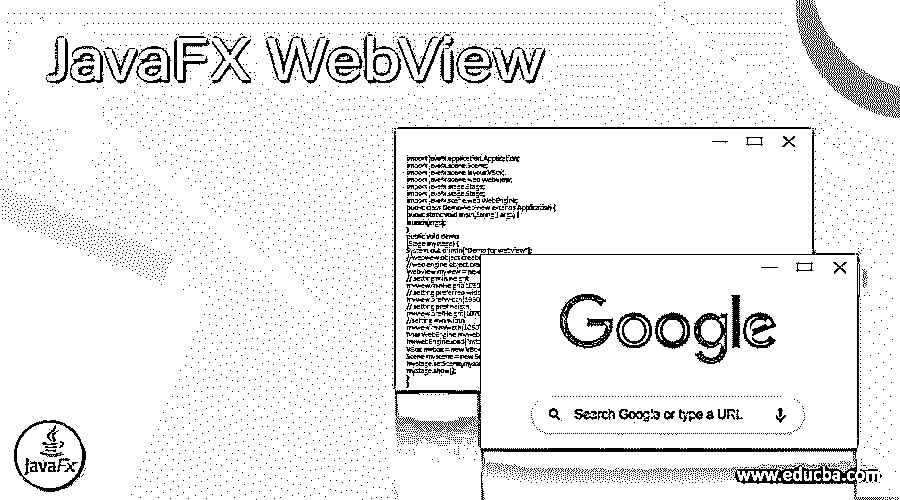
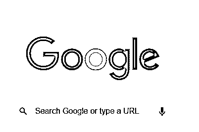

# JavaFX WebView

> 原文：<https://www.educba.com/javafx-webview/>




## JavaFX WebView 的定义

JavaFX WebView 是用来显示网页的，这也是 WebView 这个名字在这里的原因。它充当一个迷你或小型浏览器，能够在视图上显示页面。它能够在 JavaFX 应用程序中的 webView 上显示 CSS、HTML 和 JAVASCRIPT 代码。要使用它，我们需要在编程时从 JavaFX 导入库。简而言之，webView 是用来呈现网页的，它非常容易使用，我们可以显示我们不同的页面，如新闻、博客，还可以非常快速地下载它们。在下一部分，我们将详细讨论 WebView。

**语法:**

<small>网页开发、编程语言、软件测试&其他</small>

要使用 WebView，我们需要将库导入到我们的程序中。我们知道它是 JavaFX 包的一部分。有关更多理解，请参见下面的语法；

```
import javafx.scene.web.WebView;
WebView name_varible = new WebView();
```

正如您在上面几行代码中看到的，我们首先导入 webView 所在的包，然后使用“new”关键字创建 webView 的对象。此外，这个类只在 JavaFX 包中可用。为了更好地理解语法，让我们看一个初学者练习语法，见下文；

```
import javafx.scene.web.WebView;
WebView myview = new WebView();
```

**//逻辑调用方法**

这里我们只是为变量赋值，然后我们可以调用 web view 类中的任何方法来处理 JavaFX 应用程序中的网页

### JavaFX WebView 如何工作？

现在我们知道 WebView 用于在 JavaFX 应用程序中显示我们的网页。这是非常轻量级的，可以很容易地使用。通过使用这个网络视图，我们可以在网络视图上呈现我们的 HTML 页面。这也支持 CSS 和 JavaScript。这个模块是 JavaFX 应用程序的节点，所以我们需要在程序中使用时导入它。此外，WebView 内部使用 web-kit 在迷你或小型浏览器上呈现我们的网页。让我们看看并理解 JavaFX 中 WebView 节点的内部工作方式，见下文；

**例如:**

```
import javafx.scene.web.WebView;
String myText = "Demo to show internal working of webview";
WebView myview = new WebView();
myview.loadContent(myText, "file.html");
```

在上面几行代码中，我们试图在 JavaFX 应用程序中使用 WebView 将文本显示到 HTML 文件中。为此，我们首先创建了 WebView 的一个实例，之后我们调用 WebView 节点的 loadContent()方法来显示 HTML 文件上的文本。这个 loadContent()方法内部有两个参数。第一个是你想要显示的文本，另一个是我们想要打印文本的文件名。在这之后，我们可以很容易地在 HTML 页面上看到我们的文本。

### 构造器

WebView 是一个节点，为了使用这个节点，我们需要有一个这个类的对象。在对象创建之后，只有我们能够在程序内部使用它的方法。同样，为了在面向对象的编程语言中创建对象，我们需要一个构造函数。在 WebView 中，我们只有一个构造函数作为 WebView 的实例方法，使用它我们可以很容易地初始化它。让我们讨论它在 JavaFX 应用程序中的用法，见下文；

**语法:**

```
WebView myview = new WebView();
```

这是 WebView 中的默认构造函数或无参数构造函数，用来初始化 WebView 的对象。为了创建新对象，请在此处使用“new”关键字。之后，我们就可以访问 WebView 类中的方法和其他变量了。

### 方法

WebView 提供了多种方法来处理 JavaFX 应用程序中的网页。让我们详细讨论每种方法，如下所示:

**1)宽度:**这个方法用于设置我们的 webview 的宽度。

**2) maxHeight:** 该方法用于设置 JavaFX 应用程序中 webview 节点的最大高度

**3) height:** 该方法用于设置 JavaFX 应用程序中 WebView 节点的高度。

**4) maxWidth:** 该方法用于设置 JavaFX 应用程序中 WebView 节点的最大宽度。

**5) zoom:** 该方法用于获取 webview 中的 zoom 对象。

**6) prefWidth:** 该方法用于设置 JavaFX 应用程序中 WebView 节点的首选宽度。

**7) prefHeight:** 该方法用于设置 JavaFX 应用程序中 WebView 节点的首选高度。

**8) min-width:** 该方法用于设置 JavaFX 应用程序中 WebView 节点的最小宽度。

**9) minHeight:** 该方法用于设置 JavaFX 应用程序中 WebView 节点的最小高度

**10) fontScale:** 该方法用于指定字体在 WebView 中的字体比例。

**11) contextMenuEnabled:** 此方法用于检查上下文菜单是否启用。

### JavaFX WebView 示例

在本例中，我们创建了一个窗口，并在其中尝试打开 google 链接。

```
import javafx.application.Application;
import javafx.scene.Scene;
import javafx.scene.layout.VBox;
import javafx.scene.web.WebView;
import javafx.stage.Stage;
import javafx.stage.Stage;
import javafx.scene.web.WebEngine;
public class DemoWebView extends Application {
public static void main(String[] args) {
launch(args);
}
public void demo
(Stage mystage) {
System.out.println("Demo for webview");
//webview object creation
//web engine object creation
WebView myview = new WebView();
// setting min height
myview.minHeight(1050);
// setting preferred width
myview.prefWidth(1950);
// setting pref heigth
myview.prefHeight(1070);
//setting min width
myview.minWidth(1050);
final WebEngine mywebEngine = webView.getEngine();
mywebEngine.load("http://www.google.com");
VBox mybox = new VBox(webView);
Scene myscene = new Scene(mybox, 960, 600);
mystage.setScene(myscene);
mystage.show();
}
}
```

**输出:**




### 结论

它可以用来显示或渲染我们的网页，这作为一个迷你浏览器，它也使用网络工具包内部显示我们的网页。这是 JavaFX 包中的一个节点，通过使用 WebView，我们可以仅在 JavaFX 应用程序中显示网页。

### 推荐文章

这是 JavaFX WebView 的指南。在这里，我们还讨论了 JavaFX WebView 的定义、方法以及如何与示例一起工作。您也可以看看以下文章，了解更多信息–

1.  [JavaFX 渐变颜色](https://www.educba.com/javafx-gradient-color/)
2.  [JavaFX 固定窗格](https://www.educba.com/javafx-anchorpane/)
3.  [JavaFX 场景](https://www.educba.com/javafx-scene/)
4.  [JavaFX 画布](https://www.educba.com/javafx-canvas/)


