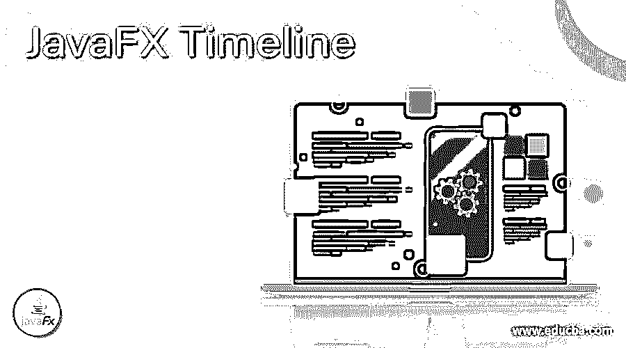
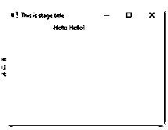
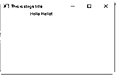
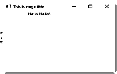
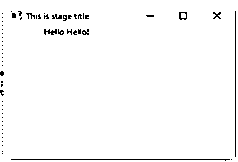
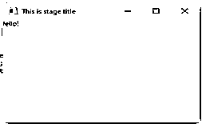

# JavaFX 时间线

> 原文：<https://www.educba.com/javafx-timeline/>




## JavaFX 时间轴的定义

JavaFX 中的 Timeline 基本上是用来定义自由灵活的动画形式的。JavaFX 中的 Timeline 使用关键帧来逐个按顺序处理每个关键帧。它不能保证每个关键帧的处理时间；相反，它以指定的时间间隔处理每个关键帧。程序员可以在创建时或之后将关键帧添加到时间轴中。Timeline 是 javafx.animation.Animation 类的子类。许多其他的事情可以使用时间轴来完成，比如设置时间轴的反转，循环运行多少次等等。

**语法:**

<small>网页开发、编程语言、软件测试&其他</small>

下面给出了在 JavaFX 中使用时间轴的基本语法:

```
Final Timeline tm = new Timeline();
tm.add(new KeyFrame(Duration.millis(10000),
new KeyValue (button.translateXProperty(), 8)));
tm. setCycleCount(8);
.
..
..
```

### JavaFx Timeline 函数是如何工作的？

下面给出了定义 JavaFX timeline 工作的一些要点:

*   JavaFX 中的 Timeline 只不过是由许多关键帧对象组成的动画，每个对象都需要按顺序运行。
*   时间线的一些标准属性是自动反转和周期计数。
*   循环计数就是计算动画应该播放的次数。我们也可以使用 Timeline.INDEFINITE 无限次播放动画，但是默认情况下动画只运行一次。
*   自动反转只不过是一个布尔值，用来指示动画是否可以向后播放。
*   为了设置时间轴的最大时间，使用了 keyframeanimation . cycledurationproperty()。
*   我们不能更改运行时间轴的关键帧。为了使用新值，需要停止并重新开始。
*   在 JavaFX 的时间轴中，循环计数为 1，自动反转功能设置为 TRUE。
*   方法 start()包含时间轴动画的主要逻辑。

### 构造器

下面给出了 JavaFX 中时间轴的构造函数:

| **序列号** | **构造器** | **描述** |
| 1. | 时间轴() | 它是一个没有参数的时间轴构造函数 |
| 2. | 时间轴(双目标帧率，关键帧…关键帧) | 它是时间轴的构造器，有两个参数，即 targetFramerate 和 keyFrames。它允许定义自定义帧速率和时间轴的关键帧。 |
| 3. | 时间轴(双倍目标帧率) | 它是以 targetFramerate 为参数的时间轴的构造函数。在这个构造函数中，需要定义 Animation.targetFramerate。 |
| 4. | 时间轴(关键帧…关键帧) | 它是以关键帧为参数的时间轴的构造器。可以有一个或多个关键帧。 |

### 方法

下面给出了 JavaFX 时间轴中使用的方法及其描述:

| **序列号** | **方法名** | **方法描述** |
| 1. | 获取关键帧() | This method returns the keyframes of the respective timeline.**语法**:public final observable list<key frame>get key frames()； |
| 2. | 停止() | As the name indicates, this method stops the animation and allows the head to start from the initial position. As using the stop() method is an asynchronous call so it might not get stopped immediately. If the animation is not working/ running, this method has no impact. It has ‘void’ as a modifier.

**语法** : public void stop()

 |

下面给出了从 javaFX.animation.Animation 类继承的一些方法:

| **序列号** | **方法名** | **描述** |
| 1. | getTargetframeRate() | 该方法定义了动画运行的帧速率，即每秒的帧数。 |
| 2. | getStatus() | 该方法用于获取动画的状态。JavaFX 中的动画基本上有三种状态，即停止、暂停和运行 |
| 3. | setStatus() | 该方法用于设置属性的状态，即动画。状态可以设置为停止、暂停和运行。 |
| 4. | setCycleDuration() | 该方法用于设置周期持续时间的值。它基本上是用来表示动画的一个周期的持续时间。它是一个只读变量。 |
| 5. | getCurrentTime() | 这个方法用于获取动画的当前时间。其默认值为 0 毫秒。 |
| 6. | 设置延迟() | 此方法用于设置动画的延迟属性。利用这一点，程序员可以延迟动画的开始。默认情况下，其值为 0 毫秒。 |
| 7. | getDelay() | 这个方法用于获得动画的延迟。默认情况下，其值设置为 0 ms。 |

### JavaFX 时间线示例

下面给出了在 JavaFX 代码中实现时间轴用法的示例:

**代码:**

```
import javafx.animation.KeyFrame;
import javafx.animation.KeyValue;
import javafx.animation.Timeline;
import javafx.application.Application;
import javafx.scene.Scene;
import javafx.scene.layout.VBox;
import javafx.scene.text.Font;
import javafx.scene.text.Text;
import javafx.stage.Stage;
import javafx.util.Duration;
public class TimelineFX extends Application {
public static void main(String[] args) {
launch(args);
}
@Override
public void start(Stage stage)
{
// Create the Text using text object
Text text = new Text("Hello Hello!");
VBox root = new VBox(text);
// Setting the text font size
text.setFont(Font.font(12));
// Creating the Scene using its object
Scene scene = new Scene(root);
// Adding the Scene to the Stage
stage.setScene(scene);
// Now Setting the title of the above Stage
stage.setTitle("This is stage title");
// Displaying the Stage using the show() method
stage.show();
// Getting the Scene width and the Text width
double sw = scene.getWidth();
double tw = text.getLayoutBounds().getWidth();
// Defining the Durations of animations
Duration startD = Duration.ZERO;
Duration endD = Duration.seconds(50);
//Creating the keyFrames to use in timeline
KeyValue startValue = new KeyValue(text.translateXProperty(), sw);
KeyFrame startFrame = new KeyFrame(startD, startValue);
KeyValue endValue = new KeyValue(text.translateXProperty(), -6.0 * tw);
KeyFrame endFrame = new KeyFrame(endD, endValue);
// Creating a Timeline using above values
Timeline t1 = new Timeline(startFrame, endFrame);
// Setting the cycle count of animation
t1.setCycleCount(t1.INDEFINITE);
//Setting the auto reverse property of animation
t1.setAutoReverse(false);
// Running the animation using play() method
t1.play();
}
}
```

**输出:**
















### 结论

上面的描述清楚地解释了什么是 JavaFX 中的时间轴，以及它如何用于使用关键帧的动画。如果没有正确启动和停止，无限次使用时间轴会导致内存泄漏和其他严重问题。所以你需要理解时间线的每个概念，它的构造函数，方法，所有的东西，并且在使用它之前需要非常小心。

### 推荐文章

这是 JavaFX 时间轴的指南。在这里，我们讨论 JavaFx Timeline 函数的定义以及它是如何工作的，并给出了一些例子。您也可以看看以下文章，了解更多信息–

1.  [JavaFX 图像](https://www.educba.com/javafx-image/)
2.  [JavaFX 定时器](https://www.educba.com/javafx-timer/)
3.  [JavaFX 渐变颜色](https://www.educba.com/javafx-gradient-color/)
4.  [JavaFX TabPane](https://www.educba.com/javafx-tabpane/)


