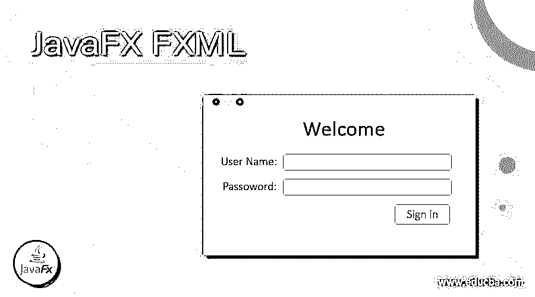
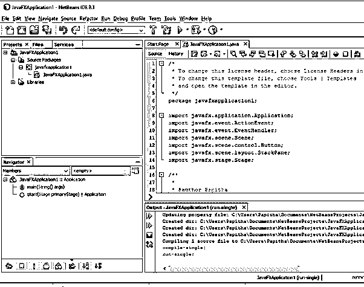
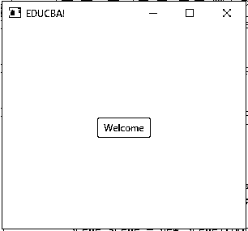
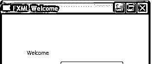

# JavaFX FXML

> 原文：<https://www.educba.com/javafx-fxml/>




## JavaFX FXML 简介

JavaFX FXML 是由 Oracle 公司推出的一种基于 XML 语言的图形用户界面格式，可以用来组成图形用户界面的布局或图形用户界面的应用程序。FXML 的主要目的是定义一个用户界面。将 XML 标记放在这里是为了描述层次结构中 UI 的一个组件。控制器通过定义组件并将它们链接起来来管理交互。FXML 文件有扩展名。它是由 JavaFX 的 fxml 加载器加载的，

**语法**

<small>网页开发、编程语言、软件测试&其他</small>

JavaFX FXML 创建如下

```
<?xml version="1.0" encoding="UTF-8"?>
<?import javafx.scene.layout.VBox?>
<?import javafx.scene.control.Button?>
<VBox>
<children>
<Button text="This is my official website on FXML"/>
</children>
</VBox>
```

在上面的语法中，第一行包括 FXML 文档。接下来是包含导入文件和类；最后，通过创建 VBox 组件和按钮组件来嵌入 GUI 组合。<vbox>创建一个垂直组件，作为多个定位组件的容器。</vbox>

### JavaFX FXML 是如何工作的？

JavaFX 用于创建桌面应用程序，它允许通过简化应用程序来编写用户界面。在 FXML 中，XML 元素是类、脚本、属性、静态。典型的 JavaFX FXML 如下所示:

*   FXML 文档具有 FXML 应用程序的用户界面。
*   FXML 控制器处理所有的事件处理过程。
*   接下来，FXML Loader 解析给定的 FXML 文档并创建一个图。同时，主类启动程序的执行。

例如，当用户访问一个网站时，他/她检查他们需求的更新信息；因此，我们需要重新编译一段代码。在这种情况下，FXML 控制器发挥作用。

在本文中，我使用了 NetBeans IDE，它支持 JavaFX。该 IDE 通常为设计 UI 提供可视化布局。需要部署第一个 JavaFx 应用程序。开始这个过程:

1.  通过单击 JavaFX FXML 应用程序来设置新项目。IDE 分为三个部分。

*   java 文件:这占用了一个应用程序(主应用程序)的 Java 代码
*   .fxml 文件:这里创建 FXML 源文件来定义用户界面部件。
*   java:这部分包括一个事件处理过程，比如鼠标和键盘点击。

下面是支持 JavaFX 的 NetBeans IDE 截图。这里我们可以看到三个名为 JAVAFXApplication1 的应用程序文件




下图显示了使用按钮事件处理程序执行的应用程序。FXML 指定了两个事件处理程序，即脚本和控制器事件处理程序。可以为更多零件创建 FXML 布局文件；这使控制器和视图保持独立。场景构建器不需要直接使用 XML。舞台是主要容器，场景是这里的 UI 元素。




通常，FXML 加载器加载。应用程序的 fxml 文件。在此期间，它会找到控制器的名称。它们创建的对象可能在任何地方，所以为了进行引用，我们需要用属性 fx: id 来标识对象。接下来，根元素是 javafx 的子类。场景。布局。窗格。甚至我们可以通过通信每个窗口来使用两个控制器。

**添加脚本**

```
<fx:script>
function bt_click() {
mainButton.setText("press me!");
}
</fx:script>
```

我们在

**FXML 名称空间**

```
<?xml version="1.0" encoding="UTF-8"?>
<?import javafx. scene. layout.VBox?>
<VBox xmlns:fx="http://edujava.com/fxml">
</VBox>
```

这里的 Vbox 是一个以垂直顺序制作表单的组件(子元素)。我们可以插入文本、标签和按钮来创建表单布局。命名空间被添加到根元素中。

**包含 stackPane 的 FXML】**

```
<?xml version="1.0" encoding="UTF-8"?>
<?import javafx.scene.text.*?>
<?import javafx.scene.layout.*?>
<StackPane prefHeight="150" prefWidth="150" xmlns:fx="http://javafx.com/fxml/1" fx:controller="counter.Classctrl">
<children>
</Stackpane>
```

**使用边框面板**

```
<HBox prefHeight="110.0" prefWidth="210.0"
BorderPane.alignment="CENTER">
<children>
<Label text="Square Root:" textFill="Red">
<font>
<Font size="16.0" />
</font>
</Label>
<TextField fx:id="mysample" />
</children>
</HBox>
</top>
</BorderPane>
```

**在 FXML 文件中添加组件**

```
public class load extends VBox implements Initializable {
@FXML
private void handleAction(ActionEvent eve) {
}
@Override
public void initialize(URL u, ResourceBundle re) {
}
}
```

**FXML 注释给定为**

```
public class layout
@FXML
private TextField txt;
@FXML
private Button btn;
@FXML
private VBox dataContainer;
@FXML
private TableView tab;
```

### 例子

在本节中，我们将向您展示如何在 Net Beans IDE 中使用 javafx.fxml。

相应的 Java 类如下所示

**FXMLsample.java**

```
package fxmlsample;
import javafx.application.Application;
import javafx.fxml.FXMLLoader;
import javafx.scene.Parent;
import javafx.scene.Scene;
import javafx.stage.Stage;
public class FXMLsample extends Application {
@Override
public void start(Stage st) throws Exception {
Parent root = FXMLLoader.load(getClass().getResource("FXMLdoc.fxml"));
Scene sc = new Scene(root, 200, 215);
st.setTitle("FXML Welcome");
st.setScene(sc);
st.show();
}
public static void main(String[] args) {
launch(args);
}
}
```

一个简单的 FXML 文件，包含网格窗格和文本内容，默认情况下与控制器类相关联。

**FXMLdoc.fxml**

```
<?xml version="1.0" encoding="UTF-8"?>
<?import java.net.*?>
<?import javafx.geometry.*?>
<?import javafx.scene.control.*?>
<?import javafx.scene.layout.*?>
<?import javafx.scene.text.*?>
<Text text="Welcome Page"
GridPane.columnIndex="0" GridPane.rowIndex="0"
GridPane.columnSpan="3"/>
<GridPane fx:controller="FXMLdoc.FXML_ctrl"
xmlns:fx="http://javafx.com/fxml" alignment="center" hgap="9" vgap="9">
<padding><Insets top="22" right="22" bottom="12" left="22"/></padding>
</GridPane>
```

接下来是控制器类，它响应 UI 应用程序的 FXML 文件

**FXML_ctrl.java**

```
package FXMLsample;
import javafx.event.ActionEvent;
import javafx.fxml.FXML;
import javafx.scene.text.Text;
import javafx.scene.control.Label;
public class FXML_ctrl {
@FXML private Text actiontarget;
@FXML protected void handleSubmitButtonAction(ActionEvent event) {
actiontarget.setText("Submit the button");
}
}
```

**解释**

上面的代码部分显示了如何通过加载加载程序来运行 FXML 应用程序。类似地，我们可以看到组件是如何相互连接的。

**输出:**




### 特征

1.  它们有大量的内置 GUI 组件，比如复选框；按钮还带有一个内置图表库来创建图表。
2.  JavaFX FXML 是一种 XML 标记语言，具有丰富的 API 集。这是一个强大的工具，使代码更加简单。用于使用 java 文件开发富互联网应用程序。
3.  JavaFX 具有 CSS 样式，并通过 FXML 给出声明性布局。
4.  fxML 使用带有前缀“FX”的名称空间，其中所有元素和属性都被赋值。此外，调试和修改也很简单。

### 结论

这都是关于 JavaFX FXML 的。在本文中，我们讨论了它们的定义以及它如何与 JavaFX 一起工作，并给出了示例。一般来说，JavaFX 演示的基础不会很好。为了构建一个更大的应用程序，我们需要一个系统 FXML。因此，我们解释了如何在 JavaFX 实现的开发中使用它。

### 推荐文章

这是 JavaFX FXML 的指南。这里我们讨论定义和它如何与 JavaFX 一起工作，以及例子和特性。您也可以看看以下文章，了解更多信息–

1.  [JavaFX WebView](https://www.educba.com/javafx-webview/)
2.  [JavaFX 渐变颜色](https://www.educba.com/javafx-gradient-color/)
3.  [JavaFX 固定窗格](https://www.educba.com/javafx-anchorpane/)
4.  [Java FX 中的表格视图](https://www.educba.com/tableview-in-javafx/)


