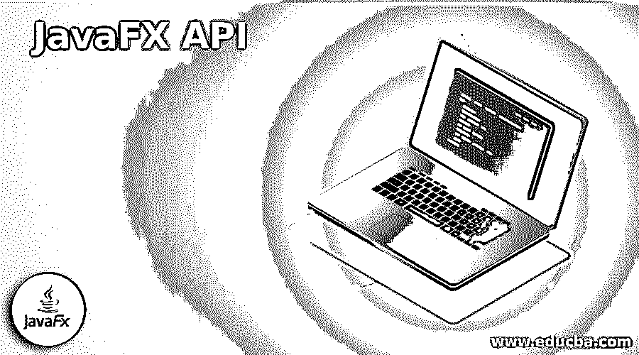
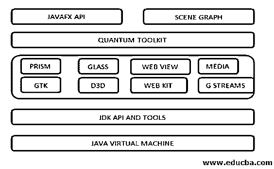
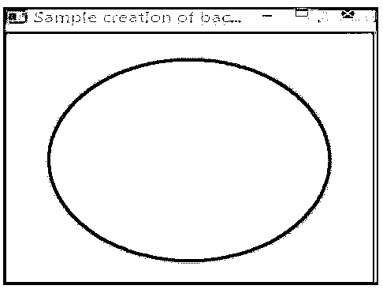

# JavaFX API

> 原文：<https://www.educba.com/javafx-api/>




## JavaFX API 简介

为了构建富客户端应用程序，使用了称为 JavaFX 的库，该库提供了用于创建、测试、调试和部署 GUI 应用程序的 API，这些 GUI 应用程序可以在几乎所有支持 Java 的设备上运行。也就是说，它在所有平台上以一致的方式运行。此外，这些应用编程接口(API)以这样一种方式提供帮助，即它充当了像 Scala 和 JRuby 这样的 [JVM 语言](https://www.educba.com/what-is-jvm/) (Java 虚拟机)语言的友好替代品。此外，它还可以访问本机系统的一些功能，并帮助连接基于服务器的中间件应用程序。

### JavaFX API 的体系结构

下面是 JavaFX API 的架构。

<small>网页开发、编程语言、软件测试&其他</small>




在 [GUI 应用](https://www.educba.com/what-is-gui/)中，场景图被认为是其构建的起点。它由称为节点的所有应用程序原语组成。该架构中的 Prism 是一个更高性能的硬件加速图形管道，有助于渲染 JavaFX 图形。在这里，二维和三维图形都可以被渲染。

GWT 提供管理界面、窗口、定时器和事件队列的服务。它连接 JavaFX API 平台和本地操作系统。WebView 是 JavaFX 组件，它使用一种称为 Web Kit 的技术来帮助处理内容。这是一个开源的内部网络浏览器引擎。该组件提供了多种 web 技术，如 HTML5、DOM、JavaScript、CSS 和 SVG。JavaFX 中的媒体引擎基于一个称为 streamer 的开源引擎。该引擎支持视频播放和音频内容。

### JavaFX API 中的包

重要的 JavaFX API 包包括:

*   javafx.animation: 将提供一组用于过渡相关动画的类。
*   **javafx.application:** 提供包的应用生命周期类。
*   javafx.beans: 解释可观察性通用形式的接口在这个包中有解释。
*   **javafx.beans.binding:** 绑定特性在这个包里有解释。
*   **javafx.beans.property:** 这个包中提供了只读和可写属性以及许多实现。
*   **javafx.beans.value:** 这个包中提供了 ObservableValue 接口和 WritableValue 接口，以及所有的子接口。
*   **javafx.collections:** 所有的 javafx 集合及其实用程序都可以在这个包中获得。
*   **javafx.concurrent:** 将为 javafx.task 提供一组类。
*   **javafx.css:** 这个包中提供了一个借助 css 使属性可样式化并支持伪类状态的 API。
*   **javafx.embed.swing:** 提供了一组帮助在 swing 应用程序中使用 javafx 的类。
*   **javafx.embed.swt:** 提供了一组帮助在 swt 应用程序中使用 javafx 的类。
*   **javafx.event:** 为 fx 事件及其交付和处理提供了一个基本框架。
*   **javafx.fxml:** 为了从标记中加载对象的层次结构，这个包包含了所有的类。
*   javafx.geometry: 这个包由 2D 类集合组成，定义并执行与二维几何相关的对象操作。
*   **javafx.print:** 这个包提供了 javafx 打印 API 公共类。
*   **javafx.scene:** 这个包包含 javafx 中场景图形 API 的基类核心集。
*   **javafx.scene.canvas:** 这个包为 canvas 提供了一个类集，canvas 是一个渲染 API 的即时模式样式。
*   **javafx.scene.chart:** 它提供了几个图表组件，这对数据可视化非常有用。
*   **javafx . scene . control****:**Java FX 中的用户界面控件是 Java FX 场景图中可用的专用节点。它特别适合重用几个应用程序上下文。
*   **javafx.scene.effect:** 这个包提供了不同的类，用于将图形滤镜效果附加到 javafx 场景图的节点上。

### JavaFX API 示例

以下是 JavaFX API 的示例:

#### 示例#1

JavaFX 程序，在 API 包的帮助下显示背景色。

**代码:**

```
import javafx.application.Application;
import javafx.scene.Scene;
import javafx.event.ActionEvent;
import javafx.event.EventHandler;
import javafx.scene.canvas.*;
import javafx.scene.web.*;
import javafx.scene.layout.*;
import javafx.scene.image.*;
import java.io.*;
import javafx.geometry.*;
import javafx.scene.Group;
import javafx.scene.control.* ;
import javafx.scene.layout.* ;
import javafx.stage.Stage ;
import javafx.scene.paint.*;
import javafx.scene.shape.Circle;
//main class
public class BackgroundClassProgram extends Application {
// application launches at this point
public void start(Stage st)
{
// set the title for the stage
st.setTitle("Sample creation of background. . .") ;
//Circle c creation
Circle c = new Circle();
//Set the properties of circle
c.setCenterX(311.0f);
c.setCenterY(126.0f);
c.setRadius(112.0f);
///  create a hbox
HBox hb = new HBox(c);
// spacing set
hb.setSpacing(11);
//  alignment setting for the hbox
hb.setAlignment(Pos.CENTER);
//  creation of scene
Scene sc = new Scene(hb, 290, 280) ;
// creation of background fill
BackgroundFill bf = new BackgroundFill(Color.RED ,
CornerRadii.EMPTY , Insets.EMPTY) ;
//   creation of background <u>bg</u>
Background bg = new Background(bf);
// setting the background
hb.setBackground(bg);
// set the scene
st.setScene(sc);
//display the result
st.show();
}
// Main Method
public static void main(String args[])
{
//  application launches here
launch(args);
}
}
```

**输出:**




对于每个程序，我们必须首先导入必要的包和类。在这个程序中，所有必需的类都被导入。那么只有适当的功能可以用于背景颜色的显示。

#### 实施例 2

JavaFX 程序，在 API 包的帮助下显示计时器。

**代码:**

```
import java.util.Timer ;
import java.util.TimerTask ;
public class TimerProgramSample {
public static void main(String[] args)
{
// timer notification
System.out.println("Timer starts now...") ;
// object creation  for timer
Timer tmr = new Timer() ;
//timer schedule
tmr.schedule(new TimerTask()
{
//run method override
@Override
//run method
public void run()
{
//notifying about timer
System.out.println("Timer starts. . . .") ;
}
}, 3000) ;
//repeats each 20second
Timer tt = new Timer() ;
//repeating timer schedule
tt.scheduleAtFixedRate(new TimerTask()
{
//run method override
@Override
public void run()
{
System.out.println("Timer is working fine. . . .") ;
}
}, 0, 3000) ;
}
}
```

**输出:**


所有必需的类和包都在程序开始时导入。如果缺少任何必要的包，就会在程序中产生错误。在执行代码时，将显示一个重复计时器，可以通过单击红色方框来终止。

### 结论

JavaFX 是一个用于构建 GUI 相关应用程序的库。它提供了一个 API，用于设计运行在几乎所有支持 Java 的设备上的 GUI 应用程序。在本文中，详细展示了 JavaFX API 的不同方面，如架构、包和示例。

### 推荐文章

这是 JavaFX API 的指南。这里我们分别讨论 JavaFX API 的简介、架构、包和例子。您也可以看看以下文章，了解更多信息–

1.  [JavaFX 对话框](https://www.educba.com/javafx-dialog/)
2.  [JavaFX 图像](https://www.educba.com/javafx-image/)
3.  [JavaFX 固定窗格](https://www.educba.com/javafx-anchorpane/)
4.  [JavaFX WebView](https://www.educba.com/javafx-webview/)


