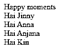
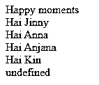

# JavaScript get 方法

> 原文：<https://www.educba.com/javascript-get-method/>

## JavaScript get 方法简介

在 Javascript 中，Map.get()方法用于返回地图中所有元素中的特定元素。该方法获取以参数形式返回的项键，并返回与作为参数传递的上述键相链接的项。如果以参数形式传递的键在映射上不可用，那么这个方法返回 unreturned。让我们深入了解 JavaScript 中获取方法的更多细节。

### 句法

下面是 JavaScript get 方法的语法。

<small>网页开发、编程语言、软件测试&其他</small>

`mobj.get(key)`

这里，

*   **mobj**——地图的对象。
*   **键**–需要搜索的键。

**返回值:**所提到的键的值。

### JavaScript 中 get 方法是如何工作的？

为了更好地了解工作，首先，让我们看看什么是地图。在 Javascript 中，Map 是一种允许存储键-值[K，V]对的数据结构，其中任何值都可以根据需要用作值或键。在映射集合中，键和值可以是任何类型，并且如果使用集合中现在存在的键将值插入到映射集合中，则旧值被新值替换。因此，map 对象中项的迭代是按照插入的顺序进行的，每次迭代都使用“for”循环返回所有的键-值对。

现在，让我们继续讨论 get 方法的工作。

首先，为地图创建一个对象。然后，使用 set()方法设置该值。最后，可以使用 get()方法检索映射中的值。如果没有元素，那么将返回 undefined。以下是相同的示例代码。

`<!DOCTYPE html>
<html>
<body>

</body>
</html>`

### JavaScript get 方法的示例

下面是一些使用 get()方法的示例程序。

#### 示例#1

Java 脚本程序在 map 中添加一个元素，并使用 get()方法检索它。

**代码:**

`<!DOCTYPE html>
<html>
<body>

</body>
</html>`

**输出:**

在这个程序中，首先，为地图创建一个对象。这里，对象是 mapobj。然后，使用 set()方法设置值“Happy moments”。然后使用 get()方法检索映射中的值。在执行代码时，快乐的时刻会显示出来。

#### 实施例 2

Java 脚本程序在地图中添加多个元素，并使用 get()方法检索它们。

**代码:**

`<!DOCTYPE html>
<html>
<body>

</body>
</html>`

**输出:**

在这个程序中，首先为地图创建一个对象。这里，对象是 mapobj。然后，使用 set()方法设置值，然后使用 get()方法检索映射中的值。最后，在执行代码时，将显示所有的值。

#### 实施例 3

Java 脚本程序，用于在 map 中添加多个元素，并使用 get()方法和一个额外的 get()方法检索它。

**代码:**

`<!DOCTYPE html>
<html>
<body>

</body>
</html>`

**输出:**

这里也为地图创建一个对象。然后，使用 set()方法设置该值。与上面的程序不同，使用一个额外的 get()方法。它将检查如果不存在任何元素，输出将是什么。在执行代码时，可以看到显示了 5 个值和一个未定义的值。也就是说，如果没有元素，那么将返回 undefined。

#### 实施例 4

用于在地图中添加多个元素并检索元素和大小细节的 Java 脚本程序。

**代码:**

`<!DOCTYPE html>
<html>
<body>

</body>
</html>`

**输出:**

首先创建地图的对象。然后，使用 set()方法设置这些值。这里，为相同的值 2 设置字符串值、布尔值和数值。在执行代码时，可以看到显示了一个弹出窗口，如示例输出所示。也就是说，在执行第一个 get 语句时，会显示 numval。

然后字符串值显示秒，如下所示。

然后，最后还检索出地图的大小。

#### 实施例 5

用于在地图中添加多个元素并检索元素和大小细节的 Java 脚本程序。

**代码:**

`<!DOCTYPE html>
<html>
<body>

</body>
</html>`

**输出:**

在这个程序中，为 name 和 count 创建了两个对象，然后使用 set()方法设置值，然后使用 get()方法检索 map 中的值。执行代码时，将显示该值。

#### 实施例 6

使用链接和检索在地图中添加多个元素的 Java 脚本程序。

**代码:**

`<!DOCTYPE html>
<html>
<body>

</body>
</html>`

**输出:**

首先创建地图的对象。然后，使用链接方法设置值。最后，在执行代码时，可以看到显示了一个弹出窗口，如示例输出所示。也就是说，在执行第一个 get 语句时，会显示 numval。

然后字符串值显示秒，如下所示。

### 结论

Map.get()方法用于返回地图中所有元素中的特定元素。在本文中，将详细解释 get()方法的不同方面，如语法、工作和示例。

### 推荐文章

这是一个 JavaScript get 方法的指南。在这里，我们讨论 get 方法如何在 JavaScript 中工作，以及代码和输出的例子。您也可以看看以下文章，了解更多信息–

1.  [JavaScript 数组切片](https://www.educba.com/javascript-array-slice/)
2.  [JavaScript 数组包含](https://www.educba.com/javascript-array-contain/)
3.  [JavaScript object.is()](https://www.educba.com/javascript-object-is/)
4.  [JavaScript encodeURI()](https://www.educba.com/javascript-encodeuri/)

