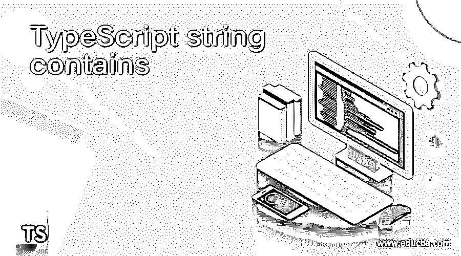

# TypeScript 字符串包含

> 原文：<https://www.educba.com/typescript-string-contains/>

## TypeScript 字符串包含简介

在打字稿中， string contains 是其中一个功能，它也是使用 includes()方法引用和实现的，该方法用于确定字符串字符是否包含指定字符串的字符。通过使用该方法，我们可以返回布尔值，如 true 和 false 语句。该方法主要包括()如果字符串值满足条件，则返回 true 值，否则返回 false，还包括() 方法是区分大小写的，我们也使用其他方法，如 search()方法，用于根据需要搜索字符串，我们可以利用这些方法来实现应用程序。

**语法:**

<small>网页开发、编程语言、软件测试&其他</small>

string 类及其默认方法用于根据用户输入(如字符串、整数格式)来访问和实现应用程序。在这些字符串包含中，有一个特性，它可以实现用户的数据，作为检查和验证字符串数据(如 substring 或其他逻辑)的最简单、最快速的方法，我们需要使用字符串默认方法来实现它。

`data type(var, local, const etc) variable name= string values;
conditional loops(variable name.includes(‘string values’))
{
---some typescript code logics depends on the requirement---
}`

以上代码是借助 includes()方法查找字符串容器逻辑的基本语法。像这样，我们可以使用其他方法，如 search()、indexof()等。根据用户需求，我们可以使用上述方法。

### string 如何包含 Typescript 中的工作？

一般来说，typescript 和 JavaScript 包含许多功能和框架，其他库实现了更多趋势的应用程序。与其他脚本语言相比，每天的更新更多。像这样的字符串是最重要的功能之一，它有许多方法来检查字符串包含像子串等。它提供了许多方法，但最重要和规范的方法包括()方法。除了 internet explorer 之外，其他现代浏览器也将使用和支持该方法。并行地，我们使用另一种方法，如 indexof()用于验证和检查类似字符串的子串索引，如果字符串不包含用户屏幕上的子串，该方法将总是返回-1。如果找到子字符串，则它返回可以是指定字符串的开头和结尾的字符的索引。includes()方法总是将第二个参数作为每个子字符串字符的起始点来操作和调用。更有甚者，像 find()这样的方法也实现了相同的概念，但方式不同，如果我们使用 includes()方法，字符串字符只能以区分大小写的格式进行验证，而不能进行验证。

### TypeScript 字符串包含的示例

下面是 TypeScript 字符串包含的例子:

#### 示例#1

`let s1 = 'Sivaraman';
let subs2 = 'Welcome To My Domain have a nice day';
let vars = new Date(5, 2, 2021, 48, 30, 1000, 1300);
if(s1.indexOf(subs2))
{
vars.setDate(30);
vars.setMonth(12);
vars.setFullYear(2020);
vars.setHours(11);
vars.setMinutes(25);
vars.setSeconds(60);
console.log("Welcome To My domain = " + vars.getFullYear());
console.log("We can get the date by using this method  = " + vars.getDate());
console.log("We can get the month by using this method= " + vars.getMonth());
console.log("We can get the current day for the month and year= " + vars.getDay());
console.log("We can get the hours details = " + vars.getHours());
console.log("We can get the minutes details = " + vars.getMinutes());
console.log("We can get the seconds details = " + vars.getSeconds());
}`

**输出:**

在上面的例子中，我们使用了类似 indexof()的 string contains 方法，通过使用这个我们可以得到指定字符串类型的索引。此外，我们可以计算当前的日期、月份、年份、时间、分钟和秒钟。在默认方法的帮助下，日期和时间是根据提到的字符串(如用户输入)计算的。s1.indexof(subs2)将用于比较基于索引的概念中的字符串字符。

#### 实施例 2

**代码:**

`var vars = "Welcome To My Domain Have a Nice Day Users";
var vars1 = "My Second Input is Entered";
var vars2 = "My Third Input is Entered";
var vars3 = "My Fourth Input is Entered";
var vars4 = "My Fifth Input is Entered";
if(vars.search(vars1)== 1)
{
console.log("(7,1): "    + vars.substr(7,1));
console.log("(-1,-5): "   + vars.substr(-1,-5));
console.log("(4,1): "      + vars1.substr(4,1));
console.log("(-5, 7): " + vars2.substr(-5,7));
console.log("(9, 4): "  + vars2.substr(9,4));
}
else{
console.log("(11, 3): "  + vars3.substr(11,3));
console.log("(18, 6): "  + vars4.substr(18,6));
}`

**输出:**

在第二个例子中，我们使用子串概念来计算给定输入中的子串。通过使用 search()方法，我们可以找到字符串字符，另外还有 substr()方法，用于调用输入字符串的正确索引和位置。与我们使用的第一个示例相同，如果评估字符串的条件包含方法 search()，如果条件为真，它将执行并在输出控制台上打印子字符串字符，否则它将退出循环并执行 else 循环条件。

#### 实施例 3

**代码:**

`var first = "Welcome To My Domain Please enter your first input";
var second = "Welcome To My Domain Please enter your second input";
var third = "Welcome To My Domain Please enter your third input";
var four = "Welcome To My Domain Please enter your fourth input";
var five = "Welcome To My Domain Please enter your fifth input";
if(first.includes('the'))
{
console.log("We have not found the mention string")
}
else if(second.includes('My'))
{
console.log("We have found the mention string")
}
else
{
console.log("Thanks for entering the inputs")
}`

**输出:**

在最后一个例子中，我们使用 includes()方法来识别提到的变量上的字符串。我们使用 if、else if 和 else 语句来验证 includes()方法中的字符串字符。

### 结论

typescript 是 javascript 的上标，因此我们在应用程序中更多地使用相同的方法和变量。就像字符串是 typescript 中最重要特性一样，它有一些默认的方法，比如我们使用 include()、search()和 find()方法计算和搜索字符串。

### 推荐文章

这是一个包含类型脚本的指南。这里我们讨论 string 如何在 Typescript 和示例中包含工作，以及代码和输出。您也可以看看以下文章，了解更多信息–

1.  [键入脚本键值对](https://www.educba.com/typescript-key-value-pair/)
2.  [打字稿设置](https://www.educba.com/typescript-set/)
3.  [TypeScript 可空](https://www.educba.com/typescript-nullable/)
4.  [打字稿类型](https://www.educba.com/typescript-typeof/)

