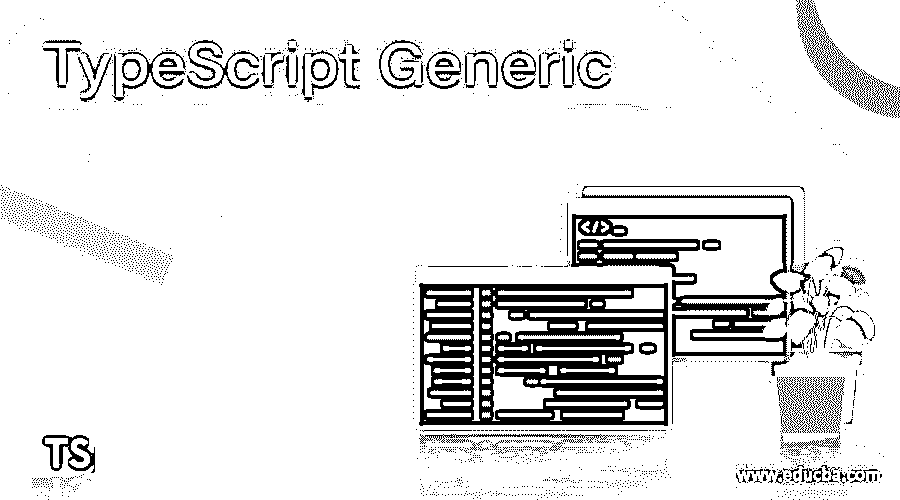
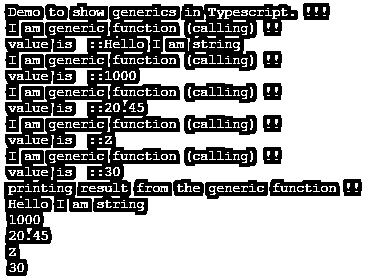

# TypeScript 泛型

> 原文：<https://www.educba.com/typescript-generic/>

## 类型脚本泛型的定义

TypeScript 中的泛型与另一种编程语言中的泛型一样常见，泛型增加了编程时代码的可重用性。通过使用泛型，我们可以向组件返回或提供任何类型的输入。这使得代码对于我们传递的任何类型的输入都是可重用的。泛型可以为几种类型的组件实现，如接口、类、函数等。在下一节中，我们将讨论更多的泛型，以便在 TypeScript 中更好地理解它们。

**语法:**

<small>网页开发、编程语言、软件测试&其他</small>

正如我们所知，泛型使组件不能用于各种类型的输入，我们也可以在 TypeScript 中有泛型接口、泛型类、泛型函数，但所有这些都有一些不同的语法。让我们看看每一个语法，以便更好地理解；

**1)通用接口:**

**语法:**

`interface interface_name<T, V> {
// logic goes here ..
}`

2)通用类:

**语法:**

`class class_name<T> {
// logic goes here ..
}`

**3)通用函数:**

**语法:**

`function function_name<T, V(parma1: T, param1: V): T {
// logic goes here ..
}`

我们可以在 TypeScript 中的上述组件中定义泛型，这样我们就可以在应用程序中的任何地方用任何类型的返回类型和输入参数轻松地使用它们。在接下来的部分中，我们将看到一个练习示例，让每个人都能详细理解语法。

### 泛型在 TypeScript 中是如何工作的？

到目前为止，我们已经知道泛型用于使代码可重用，通过使用它们，我们不需要担心我们传递的参数的类型，因为它为我们提供了向组件传递任何类型的输入参数的功能。通过使用泛型，我们可以在 TypeScript 中定义泛型类、泛型接口、泛型函数。如果没有泛型，我们必须维护许多方法，这些方法返回不同类型的输入作为结果，但是它们内部的逻辑几乎是相同的。为了更好地理解，我们可以有一个返回唯一数字的示例，如下所示；

**例如:**

`function demo(num: number): number{
// we can return number only from here
}`

在上面几行代码中，您可以看到我们接受唯一的数字并返回唯一的数字，因此该方法仅特定于数字类型的输入，但是如果我们希望从该方法返回任何类型的响应，对此我们在 TypeScript 中有“any”关键字，它允许处理这种类型的情况，但它也有一些限制。为了更好地理解，我们举一个例子如下:

**例如:**

`function demo(myvalue: any): any{
// we can return number only from here
}`

正如你在上面几行代码中看到的，我们将方法的类型设为 any，它也接受任何类型作为输入参数。通过使用这个方法，我们可以返回任何我们想要的东西，但是它也有一个限制。这个方法没有任何标识来显示它实际返回的内容。那么在这种情况下，一般进入图片。我们可以看一看；

**1)TypeScript 中的泛型函数:**我们可以通过使用< >括号将函数泛型化。在这些括号中，我们传递我们的类型。这是在 TypeScript 或任何其他编程语言中定义泛型的基本规则。

**例如:**

`function demo1<T>(param: T): T {
return param;
}`

在上面的代码中，我们在这里使用<>括号将类型设为“T”。之后，我们将结果作为参数类型返回。

**2)TypeScript 中的泛型类:**我们也可以在 TypeScript 中使一个类成为泛型。通过使任何类通用化，我们可以在应用程序的任何地方使用 while 类或组件。为了定义一个类泛型，我们使用了同样的概念<和>括号。

**例如:**

`class Demo<T> {
// logic here
}`

在上面的代码行中，我们在 TypeScript 中将类设为泛型，但是语法与在 TypeScript 中将函数声明为泛型非常相似。我们使用了<>括号来使它通用和可重用。

**3)TypeScript 中的泛型接口:**我们也可以使接口成为 TypeScript 中的泛型接口，通过使用包含类型“T”的< >括号遵循相同的语法。下面我们可以看看它在打字稿中的声明。

**例如:**

`interface Identities<T, V> {
//
}`

在上面的代码行中，我们将类型变量用作“T”和“V ”,不限制只使用“T ”,但这是一个标准。“t”代表任何编程语言中的泛型类型。

在 Typescript 中使用泛型时要记住的要点；

*   泛型使组件可在 typescript 中重用。
*   我们可以给类型参数取任何名字，但不一定要用 T 作为名字。

### 例子

1)在本例中，我们在 Typescript 中实现泛型，并尝试在同一个函数中传递几种类型的参数。它将计算值并相应地返回结果给我们。这是一个示例程序，便于初学者更好地理解它。

**代码:**

`export class Demo{
constructor() {
}
testFunction<T>(param : T): T {
console.log("I am generic function (calling) !!");
console.log( "value is::" + param);
return param;
}
}
console.log("Demo to show generics in Typescript. !!!");
let demo = new Demo();
let result1= demo.testFunction("Hello I am string");
let result2= demo.testFunction(1000);
let result3= demo.testFunction(20.45);
let result4= demo.testFunction('Z');
let result5= demo.testFunction(30);
console.log("printing result from the generic function !!");
console.log(result1);
console.log(result2);
console.log(result3);
console.log(result4);
console.log(result5);`

**输出:**

### 结论

通过在 TypeScript 中使用泛型，我们可以在整个应用程序中重用我们的类、接口和函数。我们只需要按照它的语法来使用它，它非常容易使用，也减少了我们应用程序中的重复代码。易于理解和阅读。

### 推荐文章

这是一个关于类型脚本泛型的指南。这里我们讨论定义，泛型在 TypeScript 中是如何工作的？以及代码实现的例子。您也可以看看以下文章，了解更多信息–

1.  [打字稿功能](https://www.educba.com/typescript-functions/)
2.  [打字稿数组](https://www.educba.com/typescript-array/)
3.  [打字稿操作符](https://www.educba.com/typescript-operators/)
4.  [打字稿版本](https://www.educba.com/typescript-versions/)

