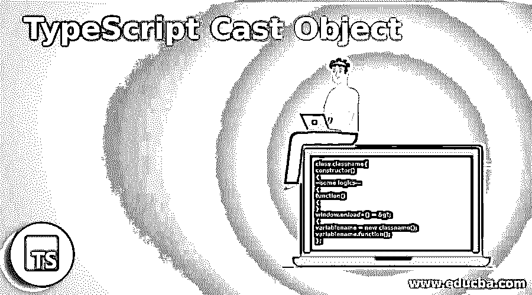
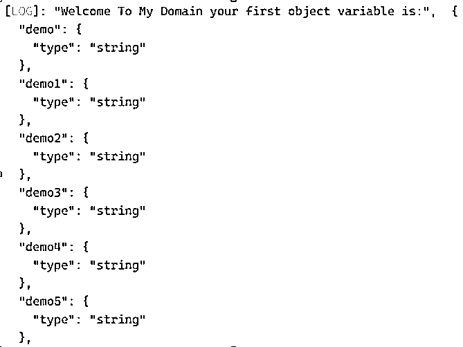
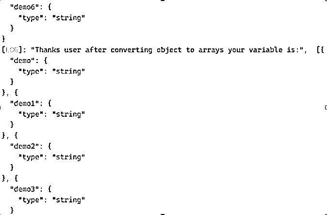
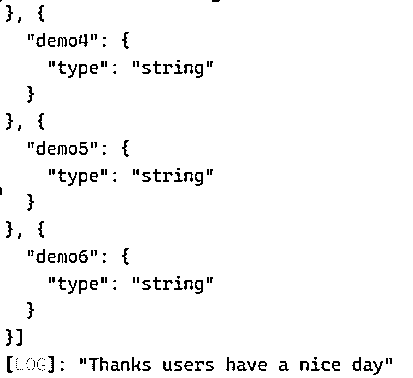
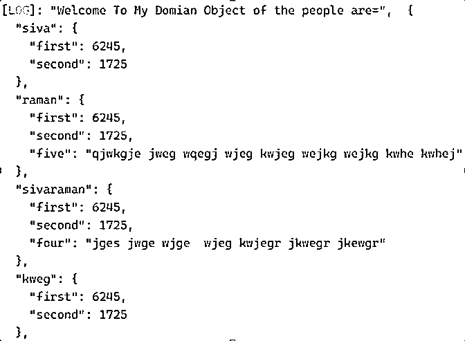
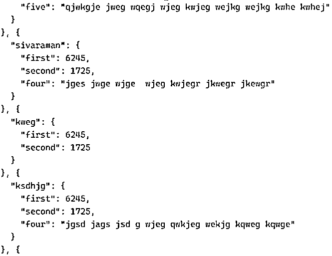

# TypeScript 转换对象

> 原文：<https://www.educba.com/typescript-cast-object/>

## TypeScript 转换对象简介

typescript 转换对象是转换一种类型的变量值的功能之一。数据类型可以是整型、字符串型、浮点型、双精度型，也可以是一些接口来转换它。如果用户已经编写了一些基于默认类的函数，我们可以通过使用对象引用来调用特定类的方法。因此，我们无法根据他们的需要在所有部分中使用对象引用。我们使用了一个 cast 对象将该对象转换成另一种带有一些引用的类型。

### TypeScript 转换对象的语法

Typescriptis 是 JavaScript 之前的一种基于 web 的语言。我们使用 typescript，它主要是指将一种数据类型转换为另一种数据类型的转换类型。这里我们使用断言来覆盖默认行为，并且类型断言是完全编译的时间结构，这是分析代码的方法之一。

<small>网页开发、编程语言、软件测试&其他</small>

**代码:**

`class classname{
constructor()
{
--some logics—
{
function()
{
}
window.onload=() = &gt;
{
variablename = new classname();
variablename.function();
};`

上面的代码是在应用程序中遍历向下转换的基本语法。在这里，我们使用一些类名来构建应用程序，我们还可以创建调用类名的实例，这样它就可以将类名从向上转换提升到向下转换。就像我们使用的 n 个类型转换将适用于这个脚本，我们可以将对象类型转换为接口类型等，这些是一些由用户端执行的频率类型转换。

### 如何在 TypeScript 中转换对象？

Typescript 通常使用 cast 操作将一种数据类型转换为另一种数据类型。我们可以将所有类型的数据从一种类型转换为另一种类型，就像转换对象是将对象类型的值转换为另一种类型的功能之一。我们也可以通过使用<>符号将一些通用类型的对象转换为自定义对象类型，或者它是一个关键字，用于将对象转换为另一种类型，如数组等。通常，对象已经声明了多个属性和它们的属性，方法是使用一些方法，比如键值对。当我们在类中使用一个对象时，变量具有数组数据类型，然后我们可以通过使用像 object.keys()、object.values()这样的键来存储和检索数据。将通过使用名为 object.keys()的方法来检索键，并且它总是返回带有键的数组返回类型。通过使用 map()方法，我们可以定义 callbackconcept 中的值，用于从后端存储和检索数据。如果我们想通过使用 to string()方法将对象转换为字符串数据类型，我们可以将对象类型更改为字符串数据类型。我们也可以通过使用 json.parse()方法将对象类型转换为 json。我们可以只获得普通对象，而不是用在类对象上。主要是我们在它创建的构造函数的帮助下使用类对象，它将用属性、构造函数和预定义的方法来定义。

### TypeScript 转换对象的示例

下面是一些例子:

#### 示例#1

**代码:**

`const eg = {
'demo': {type: 'string'},
'demo1': {type: 'string'},
'demo2': {type: 'string'},
'demo3': {type: 'string'},
'demo4': {type: 'string'},
'demo5':{type:'string'},
'demo6':{type:'string'}
};
let vars = [];
for(let vars1 in eg) {
vars.push({[vars1] : eg[vars1]});
}
console.log("Welcome To My Domain your first object variable is:", eg);
console.log("Thanks user after converting object to arrays your variable is:", vars);
function erg(labeledObj: { value: string }) {
console.log(labeledObj.value);
}
let vars2 = { key: 'demo', value: "Thanks users have a nice day" };
erg(vars2);`

**输出:**

上面的例子我们可以将对象类型转换为数组类型，这里我们可以使用带有默认关键字的函数，带有数据类型的变量。主要是我们使用字符串数据类型的所有关键这里我们使用'演示到演示 6 '这些是关键将处理类似字符串的类型，所以关键必须是唯一的 ID，所以它不接受脚本中的任何部分重复。通过使用 for 循环，我们可以迭代这些值，并将其存储在单独的变量中，就像让它是一个局部存储变量，它不会在全局类型中使用。

#### 实施例 2

**代码:**

`var example = {
siva: { first:6245, second:1725},
raman: { first:6245, second:1725,five:'qjwkgje jweg wqegj wjeg kwjeg wejkg wejkg kwhe kwhej'},
sivaraman: { first:6245, second:1725,four:'jges jwge wjge  wjeg kwjegr jkwegr jkewgr'},
kweg: { first:6245, second:1725},
ksdhjg: { first:6245, second:1725,four:'jgsd jags jsd g wjeg qwkjeg wekjg kqweg kqwge'},
kjlsldj: { first:6245, third:827,four:'jsgd34 asjkdgf jgds wjhg jweg kwjge kweg kwejg'},
}
let vars = [];
Object.keys(example).map(function(key){
vars.push({[key]:example[key]})
return vars;
});
console.log('Welcome To My Domian Object of the people are=',example)
console.log('After converting the people object to array is=',vars)`

**输出:**

在第二个例子中，我们使用了对象转换，通过使用 keys()方法，我们可以用键-值类型声明变量，键必须是唯一的，值可以是任何类型。使用 Object.keys()方法，我们可以迭代该值，并在向上转换到向下转换的过程中遍历数组元素。最后，它将返回数组作为返回类型。

#### 实施例 3

**代码:**

`class demo {
sample:string;
constructor(sample1:string) {
this.sample = sample1
}
views():void {
console.log("Welcome To My Domain:"+this.sample)
}
}
class demo1 extends demo{
example()
{
console.log("your third example this thanks")
}
}
var vars2 = new demo("Sivaraman")
console.log("Have a Nice Day user:  "+vars2.sample)
vars2.views();
function testss(d:demo) {
if (d instanceof demo1) {
d.example();
}
}`

**输出:**

最后一个例子是我们使用的带方法的类。我们可以实现父子关系，即我们必须将父类扩展到子类，并且我们已经创建了父类的实例或对象 var reference = new example()；这个对象引用是指通过使用 console.log()语句从上向下向下转换代码片段和遍历，我们可以在控制台屏幕上打印输出。

### 结论

在结论部分，typescript 是 javascript 的上标。对于 javascript 来说，这或多或少是相同的，但它将在编译时执行。类型脚本转换是一个非常重要的概念，当我们使用 javascript 时，我们不能转换变量，但是在类型脚本中，我们可以根据用户的需求从对象转换到类，从对象转换到接口，从对象转换到字符串，等等。

### 推荐文章

这是一个关于类型转换对象的指南。在这里，我们还将讨论 typescript 中的简介以及 cast 对象是如何工作的？以及不同的示例及其代码实现。您也可以看看以下文章，了解更多信息–

1.  [打字稿数组](https://www.educba.com/typescript-array/)
2.  [打字稿操作符](https://www.educba.com/typescript-operators/)
3.  [打字稿版本](https://www.educba.com/typescript-versions/)
4.  [TypeScript vs CoffeeScript](https://www.educba.com/typescript-vs-coffeescript/)
5.  [Typescript vs ES6](https://www.educba.com/typescript-vs-es6/)

