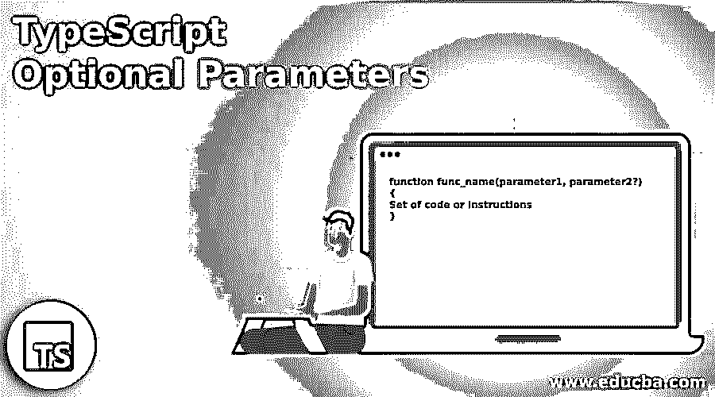
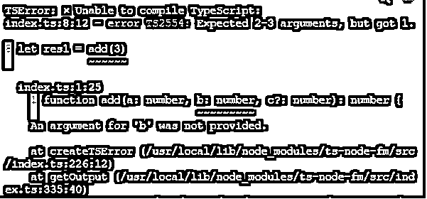

# TypeScript 可选参数

> 原文：<https://www.educba.com/typescript-optional-parameters/>

## TypeScript 可选参数简介

在 typescript 中，可选参数被定义为在调用函数时传递值时可以成为可选参数的参数，并且当函数声明了以“？”结尾的参数时，调用函数时传递的值被无错误地打印出来被标记为可选参数，并且只有这些参数的值可以被传递，也可以不被传递，因此不会引发任何错误。一般来说，可选参数顾名思义，我们可以使函数的参数可选，以便在函数被正确调用时传递值，typescript 中提供了这样的功能。

### Typescript 中可选参数的使用示例

在本文中，我们将讨论 typescript 中提供的可选参数特性。可选参数是指在调用函数时使参数可选，以便传递值而不抛出任何错误。因此，开发人员或客户可能需要也可能不需要将所有值传递给函数中声明的所有参数，因此在这种情况下，当不需要传递值时，我们可以将该参数设为可选参数。在 Typescript 中，通过追加“？”来实现可选参数在函数中的参数名末尾声明参数和没有用“？”标记的参数时也就是说，非可选参数被调用为默认参数或普通参数，必须将值传递给这些默认参数，否则它将抛出一个错误，说明参数太多，因为它将期望为函数中声明的相同数量的默认参数传递相同数量的值。我们应该注意，每当我们在函数中将任何参数作为可选参数时，函数中的任何可选参数后面都必须跟有一个或多个默认参数。因此，请始终确保至少有一个默认参数和一个可选参数，因为有时这可能会导致歧义，也可能会导致错误，就像根本没有值传递给函数一样，然后函数中的代码将不会执行，这将再次引发错误。

<small>网页开发、编程语言、软件测试&其他</small>

现在让我们看看如何声明可选参数的语法以及下一节中的示例。

**语法:**

`function func_name(parameter1, parameter2?)
{
Set of code or instructions
}`

在上面的语法中，我们可以看到在上面的函数中有两个参数，parameter1 是默认参数，parameter2 是附加了“？”这是一个可选参数。因此，其中参数 2 可以是可选的，例如，当调用函数 func_name 时，没有传递值的强制性，参数 1 的值必须传递，因为它是强制性的，否则它将引发错误，并且当函数有两个参数时，如果其中一个是可选的，则在调用函数时，只能传递一个值。我们还可以使用“typeof (parameter_name)”来检查参数是否已经初始化！= = 'undefined ' "表达式，使其成为“if”语句中的一个条件，当我们返回包含所有三个参数的结果时，有时可能会导致一个错误，说明必需参数不能作为可选参数跟随。

#### 示例#1

**代码:**

`function add(a: number, b: number, c?: number): number {
console.log("Addition of two numbers is ")
return a + b;
}
console.log("Demonstration of optional parameter in Typescript")
let res = add(2,3)
console.log(res)
//let res1 = add(3)
//console.log(res1)`

**输出:**

在上面的程序中，我们可以看到，首先我们定义了一个函数来计算两个数的相加，然后我们可能还需要计算三个数的相加，因此我们声明了 3 个参数“a”、“b”和“c”，并将最后一个参数“c”作为可选参数，其余的作为默认参数。在这个程序中，我们只返回两个数相加的结果，所以不需要第三个参数，因此我们没有在函数代码中使用它，因为它是一个可选参数。后来，当我们调用函数时，只为参数“a”和“b”传递 2 个值，并尝试使用“res”变量打印结果，该变量将添加的值打印为“5 ”,因为我们将“a”的值传递为 2，将“b”的值传递为 3，结果为“2 + 3 = 5 ”,在第一个屏幕截图中可以看到该输出。当我们试图执行只传递了一个值的函数时，将会抛出一个错误，指出应该有 2-3 个参数，但只得到一个，因为我们没有将第二个参数标记为可选参数，因此将会抛出一个错误。

现在让我们看另一个例子来演示可选参数，并在下一节的函数代码中使用这个参数。

#### 实施例 2

**代码:**

`function display(Inst_name: string, Course_name?: string): void {
console.log(" The Institution name is given as: ")
console.log(Inst_name)
console.log(" The Course provided is given as:  ")
console.log(Course_name)
}
console.log(" Demonstration of using optional parameter within the function code")
display("Educba")
display("Educba", "Python")`

**输出:**

在上面的程序中，我们可以看到我们定义了一个带有两个参数的函数“display()”,其中一个被标记为可选参数。然后，当通过传递值来调用函数时，在函数中打印两个参数的值。在这个程序中，当我们调用一个只传递一个值的函数时，它会将可选参数的值作为“未定义”并在输出中打印出来，因为在这个函数中，我们打印的是标记为可选的参数的值。因此，为了避免输出中的“未定义”值，我们可以使用“typeof(parameter_name！= =“if”语句中的“undefined”，因此可以通过如下方式更正上面的代码:

`function display(Inst_name: string, Course_name?: string): void {
console.log(" The Institution name is given as: ")
console.log(Inst_name)
if (typeofCourse_name !== 'undefined')
{
console.log(" The Course provided is given as:  ")
console.log(Course_name)
}
}
console.log(" Demonstration of using optional parameter within the function code")
display("Educba")
display("Educba", "Python")`

**输出:**

现在，在上面的屏幕截图中，我们可以看到，虽然我们没有为可选参数传递任何值，但它不会显示“未定义”,它只会打印传递给默认参数的值。

### 结论

在本文中，我们得出的结论是，Typescript 中的可选参数也是一个具有可选类型的参数，其中可以省略向这些参数传递值，并且通过附加“？”将参数标记为可选在参数的末尾。在本文中，我们看到了一个如何声明可选参数的简单示例。然后，我们还看到了当参数被标记为可选并且该值也被打印时，将会打印什么值，以及如何通过打印“未定义”的值来避免这种情况。

### 推荐文章

这是 TypeScript 可选参数指南。在这里，我们还将讨论 typescript 中可选参数的引入和工作，以及不同的示例及其代码实现。您也可以看看以下文章，了解更多信息–

1.  [打字稿数组](https://www.educba.com/typescript-array/)
2.  [打字稿操作符](https://www.educba.com/typescript-operators/)
3.  [打字稿版本](https://www.educba.com/typescript-versions/)
4.  [TypeScript vs CoffeeScript](https://www.educba.com/typescript-vs-coffeescript/)

