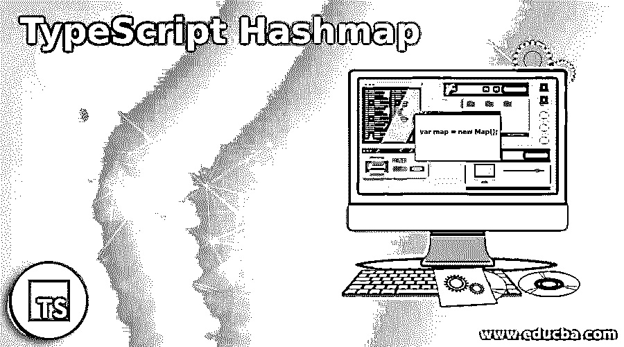
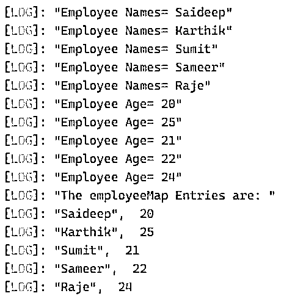
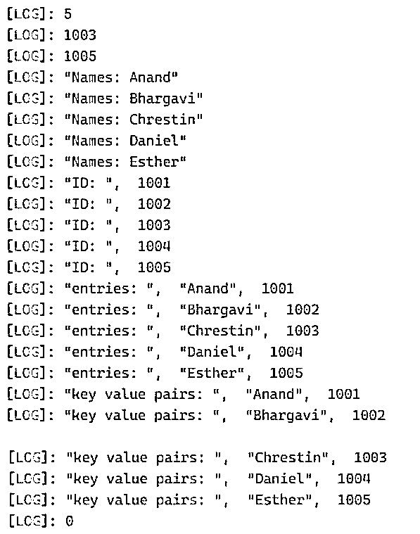

# TypeScript Hashmap

> 原文：<https://www.educba.com/typescript-hashmap/>

## TypeScript Hashmap 简介

TypeScript Hashmap 定义了它所保存的键和值的类型。TypeScript 中的 Hashmap 有一个泛型类型“map ”,为了获得更好的性能，它经常被修改。Hashmap 甚至保护类型安全。关于 TypeScript 性能，如果用户修改了 TypeScript Hashmap，对象文字会变慢。特别是，添加和移除或删除键-值对是 hashmap 上执行得最慢的操作。在 TypeScript hashmap 中删除键值对时，性能明显下降。对象文字是对象，因此删除任何键-值属性对用户来说都是忙乱的。TypeScript 中引入了专用的数据类型“Map”来解决所有这些问题。映射是定义如何使用键值对的接口；这个接口的实现“Map”是 TypeScript Hashmap。

**语法:**

<small>网页开发、编程语言、软件测试&其他</small>

下面是类型脚本映射接口的语法:

`var map = new Map();`

上面这行是用来创建地图界面的；实现这个会给我们 Hashmap。

在创建时，我们不需要在这里传递任何类型的参数，但我们需要将参数(也称为键值对)传递给下面列出的类型脚本映射方法:

*   **get(key):** 该方法用于从地图中检索数据；如果映射中不存在键，则返回 undefined。
*   **set(key，value):** 该方法用于将键值对添加到映射中。
*   **has(key):** 该方法将检查指定的键是否出现在地图中。如果密钥存在，它将返回 True，否则返回 False。
*   **delete(key):** 该方法用于移除基于键的键-值对。
*   **clear():** 该方法用于清除地图的条目。
*   **size():** 这个方法用来返回地图的大小。

TypeScript hashmap 实现是 JavaScript 的 EcmaScript 6 添加的数据结构。TypeScript 允许存储这些键值对以记住键的插入顺序。在这里，用户可以使用任何值作为键或值。

### TypeScript Hashmap 的示例

下面给出了 TypeScript Hashmap 的示例:

#### 示例#1

打字稿映射的创建。

**代码:**

`let map = new Map();
map.set('22', 'Infosys');
map.set(32, 'TCS');
map.set(false,'Google');
map.set('45','Facebook');
map.set('65','Amazon');
console.log("Employer at index 22: " +map.get('22'));
console.log("Employer at index 32: " +map.get(32));
console.log("Size of the map: " +map.size);
console.log("Deleting a value: " +map.delete('65'));
console.log( "New Size of the map: " +map.size);`

**输出:**

因此，我们在这里创建一个 TypeScript map 接口，并分配或插入一些键值对。我们使用 get 方法通过索引显示一些行。map 接口的大小，也像使用键索引删除键-值对。因此地图界面的新尺寸被改变。Hashmap 是动态类型的映射，而 map 是静态类型的映射。这实际上意味着编译器会将 map 对象视为类型 Map 之一，甚至在运行时也是如此。当 map 接口的实现是 Hashmap 时，可以实例化 Typescript Hashmap 并将其分配给 Map 变量。Hashmap 可以包含多个键值对，但不能包含重复的键。

#### 实施例 2

迭代映射键值和条目。

**代码:**

`let employeeMap = new Map();
employeeMap.set("Saideep", 20);
employeeMap.set("Karthik", 25);
employeeMap.set("Sumit", 21);
employeeMap.set("Sameer", 22);
employeeMap.set("Raje", 24);
//Iterating over map keys
for (let name of employeeMap.keys()) {
console.log("Employee Names= " +name);
}
//Iterating over map values
for (let age of employeeMap.values()) {
console.log("Employee Age= " +age);
}
console.log("The employeeMap Entries are: ");
//Iterating over map entries
for (let entry of employeeMap.entries()) {
console.log(entry[0], entry[1]);
}`

**输出:**

这里声明或创建了一个 Map 接口，并基于键、值和条目进行循环。

#### 实施例 3

Hashmap 实现了 map 接口的所有方法。

**代码:**

`let nameMap = new Map();
nameMap.set("Anand",1001);
nameMap.set("Bhargavi",1002);
nameMap.set("Chrestin",1003);
nameMap.set("Daniel",1004);
nameMap.set("Esther",1005);
console.log(nameMap.size);
console.log(nameMap.get("Chrestin"));
console.log(nameMap.get("Esther"));
//Iterating map keys
for (let item of nameMap.keys()) {
console.log("Names: "+item);
}
//Iterating map values
for (let item of nameMap.values()) {
console.log("ID: ",item);
}
//Iterating map entries
for (let item of nameMap.entries()) {
console.log("entries: ", item[0], item[1]);
}
//Destructuring on object entries
for (let [key, value] of nameMap) {
console.log("key value pairs: ", key, value);
}
// item Daniel will get deleted, will return 'true' as output
nameMap.delete("Daniel")
// Clear all the entries of the map
nameMap.clear();
console.log(nameMap.size);`

**输出:**

所以在这里我们已经研究了所有的 TypeScript hashmap 方法。

### 结论

到此，我们结束我们的主题“TypeScript Hashmap”，这是 map 接口的实现。我们已经看到了 map 的语法和 Map 方法，get、set、delete、has 等。研究了上面的 3 个例子，这肯定会帮助你在任何类型的脚本语言中实现基本的 Map。需要注意的一点是 Hashmapping 不支持重复键。

### 推荐文章

这是一个关于类型脚本散列表的指南。在这里，我们分别讨论了 TypeScript Hashmap 的介绍和例子。您也可以看看以下文章，了解更多信息–

1.  [打字稿功能](https://www.educba.com/typescript-functions/)
2.  [打字稿数组](https://www.educba.com/typescript-array/)
3.  [打字稿版本](https://www.educba.com/typescript-versions/)
4.  [打字稿 2.x](https://www.educba.com/course/typescript-2-x-tutorials/)

