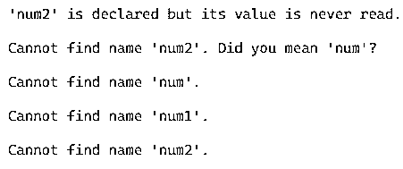
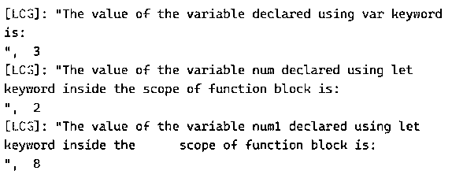
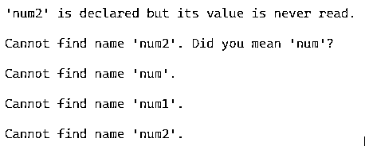

# 打字稿

> 原文：<https://www.educba.com/typescript-let/>

## 打字稿简介

TypeScript 中的变量可以使用关键字 var、const 和 let 来声明，但是使用关键字 var 时会出现一些问题，为了克服使用 var 时出现的问题。我们将关键字 let 用于类型脚本中的变量声明，其声明与 var 声明相同，但是使用 let 声明的变量具有块范围，即它们的范围被限制在声明它们的块内，并且这些变量不能在声明它们的块之外被访问或修改，并且使用 let 关键字声明的这些变量在它们在程序中被声明之前不能被读取或写入。

**在 TypeScript 中使用 let 声明变量的语法如下:**

<small>网页开发、编程语言、软件测试&其他</small>

`let variable_name;`

其中，变量名称是使用 let 关键字声明的变量的名称。

**let 关键字在 TypeScript 中声明变量的工作方式如下:**

*   TypeScript 中的变量可以使用三个关键字声明，即 var、let 和 const。
*   在处理使用 var 关键字声明的变量时有几个缺点。
*   为了克服使用 var 关键字声明变量所带来的缺点，我们使用 let 关键字来声明变量。
*   使用 let 关键字声明的变量具有块范围，即这些变量的范围限于声明它们的块。
*   使用 let 关键字声明的变量不能在声明它们的块之外被访问或修改。
*   与 var 关键字相比，使用 let 关键字声明变量的优势在于，使用 let 关键字声明的变量在程序中声明之前不能被读取或写入。

### 打字稿的例子

让我们讨论打字稿的例子。

#### 示例#1

使用 let 关键字声明一个变量并使用 var 关键字声明另一个变量的 TypeScript 程序，并演示这两个变量之间的作用域差异:

**代码:**

`//declaring a variable using var keyword
var globvar = 2;
//defining a function within which two variables num and num1 are declared using let keyword
function power()
{
let num = 10;
let num1 = Math.pow(num,globvar);
//defining a if condition statement within which a variable num2 is declared using let keyword
if(num1 >= 100)
{
let num2 = Math.sqrt(num1);
}
//displaying the value of the variables declared using var and let keywords within the scope of function
console.log("The value of the variable declared using var keyword is:\n",globvar);
console.log("The value of the variable num declared using let keyword inside the scope of function block is:\n",num);
console.log("The value of the variable num1 declared using let keyword inside the scope of function block is:\n",num1);
console.log("The value of the variable num2 declared using let keyword inside the scope of if block is:\n",num2);
}
power();
//displaying the value of the variables declared using var and let keywords outside the scope of function
console.log("The value of the variable declared using var keyword is:\n",globvar);
console.log("The value of the variable num declared using let keyword inside the scope of function block is:\n",num);
console.log("The value of the variable num1 declared using let keyword inside the scope of function block is:\n",num1);
console.log("The value of the variable num2 declared using let keyword inside the scope of if block is:\n",num2);`

**上述程序的输出如下图所示:**

上述程序产生的错误如下图所示:

在上面的程序中，我们使用 var 关键字声明了一个名为 globvar 的变量。然后我们使用 let 关键字在函数中声明另外两个变量 num 和 num1。然后在函数内部的 if 条件语句中，我们使用 let 关键字定义了另一个名为 num2 的变量。然后我们显示在函数范围内声明的变量的值，因此 globvar、num 和 num1 变量的值作为输出显示在屏幕上。因为变量 num2 是在条件语句块中声明的，所以我们收到了一个错误，即声明了 num2，但从不读取其值，并且当我们试图显示函数范围之外的变量的值时，出现了上述错误，因为它们都是使用 let 关键字声明的。

#### 实施例 2

使用 let 关键字声明一个变量并使用 var 关键字声明另一个变量的 TypeScript 程序，并演示这两个变量之间的作用域差异:

**代码:**

`//declaring a variable using var keyword
var globvar = 3;
//defining a function within which two variables num and num1 are declared using let keyword
function power()
{
let num = 2;
let num1 = Math.pow(num,globvar);
//defining a if condition statement within which a variable num2 is declared using let keyword
if(num1 >= 8)
{
let num2 = Math.sqrt(num1);
}
//displaying the value of the variables declared using var and let keywords within the scope of function
console.log("The value of the variable declared using var keyword is:\n",globvar);
console.log("The value of the variable num declared using let keyword inside the scope of function block is:\n",num);
console.log("The value of the variable num1 declared using let keyword inside the scope of function block is:\n",num1);
console.log("The value of the variable num2 declared using let keyword inside the scope of if block is:\n",num2);
}
power();
//displaying the value of the variables declared using var and let keywords outside the scope of function
console.log("The value of the variable declared using var keyword is:\n",globvar);
console.log("The value of the variable num declared using let keyword inside the scope of function block is:\n",num);
console.log("The value of the variable num1 declared using let keyword inside the scope of function block is:\n",num1);
console.log("The value of the variable num2 declared using let keyword inside the scope of if block is:\n",num2);`

**上述程序的输出如下图所示:**

上述程序产生的错误如下图所示:

在上面的程序中，我们使用 var 关键字声明了一个名为 globvar 的变量。然后我们使用 let 关键字在函数中声明另外两个变量 num 和 num1。然后在函数内部的 if 条件语句中，我们使用 let 关键字定义了另一个名为 num2 的变量。然后我们显示在函数范围内声明的变量的值，因此 globvar、num 和 num1 变量的值作为输出显示在屏幕上。因为变量 num2 是在条件语句块中声明的，所以我们收到了一个错误，即声明了 num2，但从不读取其值，并且当我们试图显示函数范围之外的变量的值时，出现了上述错误，因为它们都是使用 let 关键字声明的。

### 结论

在本文中，我们通过编程示例及其输出，使用 let 关键字通过变量的定义、语法和声明，学习了 TypeScript 中 let 关键字的概念。

### 推荐文章

这是打字稿指南。这里我们讨论定义、let 关键字在 TypeScript 中声明变量的工作以及代码实现的例子。您也可以看看以下文章，了解更多信息–

1.  [打字稿版本](https://www.educba.com/typescript-versions/)
2.  [打字稿数组](https://www.educba.com/typescript-array/)
3.  [类型脚本接口 vs 类](https://www.educba.com/typescript-interface-vs-class/)
4.  [打字稿类型](https://www.educba.com/typescript-types/)

