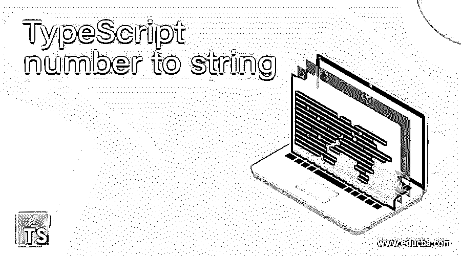
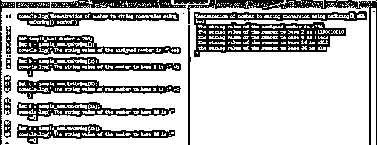

# 将数字键入字符串

> 原文：<https://www.educba.com/typescript-number-to-string/>

## 将数字键入字符串简介

在 typescript 中，数字到字符串是一种转换方法，它被定义为使用方法提供的数字数据类型将给定的数字转换为字符串，该数据类型支持浮点数，如十进制或十六进制或八进制数。一般来说，我们可以使用一个称为 to string()的数字数据类型方法来定义此方法数字到字符串的转换，该方法用于返回给定数字的字符串格式，该格式作为给定数字的指定基数的参数传递给此方法。另一种方法称为 tolocaleString()；这还将数字转换为字符串，该字符串以区域设置中指定的基数作为参数，并将表示区域设置的字符串返回到等效的数字表示形式。

**语法:**

<small>网页开发、编程语言、软件测试&其他</small>

在本文中，我们使用两种不同的方法将数字转换为字符串:

*   **toString():**

`obj_num.toString( [int_radix] )`

**参数:**

int_radix:该参数采用基本规格为 2 到 36 之间值的数字表示，其中该数字表示将采用整数格式。

toString()函数返回给定或作为参数传递的指定格式的字符串，作为数字类型的指定基值的数字表示。

*   **tolocalesring():**

`obj_num.toLocaleString( [specific_locales [, options]] )`

**参数:**

**specific_locales** :该参数用于指定给定数字需要转换到的区域设置，它将被转换为等效的或指定的区域设置。

**Options** :该参数为可选参数，用于指定 number 所属的特定区域环境。

此方法返回一个字符串，该字符串是指定数字的等效值，该值使用环境的区域设置将给定数字转换为字符串。

### 如何在 Typescript 中将数字类型转换成字符串？

在 Typescript 中，有不同的数据类型和这些类型提供的不同方法，因此，为了将特定基数的任何指定数字转换为字符串格式，Typescript 中的数字数据类型提供了一些函数，如 to string()和 toLocaleString()方法，用于数字到字符串的转换，并提供了一些示例。

**举例:**

`console.log("Demnstration of number to string conversion using toString() method")
let sample_num: number = 786;
let a = sample_num.toString();
console.log(" The string value of the assigned number is :" +a)
let b = sample_num.toString(2);
console.log(" The string value of the number to base 2 is :" +b)
let c = sample_num.toString(8);
console.log(" The string value of the number to base 8 is :" +c)
let d = sample_num.toString(16);
console.log(" The string value of the number to base 16 is :" +d)
let e = sample_num.toString(36);
console.log(" The string value of the number to base 36 is :" +e)`

**输出:**

在上面的程序中，我们可以看到；首先，我们声明了一个数字类型的变量“sample_number ”,我们将值指定为“786 ”,并使用各种基数打印这个数字的字符串值。首先，我们调用了不带参数的 toString()来打印声明时指定的相同值。然后，我们将字符串值 786 打印到基数 2，然后将字符串值打印到基数 8，将字符串值打印到基数 16，然后将字符串值 786 打印到基数 36。在上面的截图中，我们可以看到数字 786 转换为不同基数的字符串值的输出。

现在我们将在下面的程序中看到 toLocaleString()函数的另一个例子。

**举例:**

`console.log(" Demnstration of converting number to string using toLcaleString() function")
let num : number = 10667.987;
let a = num.toLocaleString();
console.log(" The string value in US English of the given number is :" +a)
let b = num.toLocaleString('de-DE');
console.log(" The string value in German of the given number is :" +b)
let c = num.toLocaleString('ar-EG');
console.log(" The string value in Arabic of the given number is:" +c)`

**输出:**

在上面的程序中，我们试图将给定的数字转换成特定的语言环境。在上面的代码中，我们打印的是美国英语、德语、阿拉伯语地区，它们都有相同的输出，而有时在德语中，它会从右侧给出逗号，在这个版本中，我们得到的是“10，667.987”，而在其他旧版本中，您会得到德语地区的输出“10.667，987”，这样我们就可以观察到逗号放在哪个数字后面。因此，使用了将数字转换为特定区域设置中的字符串的 toLocaleString()方法，上面代码的输出可以在上面的截图中看到。

在 Typescript 中，除了方法 toString()和 toLocaleString()函数将数字转换为字符串之外，还有一些其他方法，我们将在下一节中讨论这些方法。

一种方法是将空字符串附加到需要转换为字符串的数字上，然后返回一个字符串类型的对象，使用 typeof()方法检查类型，最终得到字符串形式的原始类型，并将空字符串附加到 typescript 提供“+”运算符的数字上。

**举例:**

`console.log(" Demonstration of converting number to string using append operator")
var a: number = 786
var str1: string = a + '';
console.log(" The given number's type is : " +typeof (a))
console.log(" The given number's type is after converting is : " +typeof (str1))
console.log(" The converted sting of the given number is: " +str1)`

**输出:**

在上面的程序中，我们声明了一个数字类型的变量“a ”,其赋值为“786 ”,然后声明了另一个字符串类型的变量“str1 ”,其中存储的值是一个数字，并使用“+”运算符附加了一个空字符串，如“a +”。通过这样做，当我们使用“typeof()”方法只打印“a”类型时，它将显示传递给该方法的变量的类型。因此，当只传递“a”时，它将显示一个数字，当传递“str1”时，它将显示一个字符串。所以我们可以在上面的截图中看到数字如何转换成字符串形式的输出。

### 结论

在本文中，我们得出结论，在 typescript 中将数字转换为字符串；数字数据类型提供了两种不同的方法 toString()和 toLocaleString()；我们已经看到了这些方法是如何用例子来演示的。因此，了解和学习其他用于转换为 typescript 的基本类型也是非常重要的。

### 推荐文章

这是一个将数字键入字符串的指南。这里我们讨论如何用例子和其他基本类型来演示这些方法。您也可以看看以下文章，了解更多信息–

1.  [打字稿操作符](https://www.educba.com/typescript-operators/)
2.  [打字稿类型](https://www.educba.com/typescript-types/)
3.  [打字稿版本](https://www.educba.com/typescript-versions/)
4.  [什么是 TypeScript？](https://www.educba.com/what-is-typescript/)

