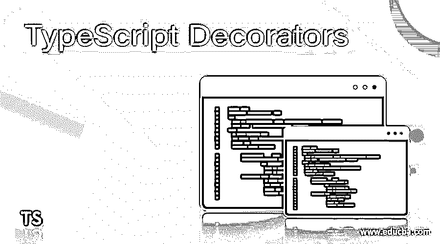
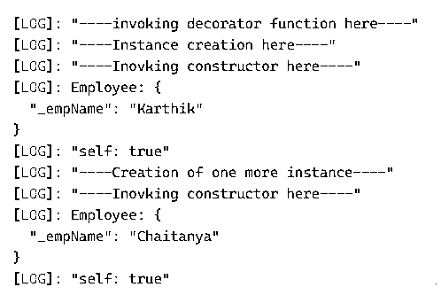

# 打字稿装饰者

> 原文：<https://www.educba.com/typescript-decorators/>

## TypeScript 装饰器简介

TypeScript Decorator 是应用于类、访问器、方法、参数或属性的声明中的一种特殊类型。这些 TypeScript Decorators 是简单的函数，在编码中以符号为前缀。我们都知道 JavaScript 是一种非常好的编程语言，它允许用户在任何平台上构建应用程序。但是，JavaScript 仍然有一些空白，TypeScript 试图填补 JavaScript 中的空白。Typescripts 用最酷的特性(如 Decorators)为动态语言增加了类型安全性。对于不同的编程语言，装饰器的定义可能不同，但是这些装饰器的存在是相同的。简而言之，TypeScript Decorator 是一种编程模式，在这种模式中，用户包装一些东西来改变行为。

**语法:**

<small>网页开发、编程语言、软件测试&其他</small>

在 TypeScript 中，没有为 Decorators 描述特定的语法。装饰器就像以 **@expression** 符号为前缀的函数一样简单，其中表达式计算出在运行时调用的函数，而没有关于声明的信息。

比如说。，我们将使用装饰器**@密封的**，如下所示；

`@sealed
function sampleEmp(target) {
// ‘target’ needs some coding here
}`

### 装饰者如何在 TypeScript 中工作？

语法主要是应用于函数的' @ '字符，

有 5 种方法可以使用装饰器，例如，

*   类别声明
*   财产
*   方法
*   参数
*   存取器

装饰者太擅长创建抽象了，他们最适合创建可复制的稳定逻辑。

**类装饰者:拥有优先级 4**

类装饰器是在类声明之前定义的，它描述了类的行为。它应用于类构造函数，用于观察、替换或修改类定义。如果 class decorator 返回一个值，那么一个类声明将被替换为构造函数。

### 例子

让我们讨论一下 TypeScript 装饰器的例子。

#### 示例#1:基本类型脚本装饰器

`// Requires enabling of `experimentalDecorators`
// http://www.typescriptlang.org/docs/handbook/decorators.html
function Self(constructorFunction: Function) {
console.log('----invoking decorator function here----');
constructorFunction.prototype.selfEmp = true;
}
@Self
class Employee {
private _empName: string;
constructor(empName: string) {
console.log('----Inovking constructor here----');
this._empName = empName;
}
}
console.log('----Instance creation here----');
let employee: Employee = new Employee("Karthik");
console.log(employee);
console.log(`self: ${employee['selfEmp']}`);
console.log('----Creation of one more instance----');
employee = new Employee("Chaitanya");
console.log(employee);
console.log(`self: ${employee['selfEmp']}`);`

**输出:**

装饰工厂(Decorator Factory):用户可以定制如何将装饰应用到一个声明中，装饰工厂就出现在图片中。它是一个函数，返回 decorator 在运行时调用的表达式。

装饰函数可以写成如下形式:

`function decorSample(value: string) {
// decorator factory
return function (target) {
// decorator
// 'target' and 'value' are used for coding...
};
}
Multiple decorators can be applied to a single declaration,
On single line; @f, @g, x
On multiple lines;
@f
@g
x`

当有多个 decorators 应用于同一个声明时，组合函数 f 和 g 被组合成(f *g)(x)等于 f(g(x))

应用多个装饰器的步骤，

1.  每个装饰器的表达式以自顶向下的方式进行评估
2.  结果以自下而上的方式被称为函数。

#### 例子#2:使用多个装饰者

`// Enabling `experimentalDecorators`
// http://www.typescriptlang.org/docs/handbook/decorators.html
function function1() {
console.log("function1(): function 1 has been evaluated");
return function (
target,
propertyKey: string,
descriptor: PropertyDescriptor
) {
console.log("function1(): function 1 has been called");
};
}
function function2() {
console.log("function2(): function 2 has been evaluated");
return function (
target,
propertyKey: string,
descriptor: PropertyDescriptor
) {
console.log("function2(): function 2 has been called");
};
}
class sampleFunct {
@function1()
@function2()
method() {}
}`

**输出:**

**属性装饰者:优先级为 3**

它是在声明属性之前定义的，非常类似于方法装饰器。属性和方法装饰器之间有一个区别，即它们不接受属性描述符作为参数，也不返回任何内容

property decorator 的表达式需要两个参数，

*   静态成员类的构造函数或实例成员类的原型。
*   另一个是会员名。

**方法装饰器:优先级为 2**

它是在方法声明之前定义的，适用于属性描述符。它用于修改、观察或替换方法定义。在声明文件中不能使用方法装饰器。

方法装饰器接受如下 3 个参数:

*   类的静态成员或类原型的实例成员的构造函数。
*   成员名称
*   成员的属性描述符

**参数装饰器:优先级为 1**

它是在参数声明之前定义的，应用于类构造函数或方法声明的函数。不能在声明的类或声明文件中使用。

参数装饰器需要如下 3 个参数:

*   类的静态成员或类原型的实例成员的构造函数
*   成员名称
*   函数参数列表中参数的索引。

**访问器装饰器:优先级为 3**

它是在声明访问器之前定义的，应用于访问器的属性描述符。它可以用来替换、修改或观察访问者的定义

访问器装饰器需要如下 3 个参数:

*   类的静态成员或类原型的实例成员的构造函数
*   成员名称
*   成员的属性描述符

#### 示例 3:访问器装饰器

`// Enabling `experimentalDecorators`
// http://www.typescriptlang.org/docs/handbook/decorators.html
function Enumerable(target: any, propertyKey: string, descriptor: PropertyDescriptor) {
//making the method enumerable
descriptor.enumerable = true;
}
class Emp {
_empname: string;
constructor(empname: string) {
this._empname = empname;
}
@Enumerable
get empname() {
return this._empname;
}
}
console.log("Accessor instance creation");
let emp = new Emp("Sandeep");
console.log("Looping string name here");
for (let key in emp) {
console.log(key + " = " + emp[key]);
}`

**输出:**

#### 例子 4:方法装饰者

`// Enabling `experimentalDecorators`
// http://www.typescriptlang.org/docs/handbook/decorators.html
const log = (target: Object, key: string | symbol, descriptor: TypedPropertyDescriptor<Function>) => {
return {
value: function( ... args: any[]) {
console.log("Arguments: ", args.join("; "));
const value = descriptor.value.apply(target, args);
console.log("NumberResult: ", value);
return value;
}
}
}
class sampleCalC {
@log
multiply(x: number, y: number) {
return x * y;
}
}
new sampleCalC().multiply(4, 6);`

**输出:**

### 打字稿装璜工的规章制度

*   Decorator 实现允许用户修饰类、参数或类内部的函数。
*   对于类方法，用户可以通过向逻辑添加前置条件和后置条件来增强装饰者的行为。
*   如果需要，用户甚至可以修饰一个方法。
*   需要记住的是，如果一个属性同时有 getter 和 setter。它们中的一个可以被装饰，这适用于两者。
*   可以在类内部修饰单个属性。

### 结论

至此，我们结束了我们的主题“TypeScript Decorators”。我们已经看到了语法及其在 TypeScript 中的使用。这是对装饰者的一个非常清晰的解释。这里的主题是 TypeScript 的一个非常有趣的特性，它允许用户在现有的逻辑之上添加行为。希望上面列出的例子能够帮助您理解每个特定装饰者的行为。谢谢！快乐学习！!

### 推荐文章

这是一个打字稿装饰者的指南。这里我们讨论一下入门，decorators 如何在 TypeScript 中工作？以及代码实现的例子。您也可以浏览我们推荐的其他文章，了解更多信息——

1.  [打字稿类型](https://www.educba.com/typescript-types/)
2.  [打字稿通用](https://www.educba.com/typescript-generic/)
3.  [打字稿版本](https://www.educba.com/typescript-versions/)
4.  [打印面试问题](https://www.educba.com/typescript-interview-questions/)

