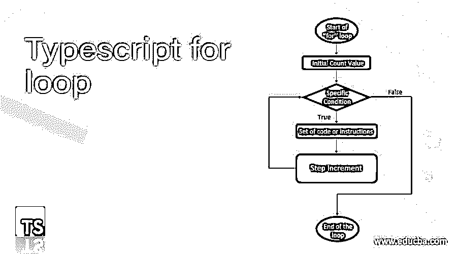
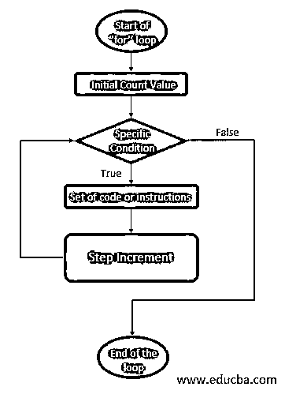
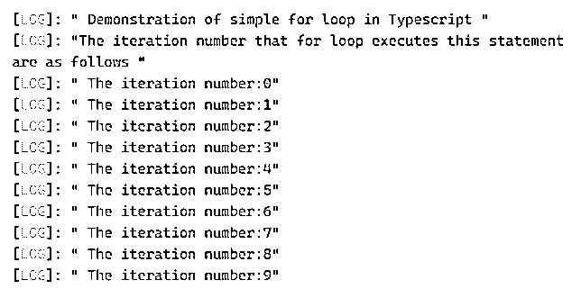
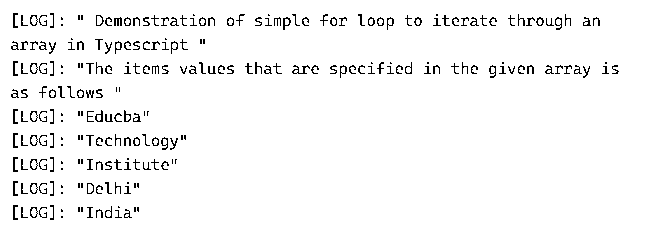

# 循环的类型脚本

> 原文：<https://www.educba.com/typescript-for-loop/>

## 循环的类型脚本简介

在 typescript 中，for 循环被定义为在 for 循环语句中以给定次数执行一组指令或代码的控制语句，在类似数组的结构(如列表、数组)中最推荐使用 for 循环中提供的条件遍历整个数组或列表并一次显示一个值。一般来说，我们可以将它定义为一个迭代语句，作为循环中声明的条件，以执行 for 循环体中的代码或语句，并指定重复执行代码。这种循环称为 for 循环。

**语法:**

<small>网页开发、编程语言、软件测试&其他</small>

在 Typescript 中，for 循环与其他编程语言具有相同的语法:

`for(initial_value, specific_condition, step_increment)`

**参数:**

*   **intial_value:** 该参数用于指定已声明变量的初始计数值，以开始迭代计数并跟踪迭代。因此，代码从“for”循环中给定的初始计数值开始执行。
*   **specific_condition:** 该参数用于指定逻辑条件，如果满足该条件，则执行循环内的代码。
*   **step_increment:** 该参数用于指定当条件满足时重复该组代码的次数，该条件指定了根据给定的条件在指定的初始次数后必须重复多少次，并且该参数的值将在每次迭代后改变。

此循环将使用 return 语句来中断循环，它用于避免编译时错误，因此此循环返回值集或值数组，其中代码在“for”循环中执行。在 typescript 中,“for”循环还有另外两种变体，如“for…of”循环和“for…in”循环，后者主要用于循环一组项中的值，这些项可以包括类似数组的对象，如 set 和 map 类型 in for…of 和 in for…in 用于循环对象属性。typescript 还提供了一个名为 foreach()的数组方法，其工作方式类似于“for”循环，但用于遍历指定数组中的每一项。

**流程图:**

在上面的内容中，我们可以看到“for”循环如何在 typescript 中工作以及所提供的条件的蓝图。这种类型的蓝图被称为“for”循环的流程图，它显示了 typescript 中“for”循环的工作或流程的图形表示，还简要介绍了任何程序的任何“for”循环代码的算法。

### “for”循环在 Typescript 中是如何工作的？

“for”循环如何在 Typescript 中工作，以及下一节中的示例演示:

在 typescript 中,“for”循环的工作方式与任何其他编程语言相同。“for”循环是一个控制流语句，用于在迭代中执行在“for”循环中编写的一组特定代码，该循环第一语句由 3 个不同的表达式组成，在第一部分中声明为用于定义迭代次数，从该迭代开始初始化变量，并且仅执行一次；第二部分用于指定条件，以在满足条件时执行循环中的代码(如果为真，则执行代码，否则循环不进入循环体)，如果条件失败，则“for”循环终止，第三部分用于声明迭代计数的增量计数，该计数在“for”语句中指定的每次迭代之后递增初始计数。上面的条件被反复执行，其中“for”循环继续执行这组代码，直到条件失败,“for”循环从指定的迭代中出来，并且循环终止。

### 例子

现在让我们在下面的例子中演示“for”循环的工作原理:

#### 示例#1

`console.log(" Demonstration of simple for loop in Typescript ")
console.log("The iteration number that for loop executes this statement are as follows ");
for(let n = 0; n <= 9; n++){
console.log(" The iteration number:"+ n);
}`

**输出:**

在上面的程序中，我们通过声明变量“n”定义了“for”循环，其中我们将该变量的值初始化为“0 ”,然后我们指定了一个条件，即从变量“n”的 0 到小于或等于 9 的值进行迭代，并且在每次迭代之后,“n”的值仅递增一次，并且每个值都被打印，直到它达到值“9”。因此，在上面的代码中，可以在屏幕截图中看到输出，它打印了“for”循环在循环内执行语句的迭代次数，然后在打印到变量值为“9”时终止。

现在让我们考虑另一个例子，其中“for”循环用于迭代数组中的每一项。

#### 实施例 2

`console.log(" Demonstration of simple for loop to iterate through an array in Typescript ")
console.log("The items values that are specified in the given array is as follows ");
let arr1 = ["Educba", "Technology", "Institute", "Delhi", "India"];
for (let i = 0; i < arr1.length; i++) {
let arr_item = arr1[i];
console.log(arr_item);
}`

**输出:**

在上面的程序中， 我们可以看到，我们首先声明了一个包含 5 个项目的数组，并将其赋值给变量“arr1 ”,然后通过迭代每个元素来打印数组中的项目或元素，我们使用“for”循环，从 1 开始初始化迭代计数，1 表示给定数组中的索引号，从索引 0 开始打印项目，直到数组结束，这是通过使用 array 方法完成的 称为 length()，它将获取项目，直到给定的数组长度，这里数组长度是 5。 为了打印每个元素，我们声明了数组及其索引，比如 arr1[i]。

### 结论

在本文中，我们认为“for”循环是一个控制语句，用于通过遍历给定的集合来打印重复的项目。在这篇文章中，我们可以看到有 for…in 和 for..类似于 foreach 循环的 for 循环的变体。它们还可以遍历一组项，以循环遍历值和对象属性。

### 推荐文章

这是一个循环类型脚本的指南。这里我们讨论定义，在 Typescript 中“for”循环如何工作，以及代码实现的例子。您也可以浏览我们推荐的其他文章，了解更多信息——

1.  [打字稿字母](https://www.educba.com/typescript-let/)
2.  [打字稿类型](https://www.educba.com/typescript-typeof/)
3.  [类型脚本转换对象](https://www.educba.com/typescript-cast-object/)
4.  [打字词典](https://www.educba.com/typescript-dictionary/)

