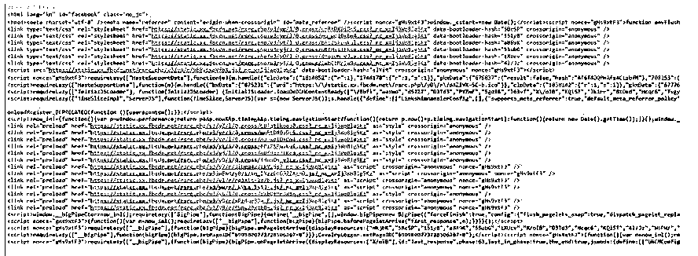

# TypeScript HTTP 请求

> 原文：<https://www.educba.com/typescript-http-request/>

## TypeScript HTTP 请求简介

TypeScript 中的 http 请求是为了从外部 web 服务器获取数据或将数据发送到外部 web 服务器。可以使用一个名为 fetch() function 的函数发出这样的请求，这个 fetch 函数有两个参数:URL 和 options，其中 URL 是我们试图访问的网站的 URL。options 参数有两个值，GET 和 POST，其中 GET 用于获取指定了 URL 的网站的内容，POST 用于将内容发布到指定了 URL 的网站，options 的默认值为 GET。

**在 TypeScript 中声明 HTTP 请求的语法:**

<small>网页开发、编程语言、软件测试&其他</small>

`fetch(URL, options);`

其中 URL 是我们尝试访问的网站的 URL，options 参数采用两个值 GET 和 POST，其中 GET 用于获取指定了 URL 的网站的内容，POST 用于将内容发布到指定了 URL 的网站，options 的默认值为 GET。

### 在 TypeScript 中处理 HTTP 请求

*   TypeScript 中的 http 请求是为了从外部 web 服务器获取数据或将数据发送到外部 web 服务器。
*   TypeScript 中的 http 请求可以使用名为 fetch() function 的函数来放置。
*   fetch()函数接受两个参数，即 URL 和选项，并返回一个响应对象。
*   使用 fetch()函数接收的响应对象包含有用的信息，如 text()、headers、json()、status、statusText 等。
*   当作为参数传递给 fetch 函数的选项的值是 POST 时，我们有几个使用该参数的选项:主体、方法和头。

### TypeScript HTTP 请求的示例

下面给出了 TypeScript HTTP 请求的示例:

#### 示例#1

TypeScript 程序，通过将网站的 URL 作为参数传递给 fetch 函数，然后将网站的响应转换为文本格式并将其打印为屏幕输出，从而向网站发出简单的 http GET 请求。

**代码:**

`//node fetch module is loaded to be able to make use of fetch function
const fetch = require('node-fetch');
//the URL of the website whose contents are to be fetched is passed as the parameter to the fetch function
fetch('https://facebook.com')
//then() function is used to convert the contents of the website into text format
.then(result => result.text())
//the contents of the website in text format is displayed as the output on the screen
.then(textformat => console.log(textformat))`

**输出:**

在上面的程序中，加载了节点获取模块，以便能够使用获取函数。然后，要获取其内容的网站的 URL 作为参数传递给 fetch 函数。然后使用()函数将网站内容转换成文本格式。然后，文本格式的网站内容作为输出显示在屏幕上。

#### 实施例 2

TypeScript 程序，通过将网站的 URL 作为参数传递给 fetch 函数，向网站发出简单的 http POST 请求，然后将发布到网站的内容转换为 json 格式，并将其作为输出打印在屏幕上。

**代码:**

`//node fetch module is loaded to be able to make use of fetch function
const fetch = require('node-fetch');
//the content to be posted to the website is defined
let todo = {
userId: 01234,
title: "SAP BW Hana Consultant",
completed: True
};
//the URL of the website to which the content must be posted is passed as a parameter to the fetch function along with specifying the method, body and header
fetch('https://jsonplaceholder.typicode.com/todos', {
method: 'POST',
body: JSON.stringify(todo),
headers: { 'Content-Type': 'application/json' }
})
//then() function is used to convert the posted contents to the website into json format
.then(result => result.json())
//the posted contents to the website in json format is displayed as the output on the screen
.then(jsonformat=>console.log(jsonformat));`

**输出:**

在上面的程序中，加载了节点获取模块，以便能够使用获取函数。然后定义要发布到网站的内容。然后，内容必须发布到的网站的 URL 作为参数传递给 fetch 函数，并指定方法、主体和头。然后使用()函数将发布到网站的内容转换成 json 格式。然后，以 json 格式发布到网站的内容将作为输出显示在屏幕上。

### 规章制度

下面给出了 TypeScript 中 HTTP 请求的规则和规定:

*   TypeScript 中的 http 请求可以通过使用名为 fetch() function 的函数来放置。
*   必须获取其内容或向其发布内容的网站的 URL 应该作为参数传递给 fetch()函数。
*   默认情况下，fetch 函数的第二个参数选项是 GET 方法，但是如果您想将某些内容发布到网站，那么有必要在 fetch()函数中将 post 方法作为一个选项参数。
*   获取的网站内容必须转换为文本格式，才能显示为程序的输出。
*   要发布到网站的内容必须转换成 json 格式，才能显示为程序的输出。

### 推荐文章

这是一个键入 HTTP 请求的指南。这里我们讨论 HTTP 请求在 TypeScript 中的介绍、工作原理和例子。您也可以看看以下文章，了解更多信息–

1.  [打字稿字母](https://www.educba.com/typescript-let/)
2.  [打字稿类型](https://www.educba.com/typescript-typeof/)
3.  [类型脚本转换对象](https://www.educba.com/typescript-cast-object/)
4.  [打字稿通用](https://www.educba.com/typescript-generic/)

