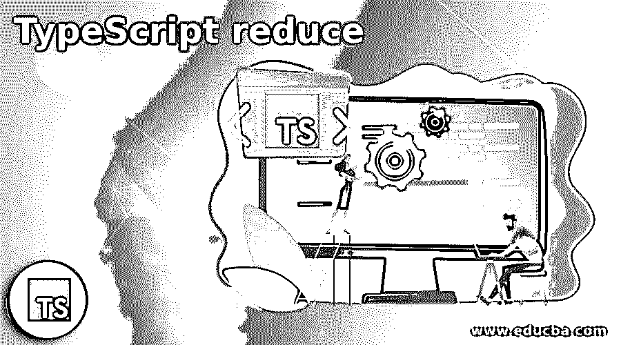

# 打字稿减少

> 原文：<https://www.educba.com/typescript-reduce/>

## TypeScript reduce 简介

每当需要通过从左边开始对数组的两个元素执行一次函数来将数组中存储的多个值缩减为单个值时，我们就使用 TypeScript 中称为 reduce function 的函数。它采用两个参数，即一个函数以及将被一次又一次回调的参数，然后来自该函数的返回值在下一次回调中充当该函数的第一个参数，并且该 reduce 函数在一次考虑两个元素的情况下对数组的所有元素执行该函数之后返回单个值作为结果。

**在 TypeScript 中声明 reduce 函数的语法:**

<small>网页开发、编程语言、软件测试&其他</small>

`reduce(function_that_is_called_again_and_again(parameter1, parameter2)
{
return parameter1
}`

其中 function _ that _ is _ called _ again _ and _ again 是带有参数 parameter 1 和 parameter2 的函数，该函数将被反复调用，直到遍历完数组的所有元素，然后该函数的返回值将作为下一次回调函数的第一个参数。

### 打字稿中 reduce 函数的使用

*   TypeScript 中的数组用于以线性方式存储相似数据类型的不同值。
*   如果需要将数组中存储的多个值缩减为一个值，我们可以使用 TypeScript 中的 reduce 函数。
*   reduce 函数从左到右一次对数组中的两个值执行 or 运算。
*   reduce 函数有两个参数，一个是函数，另一个是函数的返回值，在下次回调时作为函数本身的第一个参数。
*   作为参数传递给 reduce 函数的函数不断重复执行，直到遍历完数组的所有元素。
*   reduce 函数返回对数组元素执行运算后得到的单个值。

### TypeScript reduce 的示例

以下是 TypeScript reduce 的示例:

#### 示例#1

TypeScript 程序演示 reduced function，将数组中的两个元素一次相乘，求出数组中所有元素的乘积，并将结果值作为输出显示在屏幕上。

**代码:**

`//defining an array called arrayname to store the elements in the array
var arrayname = [ 1, 2, 5, 10 ];
//defining a variable called result to store the return result from reduce function whose firs   t parameter is a function to compute the product of two numbers and their return result is passed as a first parameter to the function itself
var result = arrayname.reduce(function(firstparam, secondparam)
{
return firstparam * secondparam;
});
//displaying the result of the reduce function as the output on the screen
console.log('The product of all the elements of the array is: ');
console.log( result );`

**输出:**

在上面的程序中，定义了一个名为 arrayname 的数组来存储数组中的元素。定义了一个名为 result 的变量来存储归约函数的返回结果，归约函数的第一个参数是一个计算两个数乘积的函数。它们的返回结果作为第一个参数传递给函数本身。然后 reduce 函数的结果作为输出显示在屏幕上。

#### 实施例 2

TypeScript 程序演示 reduced function，将数组中的两个元素一次除法，找出对数组中所有元素执行除法的结果，并将结果值作为输出显示在屏幕上。

**代码:**

`//defining an array called arrayname to store the elements in the array
var arrayname = [ 16, 4, 2 ];
//defining a variable called result to store the return result from reduce function whose firs   t parameter is a function to compute the division of two numbers and their return result is passed as a first parameter to the function itself
var result = arrayname.reduce(function(firstparam, secondparam)
{
return firstparam / secondparam;
});
//displaying the result of the reduce function as the output on the screen
console.log('The result of performing division on all the elements of the array by taking two elements at once is:');
console.log( result );`

**输出:**

在上面的程序中，定义了一个名为 arrayname 的数组来存储数组中的元素。定义了一个名为 result 的变量来存储归约函数的返回结果，归约函数的第一个参数是计算两个数的除法的函数。它们的返回结果作为第一个参数传递给函数本身。然后 reduce 函数的结果作为输出显示在屏幕上。

### 规章制度

下面给出了在 TypeScript 中使用 reduce 函数的规则和规定:

*   reduce 函数的参数必须是一个回调函数，其返回结果作为函数本身的第一个参数。
*   reduce 函数只能用于包含多个值的数组。
*   reduce 函数一次只能对数组中的两个元素执行该函数。
*   reduce 函数可以从左到右一次对数组的两个元素执行该函数。
*   reduce 函数的结果值可以是任何数据类型，如 float、double 等。
*   在无法对数组元素执行函数的情况下，结果值为无穷大。

### 推荐文章

这是一个减少打字稿的指南。在这里，我们讨论了打字稿中 reduce 函数的介绍、工作原理、示例、规则和规程。您也可以看看以下文章，了解更多信息–

1.  [打字稿字母](https://www.educba.com/typescript-let/)
2.  [打字稿类型](https://www.educba.com/typescript-typeof/)
3.  [类型脚本转换对象](https://www.educba.com/typescript-cast-object/)
4.  [打字稿数组](https://www.educba.com/typescript-array/)

