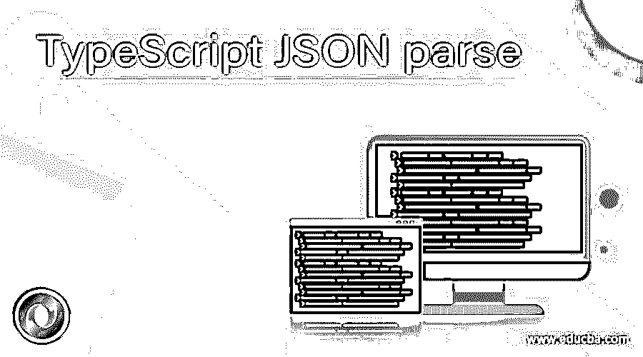
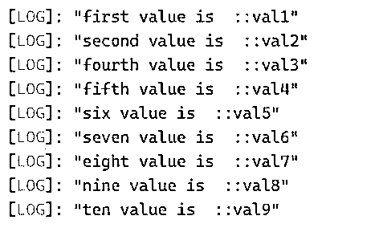

# TypeScript JSON 解析

> 原文：<https://www.educba.com/typescript-json-parse/>

## TypeScript JSON 解析简介

要将我们的 JSON 字符串转换成一个对象，我们可以使用 JSON 解析方法。我们知道 TypeScript 是 JavaScript 的下标，所以我们可以使用它的方法。JSON parse 方法是一个 JavaScript 方法，但是可以像其他函数一样在 TypeScript 中轻松使用。要在 TypeScript 中使用 JSON parse 方法，我们不需要包含任何外部库；为此，我们可以在任何需要的地方直接使用它。

**语法:**

<small>网页开发、编程语言、软件测试&其他</small>

正如所看到的，它用于将字符串解析成一个对象；此外，它在标准 TypeScript 库中也是可用的。

`JSON.parse(your_variable);`

正如您在上面 JSON 解析方法的语法中看到的，它在这里将一个参数作为输入参数，然后在 TypeScript 中将它转换为对象。

**举例:**

**代码:**

`JSON.parse('{your json here}');`

### JSON 解析方法如何在 TypeScript 中工作？

我们已经知道，JSON parse 方法用于将字符串解析成 TypeScript 中的对象。它是 JavaScript 中可用的方法。JSON 的字符串应该遵循 JSON 定义的标准，就像它们应该在键值对中一样。那么只有它能够将它们转换成指定的对象。在这一节中，我们首先将看到 JSON 解析方法签名的细节，见下文；

**方法签名:**

**JSON.parse(text[，reviver]):** 这是 javascript 文档定义的解析方法的签名。如我们所见，这里有两个参数。但是第二个参数是可选的。第一个参数是 TypeScript 中键值对的 JSON 字符串。

#### 1.文本

这个参数应该是字符串 JSON。

**举例:**

**代码:**

`'{"key":value}'`

您的 JSON 字符串应该是这样的。那么只有它会将它们解析到对象中；否则，我们将在运行时收到 TypeScript 中的异常。

#### 2.返回类型

这个解析方法可以返回任何东西:字符串、数组、对象、null、数字、布尔值等等。

#### 3.使复活的人

这是 JSON parse 方法的第二个参数，在 TypeScript 中是完全可选的。

现在让我们看一个例子来理解它的内部工作。

**举例:**

**代码:**

`const myjson = '{"key1":"val1", "key2":"val2"}';
const result = JSON.parse(myjson);
let mvalue = result.key2
console.log(mvalue);`

在上面几行代码中，你可以看到，我们没有使用任何外部库来实现 TypeScript 中的 JSON parse 方法；它已经在标准库中可用。首先，我们尝试创建 JSON 的字符串。这应该是键值对。我们将该字符串命名为‘myjson’；之后，我们调用 JSON.parse()方法，在这个方法中，我们传递我们创建的变量。

所以现在它将测试所有的语法并验证传递的 JSON 是否正确。在使用或准备它时，它应该包含单独的 commons 和单引号。如果 JSON 不正确，它将在解析字符串时抛出一个运行时异常，指出 syntaxError。在这一行之后，我们有我们的 object，它包含作为对象的 json，它们的键和值可以通过它们的名字来访问。要访问任何对象值，我们可以使用下面的语法。

**举例:**

**代码:**

`result_object.name_of_key;`

正如您在上面几行代码中看到的，我们可以通过仅使用键值的名称来访问键值。所以这也使得访问 oj 对象变得容易。

### TypeScript JSON 解析示例

下面是提到的例子:

在这里，我们试图在字符串 json 中定义几个键和值。之后，我们在 Typescript 中将它转换为一个对象。之后，只有我们可以从可用的 JSON 对象中访问对象值。

**代码:**

`const myjson = '{"key1":"val1", "key2":"val2", "key3":"val3", "key4":"val4", "key5":"val5", "key6":"val6", "key7":"val7", "key8":"val8", "key9":"val9", "key10":"val10", "key11":"val11"}';
const result = JSON.parse(myjson);
let mvalue1 = result.key1
let mvalue2 = result.key2
let mvalue4 = result.key3
let mvalue5 = result.key4
let mvalue6 = result.key5
let mvalue7= result.key6
let mvalue8 = result.key7
let mvalue9 = result.key8
let mvalue10 = result.key9
let mvalue11 = result.key10
console.log( "first value is  ::" +mvalue1);
console.log( "second value is  ::" +mvalue2);
console.log( "fourth value is  ::" +mvalue4);
console.log( "fifth value is  ::" +mvalue5);
console.log( "six value is  ::" +mvalue6);
console.log( "seven value is  ::" +mvalue7);
console.log( "eight value is  ::" +mvalue8);
console.log( "nine value is  ::" +mvalue9);
console.log( "ten value is  ::" +mvalue10);`

**输出:**

### 【JSON 解析方法的规则和规定

在 TypeScript 中使用 JSON parse 方法时，需要遵循一些规则:

1.它有两个参数，但第二个参数是可选的，第一个参数接受需要解析的输入。

2.在方法内部传递要解析的字符串时，我们应该非常小心。

*   首先，它不应该在 JSON 字符串中包含单引号，这会使 JSON 无效并且难以解析。正如你在下面一行代码中看到的，我们正试图将我们的键放在“单引号”中，这样会使字符串 json 无效。

**代码:**

`error : "{'key': some_value}"`

3.此外，它不应该在输入之间包含尾随的 commons。

*   **'【300，700，800，】':**像这样，就不应该包含逗号；否则会使输入无效，解析时会抛出 syntaxError。

### 结论

通过使用 JSON 解析方法，我们可以很容易地解析 JSON 字符串。此外，它将使使用对象和访问其值变得容易。当我们有来自后端的响应时，这可能是有用的，我们希望将它解析到某个对象并访问它们的值。

### 推荐文章

这是一个关于 TypeScript JSON 解析的指南。这里我们讨论一下引言，JSON parse 方法如何在 TypeScript 中工作？例子，规则和条例。您也可以看看以下文章，了解更多信息–

1.  [打字稿字母](https://www.educba.com/typescript-let/)
2.  [打字稿类型](https://www.educba.com/typescript-typeof/)
3.  [打字稿通用](https://www.educba.com/typescript-generic/)
4.  [什么是 TypeScript？](https://www.educba.com/what-is-typescript/)

