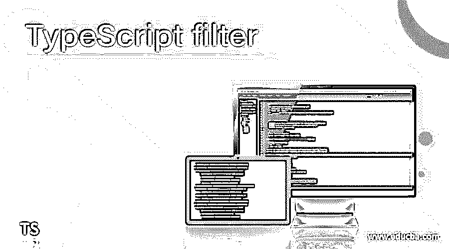

# 类型脚本过滤器

> 原文：<https://www.educba.com/typescript-filter/>

## Typescript 筛选器简介

在 Typescript 中，Filter()是一个内置的数组方法，它被定义为通过返回给定数组上新创建的子数组中所有元素值的数组来创建包含给定数组元素子集的新数组或元素集的方法。一般来说，filter()方法是一种数组方法，用于从给定的数组中仅提取少数通过测试的元素，并且该方法不支持在不改变原始数组的情况下对给定数组中的这些元素没有值的数组元素执行任何函数。

**语法:**

<small>网页开发、编程语言、软件测试&其他</small>

`var arr1 = array.filter(callback[, thisObject])
{
Return subset of given array arr1
}`

在上面的语法中，filter()方法应用于我们需要提取给定数组元素的数组，并返回数组的这个子集，它采用两个参数。

**参数:**

**回调:**该参数由一个函数组成，用于测试数组中的每个元素。

**thisObject:** 该参数在执行上述参数时使用，是一个对象。

该数组方法返回新数组，新数组由给定数组上使用该方法筛选出的部分数组元素组成，只有通过回调参数中给定的测试，才会返回子数组中的元素；否则，如果为 false，它将返回一个空数组。

有时在上面的语法中，参数 callback 有 3 个以上的参数，例如当前值，它保存给定数组的当前元素值，第二个参数是指示给定数组中元素的索引的索引，这是可选的，第三个参数是用于调用该过滤函数的数组。

### filter()方法在 Typescript 中如何工作并举例说明？

在 typescript 中，filter()方法是一个内置的数组函数，用于筛选数组中的给定元素集，以获取给定数组的元素子集，filter()方法的工作方式如下:

首先，将该方法应用于定义或声明的数组，需要从给定数组中提取元素集。该函数接受一个回调参数，该参数为数组中的每个元素调用，然后它创建一个新数组，该数组包含回调函数返回的元素；如果为真，否则返回一个空数组。该回调函数进一步调用每个元素的值、每个元素的索引以及被选择用于遍历数组的数组对象，其中所有这些都是可选的，除了每个元素的值，因为它用于过滤数组中的某些元素。

其次，filter()函数接受另一个可选的参数，但接受回调函数的“this”值；否则，它将把“未定义”作为值。并且 filter()函数遍历整个数组，其中在 filter()函数应用于数组之前，数组中的一系列元素已经被处理，但是如果原始数组是后来追加的，并且该函数是在追加之后应用的，则 filter()函数将不会遍历这些新元素，因为回调函数将不会被调用。

现在让我们用几个例子来看看这个 filter()函数的演示:

**举例:**

`console.log(" Demonstration of filter() function in Typescript ")
function smallval(ele_val)
{
return ele_val <= 40
}
let arr1 = [56, 29, 30, 11, 48, 99] console.log(" The given array to filter is as follows: ")
console.log(arr1)
let a = arr1.filter(smallval)
console.log(" The filtered array after applying the filter() function is as follows:")
console.log(a)`

**输出:**

在上面的程序中，我们可以看到我们声明了一个数组“arr1”，其中包含 6 个元素。然后我们可以看到我们定义了一个函数“smallval ”,我们将数组的元素值传递给这个函数，这个函数将返回值小于或等于 40 的元素。然后，我们使用 filter()函数来过滤值小于或等于 40 的元素，因为我们将函数“smallval”作为参数(回调)传递给 filter()函数，然后我们只打印给定数组中经过过滤的元素。在上面给出的数组“arr1”中，只有 3 个元素的值小于 40，因此创建的新数组只包含 3 个元素。输出可以在上面的截图中看到。

现在让我们看另一个例子，它使用一个过滤函数在一个数组中使用字符串的任何部分进行搜索，这可以用于在大量数据中排列或查找字符串。

**举例:**

`console.log(" Demonstration of filter() function for searching particular string ")
let a = ['Python', 'Javascript', 'Java', 'Ruby', 'Perl', 'Fortan'] console.log(" The given array is as follows: ")
console.log(a)
function func_str(arr1, b) {
return arr1.filter(function(ele_val) {
return ele_val.toLowerCase().indexOf(b.toLowerCase()) !== -1
})
}
console.log(" The filtered array from the above given array is as follows: ")
console.log(func_str(a, 'Java'))
console.log(func_str(a, 'ab'))`

**输出:**

在上面的程序中，我们可以看到我们声明了一个包含 6 个值的数组，这些值作为编程语言，这个数组首先被打印，然后我们创建了一个函数，在这个函数中，我们在给定字符串的每个元素中查找包含“Java”的字符串作为字符串的一部分。然后，我们将这个函数作为一个参数传递给 filter()函数，其中只有元素值，我们可以看到，我们只返回那些字符串中包含“Java”的元素，这样只打印了两个元素。然后，我们尝试打印带有字符串“ab”的元素，作为给定数组元素值中字符串的一部分，但是它返回一个空字符串，因为给定数组中没有这样的字符串。

### 结论

本文的结论是 filter()函数是一个内置函数，用于过滤给定的数组。在本文中，我们看到了如何在不同的例子中声明和使用 filter 函数。Typescript 中的 filter()函数仅在高于 2 的 Typescript 版本中受支持，并且在不同的浏览器中使用时，兼容率也不同。

### 推荐文章

这是 TypeScript 过滤器的指南。在这里，我们通过示例和输出来讨论 filter()方法在 Typescript 中是如何工作的。您也可以看看以下文章，了解更多信息–

1.  [打字词典](https://www.educba.com/typescript-dictionary/)
2.  [打字稿通用](https://www.educba.com/typescript-generic/)
3.  [打字稿字母](https://www.educba.com/typescript-let/)
4.  [如何安装 Typescript](https://www.educba.com/install-typescript/)

