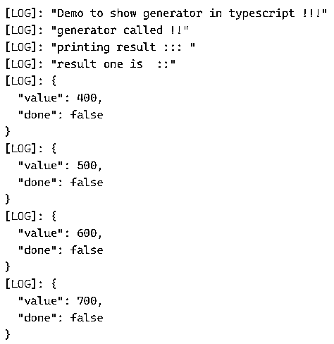
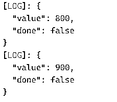

# 打字稿生成器

> 原文：<https://www.educba.com/typescript-generator/>

## 类型脚本生成器简介

在 TypeScript 中，我们有一种特殊类型的函数，称为生成器。通过使用 TypeScript 中的生成器，我们可以控制 TypeScript 中函数的执行。它提供了比 TypeScript 中的普通函数更多的额外功能。发生器可以恢复、停止、让出功能的执行；这完全取决于来电者的选择。简而言之，通过在 TypeScript 中使用生成器，我们可以控制应用程序中的函数流。在下一节中，我们将更详细地讨论生成器的内部工作，以便在我们的应用程序中更好地使用它。

**语法**

<small>网页开发、编程语言、软件测试&其他</small>

如前所述，生成器只不过是 TypeScript 中一种特殊类型的函数，它的执行完全依赖于函数的调用者。让我们看看它的语法，以便更好地理解它在应用程序中的实现；见下文；

`function* function_name() {
// our logic goes here ..
}`

正如你在上面几行代码中看到的，我们在 TypeScript 中声明了使用生成器的语法；为此，我们在 TypeScript 中的 function 关键字后使用星号。在这里，我们可以像 TypeScript 中的其他普通函数一样简单地定义函数体。让我们来看一个初学者的练习语法，以便更好地使用，见下文；

`function* myGenrator() {
// logic 1
// logic 2
}`

在下一节中，我们将详细了解它的内部工作原理，在这里我们将看到如何在我们的应用程序中实现和使用它。

### TypeScript 中的生成器是如何工作的？

到目前为止，我们已经知道生成器是用来控制程序执行的；所有的控制都取决于打电话的人。通过使用它，我们可以停止功能的执行，暂停，恢复和让位等。通过使用发电机，产量在这里起着重要的作用；没有它，我们实际上不能使用生成器来执行。在本节中，我们将看到它的内部工作方式以及如何调用它。让我们详细看看它的工作原理。

**声明一个生成器函数**:为了在 TypeScript 中声明一个生成器函数，我们在 TypeScript 中的 function 关键字前使用了一个星号。在一个普通的函数声明中，我们只有一个与函数名相关的函数关键字，但是在生成器中，我们的函数关键字与星号符号绑定。下面是 TypeScript 中生成器的函数声明:

**举例:**

`function* demo(){}`

但是在这个生成器中，我们必须使用 yield 表达式。这一点很重要，因为它会将控制权转移给调用者对象；此外，它还会将结果返回给 TypeScript 中的调用者对象。在函数声明之后，我们可以将它的主体定义为一个 swell，就像 TypeScript 中的普通函数一样。但是我们在 TypeScript 中调用生成器函数时有一些规则，我们将在本教程的下一节中讨论。

### 如何使用 TypeScript 中的生成器？

正如我们所讨论的，在 TypeScript 中定义一个生成器非常简单，但是调用它；我们必须看一看由 typescript 语言定义的一些标准。我们必须再执行一个额外的步骤来调用 TypeScript 中的生成器；我们不能像在 TypeScript 中调用普通函数那样调用它们。我们必须使用迭代器来执行它。假设我们刚刚定义了生成器函数，但是在生成器的例子中，我们只是调用了函数，而不是函数体。在我们使用迭代器之前，它的主体不会被执行；在这种情况下，迭代器将完成这项工作。生成器内部支持迭代器，通过使用迭代器，我们可以执行生成器的主体。

让我们看一个例子，让初学者更详细地理解它们的工作和植入，以便在应用程序中更好地使用而不出错；见下文；

**举例:**

`function* demogenerator(mynum:any) {
//logic here
for(var z = 0; z < mynum.length; z++) {
yield mynum[z];
}
}
var mydemoarray = [400, 500, 600, 700, 800, 900];
var myitr = demogenerator(mydemoarray);
console.log(myitr.next());`

在上面几行代码中，我们试图用 TypeScript 实现一个生成器。在第一行代码中，我们创建了一个生成器函数，它将从传递的数组中返回值。同样，在这个生成器函数中，我们使用 yield 关键字将结果返回给调用者函数。我们可以从生成函数中产生任何东西；它是字符串、数字还是任何其他对象取决于需求。之后，我们调用生成器函数。我们还创建了一个名为“mydemoarray”的数组，其中包含了我们希望生成器函数在调用它时返回的所有元素。要调用它，我们必须遵循下面提到的两个步骤；

1)调用函数并在其中传递所需的参数(如果有)。

2)在这之后，我们必须使用迭代器来执行它的主体。没有它，我们将无法从生成器函数中获得任何输出。为此，我们必须使用迭代器库中的 next()方法。

### 例子

1)在本例中，我们尝试在 Typescript 中实现一个生成器，并尝试打印数组中的值。这里，我们也只创建了一个生成器函数*的实例，并多次调用 next()以指向数组中的下一个元素。

**举例:**

`function* demogenerator(mynum:any) {
//logic here
console.log("generator called !!");
for(var z = 0; z < mynum.length; z++) {
yield mynum[z];
}
}
console.log("Demo to show generator in typescript !!!");
var mydemoarray = [400, 500, 600, 700, 800, 900];
var myitr = demogenerator(mydemoarray);
let result1 = myitr.next();
let result2 = myitr.next();
let result3 = myitr.next();
let result4 = myitr.next();
let result5 = myitr.next();
let result6 = myitr.next();
console.log("printing result ::: ");
console.log("result one is  ::" );
console.log(result1);
console.log(result2);
console.log(result3);
console.log(result4);
console.log(result5);
console.log(result6);`

**输出:**

### 打字稿中生成器的规则和规定

在 TypeScript 中使用 generator 函数有几个规则和规定，我们将在下面讨论；

1)要在 TypeScript 中定义生成器函数，我们必须在 TypeScript 中将* '星号'符号与 function 关键字一起使用。

2)此外，我们必须在生成器函数中使用 yield 表达式来返回结果，并将控制权交还给 TypeScript 中的调用方函数。

3)我们不能像在 TypeScript 中调用普通函数一样调用生成器函数；我们必须使用迭代器 next()方法来执行 TypeScript 中的生成器函数体。

4)我们可以在 TypeScript 中控制生成器函数。

### 结论

通过使用它，我们可以控制应用程序中的功能执行。它们非常容易使用和实现，就像 TypeScript 中的任何其他函数一样；我们只需要在声明 function 关键字之前使用‘*’符号。我们可以根据需要暂停、停止、恢复发电机功能。

### 推荐文章

这是一个类型脚本生成器的指南。这里我们讨论如何在 TypeScript 和 Example 中使用生成器以及输出。您也可以看看以下文章，了解更多信息–

1.  [打字稿类型](https://www.educba.com/typescript-typeof/)
2.  [打字词典](https://www.educba.com/typescript-dictionary/)
3.  [打字稿版本](https://www.educba.com/typescript-versions/)
4.  [打字稿功能](https://www.educba.com/typescript-functions/)

