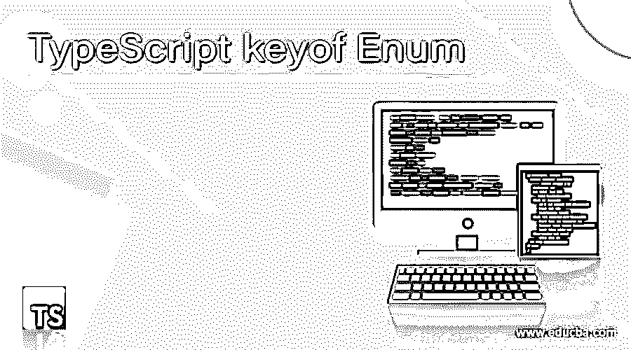

# 枚举的 TypeScript 键

> 原文：<https://www.educba.com/typescript-keyof-enum/>

## 枚举的 TypeScript 键简介

枚举的 TypeScript keyof 是索引类型查询运算符。TypeScript 中的枚举也有自己的用途，常见的用法是字符串枚举，用于表示一组可由用户自己选择的静态值。最有可能的是，我们使用 keyof 操作符来创建一个元素是成员键的类型。TypeScript keyof 将生成一个包含其操作数可能的属性名/键的并集。大多数情况下，keyof 操作符位于用户定义的对象类型之前。Keyof enum 可用于不太有用的基元类型。Keyof 运算符创建其元素将成为枚举成员的键的类型。让我们进一步了解如何在编码中使用 TypeScript keyof enum 及其语法定义。

**语法:**

<small>网页开发、编程语言、软件测试&其他</small>

下面是 TypeScript 中 keyof enum 的语法。在研究 keyof enum 的语法之前，我们需要知道 keyof 是如何使用的，

`keyof sample_key
sample_key = Type;`

因此，这里的 sample_key 是应用 keyof 的类型。

`type keyofEnum = keyof sample_keys;`

这里，sample_keys 是一个应用了 keyof 的可枚举类型。

在使用 TypeScript keyof 运算符时，我们需要将其与 typeof 运算符结合使用，例如，

`enum sample_keys {
‘TypeScript’,
‘JavaScript’,
‘ExpressJS’,
‘NodeJS’,
‘NextJS’
}
type enum = keyof typeof sample_keys;`

这些 TypeScript 枚举或枚举允许用户声明一组命名常数。简单地说，枚举是数字或字符串数据类型的相关值的集合。

### TypeScript 中的枚举类型

TypeScript 中有三种类型的枚举:

*   数字枚举
*   字符串枚举
*   异构枚举

**数字枚举**:这些数字枚举是基于数字的枚举。它们将字符串类型值存储为数字。这些是使用关键字 enum 定义的。例如，假设用户想要存储一组媒体类型。枚举的 TypeScript keyof 可以编写如下:

`enum socialMedia {
Instagram,
Facebook,
Whatsapp,
Snapchat
}
type enum = keyof typeof socialMedia;`

在上面的例子中，有一个 enum socialMedia，它有 4 个值:Instagram、脸书、Whatsapp 和 Snapchat。因为枚举键值从 0 开始并递增 1。它将如下所示，

`Instagram = 0
Facebook = 1
Whatsapp = 2
Snapchat = 3`

枚举在存储时总是被赋予数值。用户还可以选择分配第一个数值。上面的例子也可以设计成

`enum socialMedia {
Instagram = 1,
Facebook,
Whatsapp,
Snapchat
}`

由于第一个成员被分配了 1，因此其余成员的 keyof 将增加 1。因此，脸书将有 2 个，Whatsapp 将有 3 个，Snapchat 将有 4 个键。

按顺序分配给枚举成员不是必须的。枚举成员的 TypeScript keyof 可以有任何分配给它们的键值，如下所示。

`enum socialMedia {
Instagram = 1,
Facebook = 10,
Whatsapp = 15,
Snapchat = 20
}`

该枚举也可以用作函数参数或返回类型，如下所示:

#### 示例 1:枚举基本示例的 TypeScript 键

**代码:**

`enum socialMedia {
Instagram = 1,
Facebook,
Whatsapp,
Snapchat
}
type KeyofEnum = keyof socialMedia;
function getsocialMedia(mediaOfficial: string): socialMedia {
if (mediaOfficial === 'Filters' || mediaOfficial === 'Snaps') {
return socialMedia.Snapchat;
}
}
let mediaType: socialMedia = getsocialMedia('Snaps'); // returns Snapchat
console.log('keyof enum string type Snapchat is', mediaType);`

**输出:**

所以在这里我们能够得到枚举成员的键。

**计算枚举**:枚举成员也可以包含带有计算数值的键。该值可以是常量，也可以是计算值。让我们看看下面的例子，看看枚举成员的计算键值。

#### 示例#2:带有计算出的枚举键的枚举的 TypeScript keyof。

**代码:**

`enum socialMedia {
Instagram = 1,
Facebook = getsocialMediaKey('Stories'),
Whatsapp = Facebook *4,
Snapchat = 6
}
type KeyofEnum = keyof socialMedia;
function getsocialMediaKey(mediaOfficial: string): number {
if (mediaOfficial === 'Stories') {
return 7;
}
}
console.log('keyof enum string type Facebook is', socialMedia.Facebook);
console.log('keyof enum string type Whatsapp is', socialMedia.Whatsapp);
console.log('keyof enum string type Snapchat is', socialMedia.Snapchat);`

**输出:**

这里我们计算了枚举的键。

**注意:**已经分配了键的成员只能用于计算其他枚举成员的值。那些在赋值前使用的成员将计算为 0，即使该成员后来被赋值。

**字符串枚举**:类似于数值枚举，但枚举值是用字符串值而不是数值初始化的。

使用字符串枚举可以提供更好的可读性，因为在调试代码时更容易读取字符串值。

#### 示例#3:枚举字符串成员的 TypeScript 键

**代码:**

`enum Employee {
Delivery_Manager = "Karthik",
Group_Project_Manager = "Saideep",
Project_Lead = "Hari",
TeamMate = "Siva"
}
// Accessing String Enum
console.log('Accessing keyof enum Member', Employee.Project_Lead);
console.log('Accessing keyof enum Member', Employee['Delivery_Manager']);
console.log('Accessing keyof enum Member', Employee['Team_Mate']);`

**输出**:

所以这里的字符串枚举有字符串键。如果没有定义键或者没有枚举成员，则枚举的键将是未定义的。

**异构枚举**:这些枚举包含数值和字符串值。

举个例子，

`enum Employee {
Boolean = “True”,
Pending = 1,
Closed = 0
}`

### 结论

至此，我们结束了我们的主题“枚举的类型脚本键”。我们已经看到了上面几个例子的语法及其描述，知道如何获得枚举成员的 keyof 并显示。我们已经讨论了一些需要注意的要点，这些要点在实施时会给出一个更好的想法。谢谢！快乐学习！!

### 推荐文章

这是枚举的类型脚本密钥指南。这里我们讨论定义、语法、方法和代码实现的例子。您也可以浏览我们的其他相关文章，了解更多信息——

1.  [打字稿抽象类](https://www.educba.com/typescript-abstract-class/)
2.  [打字稿问号](https://www.educba.com/typescript-question-mark/)
3.  [打字稿装璜师](https://www.educba.com/typescript-decorators/)
4.  [循环的打字稿](https://www.educba.com/typescript-for-loop/)

