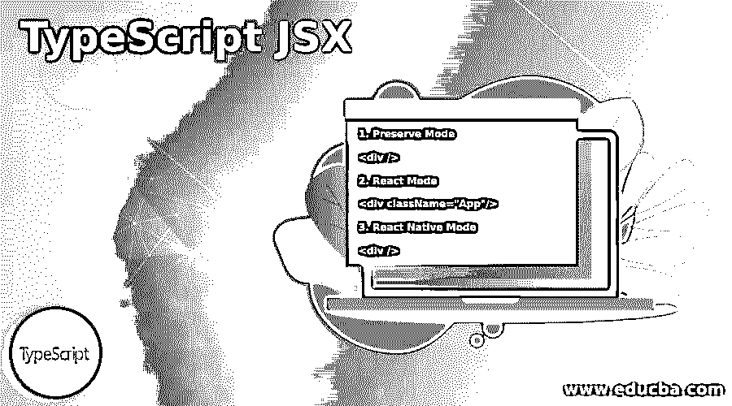
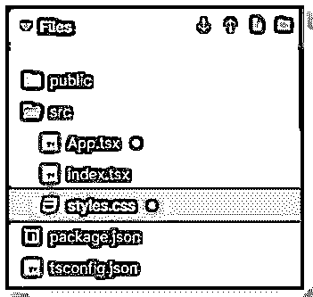
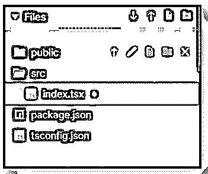
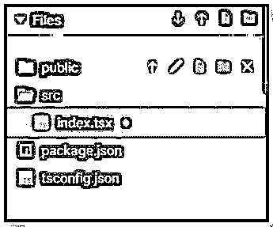
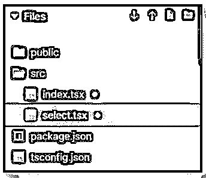
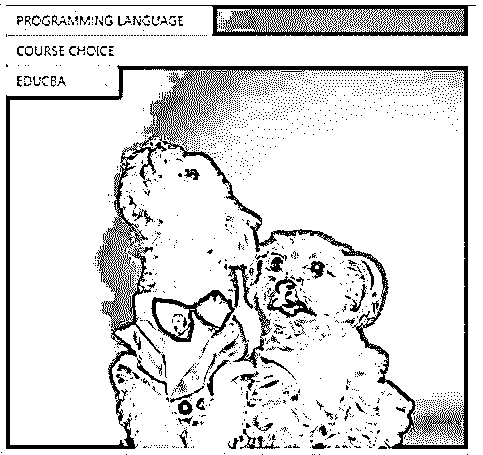

# 打字稿 JSX

> 原文：<https://www.educba.com/typescript-jsx/>

## 打字稿 JSX 简介

以下文章提供了打字稿 JSX 的概述。TypeScript 基于 JavaScript，是一种开源语言。JavaScript 中添加了静态类型定义，使其成为 TypeScript。类型提供了描述对象形状和提供增强文档的方法。它允许 TypeScript 验证代码是否工作正常，没有任何错误。在 TypeScript 中编写不同的类型是可选的，因为类型推断为开发人员提供了强大的功能，而无需额外的代码。

**打字稿 JSX 语法:**

<small>网页开发、编程语言、软件测试&其他</small>

**1。保存模式**

`
`

**2。反应模式**

`
`

**3。反应自然模式**

`
`

### JSX 的打字工作

JSX 可以像 XML 一样嵌入。JSX 可以用 JavaScript 进行转换，尽管这种转换主要基于实现的类型。JSX 主要用于 React 框架，现在 TypeScript 也支持将 JSX 编译成 JavaScript。

为了使用 JSX，有两件最重要的事情应该做:

*   .tsx 应该是所用文件的文件扩展名。
*   应该启用 jsx 选项

TypeScript 在三种 JSX 模式下工作。这些模式包括本地反应、反应和保留。发射阶段受这些模式的影响。通过保留模式，JSX 被保留为输出的一部分。在 react 模式下，会发出 React.create 元素，不需要 JSX 变换。反应本机模式与保留模式有些相似。

### 打字稿 JSX 的例子

下面是提到的例子:

#### 示例#1

用于正确执行代码的文件有:

**a. App.tsx**

`import "./styles.css";
export default function App() {
return (

<h1>EDUCBA</h1>
<h2>****WE ARE HAPPY TO HELP****</h2>

);
}`

**b. index.tsx**

`import { render } from "react-dom";
import App from "./App";
const rootElement = document.getElementById("root");
render(<App />, rootElement);`

**c. styles.css**

`.App {
font-family: 'Times New Roman'
, Times
, serif;
text-align: center;
background-image: url('https://images.pexels.com/photos/1619690/pexels-photo-1619690.jpeg?auto=compress&cs=tinysrgb&dpr=1&w=500');
height: 450px;
width: 490px;
color: #94041f;
border-image: url('https://images.pexels.com/photos/1485637/pexels-photo-1485637.jpeg?auto=compress&cs=tinysrgb&dpr=1&w=500');
border-radius: 500px;
background-color: #f57ff3;
border-right-width: 100px;
border-right-color: #f58c58;
border-left-width: 100px;
border-left-color: #f50c18;
border-top-width: 100px;
border-top-color: #140ddb;
border-bottom-color: #ba1658;
}`

**输出:**

#### 实施例 2

用于正确执行代码的文件有:

**a. index.tsx**

`import * as React from "react";
import { render } from "react-dom";
interface IState {
count: number;
}
class EDUCBA extends React.Component<
{}
, IState> {
public readonly state = {
count: 0
};
private handleClick = (
event:
React.MouseEvent<
HTMLButtonElement
>) => {
const type:
string =
event.currentTarget.title;
this.setState(
(
{ count
}
) => ({
count: type === "decrement" ?
count - 10 : count + 10
}));
};
public render() {
return (

<button
title="decrement"
onClick={
this.handleClick
}
style={{
color: '#991450'
, height: '50px'
, width: '150px'
, backgroundColor: '#8ef73e'
, borderRadius: '50px'
, borderRightWidth: '5px'
, borderRightColor: '#b30b1b'
, borderLeftWidth: '5px'
, borderLeftColor: '#0b0ebd'
, borderTopWidth: '10px'
, borderTopColor: '#e3431b'
, borderBottomColor: '#22c0f5'
, fontSize: '15px'
}}
>
Decreasiow
</button>
{
this.state.count
}
<button
title="increment"
onClick=
{
this.handleClick
}
style={{
color: '#e30b1d'
, height: '50px'
, width: '150px'
, backgroundColor: '#f5ee67'
, borderRadius: '50px'
, borderRightWidth: '5px'
, borderRightColor: '#31cc43'
, borderLeftWidth: '5px'
, borderLeftColor: '#0c0c70'
, borderBottomWidth: '10px'
, borderTopColor: '#ad1599'
, borderBottomColor: '#3e700c'
, fontSize: '15px'
}}
>
Increasiow
</button>

);
}
}
render(<EDUCBA />
, document.getElementById("root"));`

**输出:**

**关于代码执行:**

**点击“减少显示”按钮:**

**点击“增加”按钮:**

#### 实施例 3

用于正确执行代码的文件有:

**a. index.tsx**

`import ReactDOM from "react-dom";
import React from "react";
import {
makeStyles } from "@material-ui/styles";
const useStyles = makeStyles({
root: {
backgroundColor: (
{
color }) => color
}
});
const EDUCBA = () => {
const classes = useStyles(
{
color: "#53f5cf"
});
return 

EDUCBA

};
ReactDOM.render(
<EDUCBA />
, document.getElementById(
"root"
));`

**输出:**

#### 实施例 4

用于正确执行代码的文件有:

**a. index.tsx**

`import * as React from "react";
import { render } from "react-dom";
import "antd/dist/antd.css";
import Select from "./select";
const { Option } = Select;
function handleChange(value: string) {
console.log(`selected ${value}`);
}
class Application extends React.Component<{}, {}> {
public render() {
return (

<Select
defaultValue="PROGRAMMING LANGUAGE"
style={
{
width: 220,
backgroundColor: "#6cf5d3"
}
}
onChange={handleChange}
>
<Option
value="REACT NATIVE"
style={
{
backgroundColor: "#a922c7"
}
}>
REACT NATIVE
</Option>
<Option
value="TYPESCRIPT"
style={
{
backgroundColor: "#655bfc"
}
}>
TYPESCRIPT
</Option>
<Option
value="disabled"
disabled
style={
{
backgroundColor: "#9ff263"
}
}>
NO CHOICE
</Option>
<Option
value="JAVASCRIPT"
style={
{
backgroundColor: "#e6f55f"
}
}>
JAVASCRIPT
</Option>
</Select>
<Select
defaultValue="COURSE CHOICE"
style={
{
width: 510
}
}
onChange={handleChange}
>
<Option
value="DATA SCIENCE"
style={
{
backgroundColor: "#f54c5d"
}
}>
DATA SCIENCE
</Option>
<Option
value="FINANCE"
style={
{
backgroundColor: "#63f76f"
}
}
>
FINANCE
</Option>
<Option
value="disabled"
disabled
style={
{
backgroundColor: "#f2ca63"
}
}>
NO CHOICE
</Option>
<Option
value="EXCEL"
style={
{
backgroundColor: "#72dcfc"
}
}
>
EXCEL
</Option>
</Select>
<Select
defaultValue="EDUCBA"
style={
{
width: 120,
backgroundColor: "#a864f5"
}
} loading>
<Option
value="EDUCBA"
style={
{
backgroundColor: "#a864f5"
}
}
>EDUCBA
</Option>
</Select>

);
}
}
render(<Application />
, document.getElementById(
"root"));`

**b. select.tsx**

`import * as React from "react";
import Select
, { SelectProps } from "antd/es/select";
import "antd/es/input/style/css";
class MySelect<T>
extends React.Component<
SelectProps<
T>
, {}> {
static Option: typeof Select.Option = Select.Option;
render() {
return <
Select<
SelectProps<
T>> {
...this.props
} />;
}
}
export default MySelect;`

**输出:**

**关于代码执行:**

**点击“编程语言”下拉菜单:**

**点击“课程选择”下拉菜单:**

**点击“EDUCBA”:**

### 结论

我们看到了 TypeScript 如何使用三种 JSX 模式:保留、反应和本机反应。这些示例代表了所有三种模式。

### 推荐文章

这是 JSX 打字指南。这里我们分别用例子来讨论 JSX 在打字稿中的介绍、工作。您也可以看看以下文章，了解更多信息–

1.  [打字稿功能](https://www.educba.com/typescript-functions/)
2.  [打字稿操作符](https://www.educba.com/typescript-operators/)
3.  [打字稿版本](https://www.educba.com/typescript-versions/)
4.  [什么是 TypeScript？](https://www.educba.com/what-is-typescript/)

