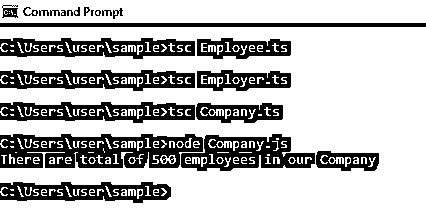
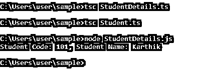

# 类型脚本模块

> 原文：<https://www.educba.com/typescript-module/>

## TypeScript 模块简介

TypeScript 模块是一个包含函数、变量或类的文件。这些 typescript 模块在它们自己的范围内执行，而不是在全局空间中执行。从 ECMAScript 2015 开始，TypeScript 分享了 JavaScript 的这种模块概念。变量、类、函数等。以模块化方式声明，并且在模块外部不可见，除非使用可用的导出形式之一显式导出它们。同样的，消费任何变量，类，函数，或者接口等等。是从另一个模块中导出的，因此要使用一个可用的导入表单来导入。

模块是装饰性的，模块之间的关系是基于文件级的导入和导出来指定的。模块加载器负责在运行时执行之前定位模块的依赖性并执行模块的依赖性。JavaScript 中使用的一些现代加载器是 RequireJS 加载器的 NodeJS 加载器和 web 应用程序中 AM 模块的 CommonJS 模块。

<small>网页开发、编程语言、软件测试&其他</small>

模块以这样一种方式设计，使得代码被组织，并且这些被分成 2 个模块，

1.  内部模块
2.  外部模块

这些模块有助于细分应用程序，允许用户创建小而独立的可重用代码。此外，模块知道它们自己的依赖关系，因此用户可以在需要时按顺序加载模块。

**语法:**

下面是 TypeScript 模块的语法，它有两种类型；导入模块和导出模块

**内部模块语句:**

使用以下 import 语句之一导入导出的申报。

`import { sample_file } from “./sample_file”;`

导入语句也可以重命名如下:

`import { sample_file as sf } from “./sample_file”;`

这个导入模块也可以用来将整个模块导入到一个变量中，如下所示:

`import * as sample_file from “./sample_file”;`

**外部模块语句:**

可以使用 export 关键字导出任何特定的声明，如变量、函数、类、接口或类型别名。

`export interface sample_file {
}`

对于 NodeJS 应用程序，模块是默认的，开发人员推荐使用模块而不是名称空间。

### TypeScript 模块示例

让我们用几个例子来看看 TypeScript 模块是如何工作

#### 示例# 1–简单的类型脚本模块示例

**In script.ts**

`export function multiple(x: number, y: number): number {
log(`${x} * ${y}`);
return x + y;
}
function log(message: string): void {
console.log("Numbers", message);
}`

**In index.ts**

`import { multiple } from "./script";
console.log('Value of x*y is:', multiple(4, 2));`

**输出:**

当 script.ts 导入到索引文件中时，我们需要运行 index.ts 模块。

要使用的命令:tsc index.ts(这将创建一个自身的. js 文件，然后通过使用 node 命令，我们需要运行 js 文件来查看输出。

#### 示例 2–打字稿模块员工计划

**In Employee.ts**

`export interface Employee {
total();
}`

**In Company.ts**

`import employee = require("./Employee");
import employer = require("./Employer");
function drawAllShapes(shapeToDraw: employee.Employee) {
shapeToDraw.total();
}
drawAllShapes(new employer.Employer())`

**In 雇主. ts**

`import employee = require("./Employee");
export class Employer implements employee.Employee {
public total() {
console.log("There are total of 500 employees in our Company");
}
}`

**编译输出:**

在编译以下命令时，

`tsc Employee.ts
tsc Employer.ts
tsc Company.ts`

使用这些命令，。js 文件以相同的名称创建。

创建 Employee.js、employee . js 和 Company.js 文件，如下所示

**Employee.js**

`"use strict";
exports.__esModule = true;`

**employee . js**

`"use strict";
exports.__esModule = true;
exports.Employer = void 0;
var Employer = /** @class */ (function () {
function Employer() {
}
Employer.prototype.total = function () {
console.log("There are total of 500 employees in our Company");
};
return Employer;
}());
exports.Employer = Employer;`

**Company.js**

`"use strict";
exports.__esModule = true;
var employer = require("./Employer");
function drawAllShapes(shapeToDraw) {
shapeToDraw.total();
}
drawAllShapes(new employer.Employer());`

**输出:**

在 TypeScript 中，由于导入和导出在模块中可用，因此重新导出也起着重要的作用，即导出其他模块并公开属性。重新导出不是本地导入或引入本地变量。在这种情况下，重新导出这种情况要么使用原始的，要么重命名它。

#### 示例 3–使用 TypeScript 模块的学生详细信息

**In Student.ts**

`export class Student {
stuCode: number;
stuName: string;
constructor(name: string, code: number) {
this.stuName = name;
this.stuCode = code;
}
displayStudent() {
console.log ("Student Code: " + this.stuCode + ", Student Name: " + this.stuName );
}
}`

**在 StudentDetails.ts**

`import { Student } from "./Student";
let empObj = new Student("Karthik", 101);
empObj.displayStudent();`

**编译输出:**

关于编译。ts 文件、JavaScript 文件创建如下

**在 Student.js**

`"use strict";
exports.__esModule = true;
exports.Student = void 0;
var Student = /** @class */ (function () {
function Student(name, code) {
this.stuName = name;
this.stuCode = code;
}
Student.prototype.displayStudent = function () {
console.log("Student Code: " + this.stuCode + ", Student Name: " + this.stuName);
};
return Student;
}());
exports.Student = Student;`

**在 StudentDetails.js**

`"use strict";
exports.__esModule = true;
var Student_1 = require("./Student");
var empObj = new Student_1.Student("Karthik", 101);
empObj.displayStudent();`

**输出:**

### 结论

至此，我们结束了我们的主题“类型脚本模块”。我们已经看到了 TypeScript 模块是什么以及它是如何工作的。对模块的不同版本进行语法检查，无论是内部语法还是导入语法；外部或导出语法。在 TypeScript 中使用模块是一种非常简单的方法；理解组件之间的依赖关系。虽然不支持这些本机模块，但用户可以简单地将模块与 SystemJS 或 RequireJS 一起使用，并迁移到本机形式。当模块使用模块加载器相互导入时，在运行时，模块加载器负责在执行之前定位和执行模块的所有依赖关系。

### 推荐文章

这是一个类型脚本模块的指南。这里我们讨论什么是 TypeScript 模块，以及它如何与示例和输出一起工作。您也可以看看以下文章，了解更多信息–

1.  [打字稿设置](https://www.educba.com/typescript-set/)
2.  [打字稿问号](https://www.educba.com/typescript-question-mark/)
3.  [打字词典](https://www.educba.com/typescript-dictionary/)
4.  [打字稿通用](https://www.educba.com/typescript-generic/)

