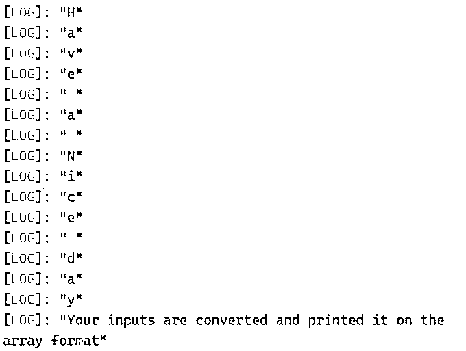
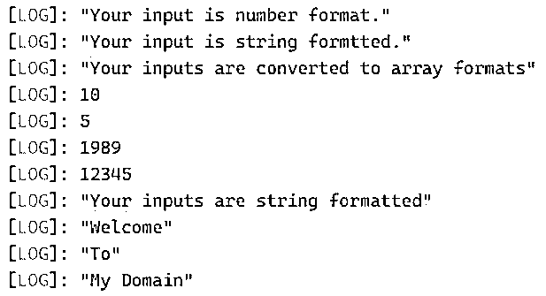

# TypeScript 联合类型

> 原文：<https://www.educba.com/typescript-union-types/>

## TypeScript 联合类型介绍

在 TypeScript 中 union types 是特性之一，它主要用于定义可以有多个集合和数据类型值的用户变量，如整数或数字、字符、字符串、 float 等。这些组合的数据类型被称为联合类型，它允许变量具有多组数据类型。这可以通过使用运算符(如|管道符号)来实现，以便利用具有单个操作数或其他函数参数的所有数据类型。每当我们使用变量时，变量代码也充当脚本上的联合类型模型。

**语法:**

<small>网页开发、编程语言、软件测试&其他</small>

TypeScript 有许多不同的模块、包和名称空间等。像这样，我们使用不同的数据类型来分离数据，并利用标准输入和输出的数据类型值。如果我们使用不同的输入数据类型集，并且当我们将类型值转换或强制转换为其他类型格式时，它也可能包含在 TypeScript 中的 union 类型上。

`var or let variable name: string | number| boolean| bigint| symbol| null
variable name = 123434;
variable name=”siva”;
variable name=true;
variable name=null;
variable name=undefined;`

以上代码是在 TypeScript 上使用 union 类型的基本语法。我们可以用相同的变量名声明每个数据类型的值。

### TypeScript 中的联合类型

TypeScript union 是其中一个特性，它主要用于允许一个以上的数据类型作为单个变量或任何其他函数或方法参数的自变量。union 对每种类型都有不同的类型，我们偶尔会遇到 TypeScript 库，但最有可能的是预期的参数是数字、整数或任何其他字符串格式。

#### 1.歧视工会

它是联合类型的一种，是在文字类型中使用的单变量字段的常用技术。TypeScript narrow 将 down 模型中的数据分离为最可能的当前数据类型，并在用户端声明。

让我们举一个例子，单个变量字段将与三个不同的联合类型状态共享，如“成功、失败、挂起”。对于输出的每个状态，输入变量是相同类型的。

**举例:**

**代码:**

`type pending = {
status: "your input is pending state";
errorcode:number;
};
type success = {
status: "your input is success";
errorcode: number;
};
type failed = {
status: "your input is failed state";
errorcode: number
};
type currentState =
| pending
| success
| failed;
function demo(status: currentState): string {
status.errorcode;
switch (status.status) {
case "first":
return "your inputs are still pending state";
case "second":
return `success ${status.errorcode} your inputs are still pending state`;
case "third":
return `pending ${status.errorcode} pending`;
}
}`

**输出:**

#### 2.联合彻底检查

它是另一种联合类型，就像 TypeScript 编译器想要告诉我们的那样，它可能不包含来自被区分的联合类型的所有变体。因此，它结合并遵循有区别的联合，即)当我们想从一种状态(待定)改变到另一种状态(成功或失败)时，应用程序后端跟踪日志技术，以更新应用程序的当前状态。

**举例:**

**代码:**

`enum first {
Ok = 'Ok',
Cancel = 'Cancel',
}
function demo(i: first): string {
switch (i) {
case first.Ok:
return 'welcome';
}`

**输出:**

**

** 

#### 3.具有相同公共字段的联合

假设如果我们有相同联合类型的变量值，那么我们只能访问像继承概念这样的父子关系成员。因此，联合类型的成员对于与同一个变量字段相关的所有数据类型都是通用的。

**举例:**

**代码:**

`interface A {
demo(): void;
demo1(): void;
}
interface B {
demo2(): void;
demo(): void;
}
interface C {
demo3(): void;
demo2(): void;
}
declare function example(): A | B | C;
let eg = example();
eg.demo();
eg.demo3();`

**输出:**

### TypeScript 联合类型的示例

下面给出了 TypeScript 联合类型的示例:

#### 示例#1

**代码:**

`function demo(vars) {
if (typeof vars == "boolean") {
console.log(vars);
} else {
var i;
for (i = 0; i < vars.length; i++) {
console.log(vars[i]);
}
}
}
demo("Have a Nice day");
console.log("Your inputs are converted and printed it on the array format");
demo(["Sivaraman", "BTech", "Tiruppur", "IT Professional"]);`

**输出:**

在上面的例子中，我们使用了单参数单函数，它可以是任何类型。我们可以使用 if 语句评估类型，将 boolean 作为评估类型，并在控制台上的请求和响应输出中打印出来。

#### 实施例 2

**代码:**

`function demo1(eg: (string | number)) {
if(typeof(eg) === "number")
console.log('Your input is number format.')
else if(typeof(eg) === "string")
console.log('Your input is string formtted.')
}
demo1(49);
demo1("GFG");
demo1(true);
var first;
var j;
first = [10, 5, 1989, 12345];
console.log("Your inputs are converted to array formats");
for (j = 0; j < first.length; j++) {
console.log(first[j]);
}
first = ["Welcome", "To", "My Domain"];
console.log("Your inputs are string formatted");
for (j = 0; j < first.length; j++) {
console.log(first[j]);
}`

**输出:**

在第二个例子中，我们使用了具有不同参数类型的单个函数和单个变量。通过使用 if 条件，我们可以用 consult 格式评估输入。For 循环还迭代输入值，并将其打印在输出控制台上。

#### 实施例 3

**代码:**

`interface A<T>{
firsttype:T;
}
function demo<T>(firsttype:T) : A<T>{
return {firsttype:firsttype};
}
var vars1 = demo("Welcome To My Domain");
var vars2 = vars1.firsttype.length;
var vars3 = demo(true);
var output = vars3.firsttype === true;
if(output == true)
{
console.log(output)
}
else
{
console.log("your input conditions are not evaluated and the output is false");
}`

**输出:**

在最后一个示例中，我们在传递名为“T”的类型时使用了接口和单个函数。我们使用布尔类型评估输入条件，如果条件满足，它将输出“真”作为输出控制台，否则它将输出“假”。

### 结论

在 TypeScript 中，我们使用不同的功能集来实现具有用户响应能力和需求的应用程序。通过使用 TypeScript 上的 union 功能，我们可以在脚本上替换和包含其他不同的数据类型，这将有助于在应用程序的单个模块中包含 n 个数据类型，这样性能会更快，并减少内存消耗。它用于通过单变量引用将 n 个数据类型值相加。

### 推荐文章

这是一个关于类型脚本联合类型的指南。这里我们分别讨论引言、TypeScript 中的联合类型和示例。您也可以看看以下文章，了解更多信息–

1.  [对象的类型脚本数组](https://www.educba.com/typescript-array-of-objects/)
2.  [枚举的键入关键字](https://www.educba.com/typescript-keyof-enum/)
3.  [打字稿设置](https://www.educba.com/typescript-set/)
4.  [打字稿抽象类](https://www.educba.com/typescript-abstract-class/)

