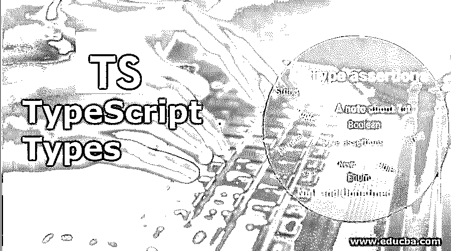
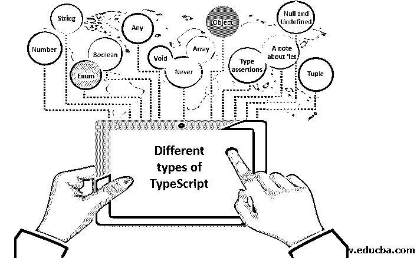

# 类型脚本类型

> 原文：<https://www.educba.com/typescript-types/>




## 类型脚本类型介绍

以下文章提供了各种类型的 TypeScript 的概述。每种编程语言都基于一些关键字和数据类型。我们已经看到了许多类型的数据。概念就是这么简单。我们知道字母是 1 和数字。为了在[中存储每种类型的数据，编程语言](https://www.educba.com/what-is-a-programming-language/)用一些名字将它们分开。

### 不同类型的打字稿

如果你不熟悉这些词，不要担心。但是如果你有编程背景，这就很容易理解了。在接下来的部分中，我们将详细了解其中的每一项:

<small>网页开发、编程语言、软件测试&其他</small>




#### 1.数字

众所周知，TypeScript 是 JavaScript 的[超集。所以，Javascript 没有 integer 和 float 这样的数据类型。Typescript 属于同一个概念。它只有一个数字类型，即数字。但是请注意，typescript 中的每个数字都是一种浮点。](https://www.educba.com/what-is-javascript/)

**例子**

```
let marks: number;
```

我们也可以考虑所有类型的 no，如 float，double，int，long int 等，我们有唯一的数字作为数据类型。

#### 2.线

正如我们所看到的，数字数据类型就像字符串数据类型一样。任何字符或字符集合都是字符串。这是 TypeScript 中重要的数据类型之一。我们可以使用单引号(“”)和双引号(“”)。模板字符串是 Typescript 中的新概念。

**例子**

```
name: string = 'John';
Designation: string = "Engineer";
```

#### 3.列举型别

这是非常重要的一点。它更像是一个数组。我们可以给给定的值取一个合适的名字。此外，请指定索引号

**例子**

```
enum Fruits {apple = 2, banana, kiwi}
let favFruit: string = Fruits[3];
```

看看上面的代码片段。它有果实，我们决定从 2 开始它的索引。那么输出将是香蕉。

#### 4.布尔代数学体系的

它是最简单的数据类型，因为我们都知道它只给出两个值，即 true 和 false。

**例子**

```
let isSuccess: boolean = true;
```

我们主要在基于条件的代码呈现中使用这种数据类型。

#### 5.任何的

当我们不知道会有什么样的数据时，任何数据类型在编程中都是非常有用的。很多情况下，我们对被使用的数据之王一无所知。所以，在这种情况下，我们可以任意给予。我们也可以使用这种类型的混合阵列。

**例子**

```
data: any;
```

当我们使用像 [angular 或 react](https://www.educba.com/angular-vs-react/) 这样的 javascript 框架时，我们不知道从第三方或 API 获得的数据类型。所以在这种情况下，我们可以使用任何数据类型。

#### 6.空的

虚空只不过是一种空虚的东西。给定数据没有数据类型。我们不是在变量上使用它，而是在函数上使用它，就好像函数没有任何东西要返回一样。

**例子**

```
function message(): void {
console.log("Welcome!!!");
}
```

#### 7.从不

像 void never 也用在从不返回任何东西或者可能进入异常的函数上。

**例子**

```
Function abc() :never{……some code….}
```

很多时候，我们不得不处理代码无法运行或出现任何错误的异常。这些函数没有返回任何有价值的数据。在这些场景中，我们可以使用 never 数据类型。

#### 8.排列

与 JavaScript 一样，typescript 也有数据类型数组。有两种方法可以让[在 typescript](https://www.educba.com/typescript-array/) 中声明数组。数组是非基本的，或者我们可以说是引用类型或用户定义的数据类型。每种编程语言都有一个数组作为它的数据类型。它被认为是重要的数据类型之一。

**例子**

```
let name:string[] = ['john','sam']
Letname: Array<string>= ['john','sam']
```

在上面的例子中，我们指定了一个字符串类型的数组。在 typescript 中，我们大多使用尖括号来指定类型。

#### 9.目标

数组和对象主要是引用类型，也称为用户定义或非原语。

**例子**

```
const obj = {}
```

#### 10.类型断言

类型断言无非就是其他语言中的[类型强制转换](https://www.educba.com/type-casting-in-python/)或者类型内聚。

**例子**

```
let name: any = "Sam";
let nameNo: number = (<string> name).length;
```

在上面的例子中，我们有一个名为 any 类型的变量。

在第二行，你可以看到我们有另一个变量 nameno，它有一个类型号。因为我们需要字符串，但也需要得到变量的长度。

#### 11.空且未定义

这是 typescript 中最重要也最容易混淆的两个[术语。这些在 javascript 中也有。如果你熟悉这些，那么好吧。如果没有，不要担心，我们会检查这一点。](https://www.educba.com/what-is-typescript/)

*   Null: Null 是我们在必须给变量赋值的情况下使用的，但不是现在。也许在将来。但是今天我们必须给它一些值，在这种情况下，我们把 null 作为变量的类型。
*   **未定义:**这是默认应用于 javaScript 中所有变量的数据类型。我们可以说，它与虚空是一样的。

假设我们声明了一个变量，但没有给它提供任何值，那么默认情况下，它的数据类型和值也是未定义的。

#### 12.元组

Tuple 只不过是一个数组，其中包含该数据类型的数据。

**例子**

```
Let employee: [string, number];
employee= ["sam",101];
```

在上面的例子中，我们有一个名为 employee 的数组，它有一个 string 类型的值，并且是 number 类型的。

### 结论

Typescript 主要因其严格的类型化而得到认可。JavaScript 具有动态类型，这导致了一些安全问题。在这一点上，Typescript 把我们从这个缺点中拯救了出来。

### 推荐文章

这是一个关于类型脚本类型的指南。这里我们用例子来讨论 TypeScript 的简介和不同类型。您也可以看看以下文章，了解更多信息–

1.  [打字稿版本](https://www.educba.com/typescript-versions/)
2.  [如何安装 Typescript](https://www.educba.com/install-typescript/)
3.  [打字稿操作符](https://www.educba.com/typescript-operators/)
4.  [打字稿功能](https://www.educba.com/typescript-functions/)


