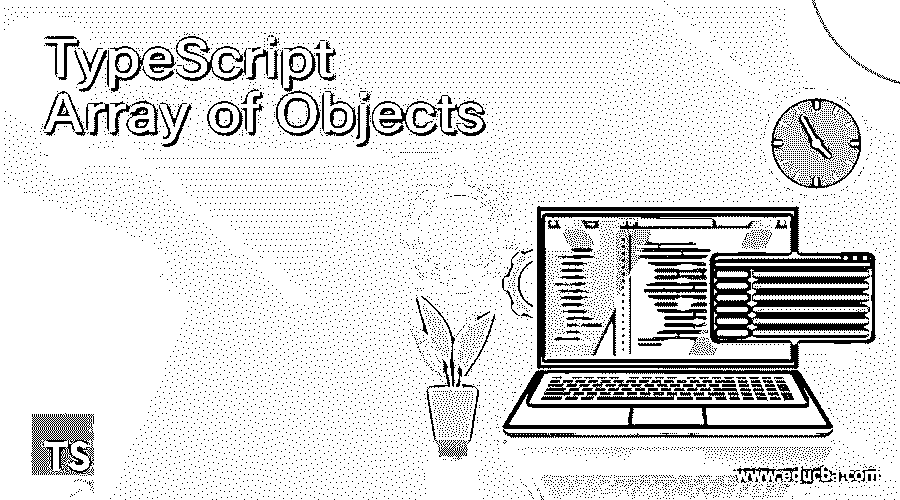
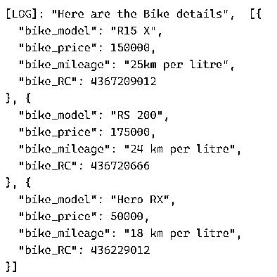

# 对象的类型脚本数组

> 原文：<https://www.educba.com/typescript-array-of-objects/>

## TypeScript 对象数组简介

TypeScript 对象数组允许用户一次在单个变量中存储多个值。对象数组用于存储相同类型元素的固定大小的顺序集合。TypeScript 数组本身是一种数据类型，就像字符串、布尔值和数字一样，我们知道有很多方法可以在 TypeScript 中声明数组。其中之一是对象数组，在 TypeScript 中，用户可以通过在接口后放置括号来定义对象数组。它可以被命名为接口或内联接口。让我们深入研究一下在 TypeScript 中声明对象数组的语法描述，并探索几个例子。

**语法:**

<small>网页开发、编程语言、软件测试&其他</small>

下面是使用内联类型声明对象数组的语法:

`const sample_arr: {
data1: <data type>;
data2: <data type>;
data3: <data type>;
}[ ] = [
{ data1: “value1”, data2: “value2”, data3: “value3” },
{ data1: “value12”, data2: “value22”, data3: “value32” },
{ data1: “value13”, data2: “value23”, data3: “value33” },
];`

使用命名接口在 TypeScript 中声明对象数组的语法:

`interface sample_arr {
data1: <data type>;
data2: <data type>;
data3: <data type>;
}
const array_emp: sample_arr[ ] = [
{ data1: “value1”, data2: “value2”, data3: “value3” },
{ data1: “value12”, data2: “value22”, data3: “value32” },
{ data1: “value13”, data2: “value23”, data3: “value33” },
]`

所以这里我们使用一个命名接口。注意:如上所述，用户可以重用命名接口 sample_arr。它看起来更容易和干净，因为这个接口可以导入或导出到其他文件，用户可以引用相同的数据结构。

### 实施细则和条例

*   TypeScript 对象数组，它的大部分可以互换使用
*   内联类型可用于别名更复杂的类型，接口更倾向于基本类型结构，如对象或类等。
*   用户不能在多个类型之间的联合的内联类型上使用关键字 implements，因为该类不知道要实现哪些方法或值。
*   在相同的上下文中，用户不能声明扩展联合类型的接口。接口的原型需要在声明中指定，而不是在使用时指定。
*   TypeScript 可以合并具有相同名称的接口声明。
*   接口具有合并多个同名声明的优势，但是对于联合类型或高级内联类型，接口的灵活性稍差。
*   默认情况下，在 TypeScript 中使用对象数组的内联类型声明。

### 例子

让我们通过几个例子来看看对象数组在 TypeScript 中是如何工作的。

#### 示例#1:以内联类型声明对象数组的基本示例

`let employee: { emp_id: number, emp_name: string, emp_desg: string }[] = [
{ "emp_id": 0, "emp_name": "Saideep", "emp_desg": "Tech Lead" },
{ "emp_id": 1, "emp_name": "Karthik", "emp_desg": "Manager" },
{ "emp_id": 2, "emp_name": "Kiran", "emp_desg": "Senior Systems Engineer" },
{ "emp_id": 3, "emp_name": "Revanth", "emp_desg": "Technology Analyst" },
{ "emp_id": 4, "emp_name": "Ravi", "emp_desg": "Systems Engineer" },
];
console.log('Employee ' + employee[0].emp_name + ' with ID ' + employee[0].emp_id + ' works as a ' + employee[0].emp_desg);
console.log('Employee ' + employee[1].emp_name + ' with ID ' + employee[1].emp_id + ' works as a ' + employee[1].emp_desg);
console.log('Employee ' + employee[2].emp_name + ' with ID ' + employee[2].emp_id + ' works as a ' + employee[2].emp_desg);
console.log('Employee ' + employee[3].emp_name + ' with ID ' + employee[3].emp_id + ' works as a ' + employee[3].emp_desg);
console.log('Employee ' + employee[4].emp_name + ' with ID ' + employee[4].emp_id + ' works as a ' + employee[4].emp_desg);`

**输出:**

因此，我们可以借助这里标记为 emp_id 的索引来访问雇员的详细信息。

#### 示例 2:使用命名接口的对象数组的基本示例

`interface Bike {
bike_model: string;
bike_price: number;
bike_mileage: string;
bike_RC: number;
}
let bike1: Bike = {
bike_model: "R15 X",
bike_price: 150000,
bike_mileage: "25km per litre",
bike_RC: 4367209012
}
let bike2: Bike = {
bike_model: "RS 200",
bike_price: 175000,
bike_mileage: "24 km per litre",
bike_RC: 436720666
}
let bike3: Bike = {
bike_model: "Hero RX",
bike_price: 50000,
bike_mileage: "18 km per litre",
bike_RC: 436229012
}
let bike: Bike[] = [];
bike.push(bike1);
bike.push(bike2);
bike.push(bike3);
console.log('Here are the Bike details', bike);`

**输出:**

我们使用命名接口方法来声明对象数组。

#### 示例 3:带有未定义数组的对象数组

`interface Student {
stu_name: string;
stu_class: string;
stu_age: number;
}
let student: Student[];
console.log(student);`

**输出:**

因此，这里我们试图打印对象 student，它不包含对象数组，因此返回 Undefined。

### 结论

至此，我们结束了主题“对象的类型脚本数组”。我们已经看到了 TypeScript 对象数组的含义以及它在 TypeScript 中的用法。描述了使用两种方式声明对象数组的语法，即内联类型化和命名接口。这两种语法看起来几乎相似，并且返回相同的输出。我们还检查了一些关于应用声明对象数组的类型的规则。上面举例说明了几个例子，一个是内联类型的，一个是命名接口的。

### 推荐文章

这是对象的 TypeScript 数组的指南。这里我们讨论在 TypeScript？中实现对象数组的介绍、语法、规则和规定。您也可以看看以下文章，了解更多信息–

1.  [TypeScript 可空](https://www.educba.com/typescript-nullable/)
2.  [打字稿抽象类](https://www.educba.com/typescript-abstract-class/)
3.  [打字稿问号](https://www.educba.com/typescript-question-mark/)
4.  [打字稿装璜师](https://www.educba.com/typescript-decorators/)

