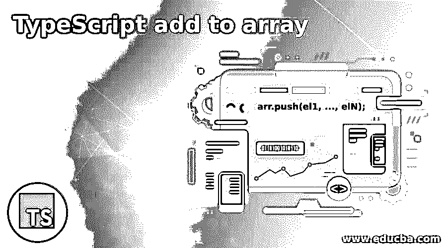

# TypeScript 添加到数组

> 原文：<https://www.educba.com/typescript-add-to-array/>

## TypeScript 添加到数组简介。

以下文章提供了 TypeScript 添加到数组的概述。数组是一种数据类型，可以按顺序存储不同数据类型的不同值。与其他编程语言一样，TypeScript 也支持数组。有几种方法支持数组。在这里，我们将看到更多关于向数组添加元素的 push()方法。它在数组末尾添加给定的项，并返回更新后数组的数组长度。

**语法:**

<small>网页开发、编程语言、软件测试&其他</small>

下面是 TypeScript 数组 push()方法的语法。

`arr.push(el1, ..., elN);`

这里，arr 是需要添加元素的数组。

**参数:**

*   el1，…，elN 是必须添加到数组末尾的元素。

将返回一个包含更新的项目和长度的新数组。

### 如何在 TypeScript 中向数组添加一个项？

数组由不同数据类型的元素组成，如数字、对象、字符串、字符等。要向数组中添加元素，首先，我们必须创建一个数组。它可以单独声明和初始化。

我们将看到声明数组的两种方式。

第一种是使用方括号，就像在 Javascript 语言中声明数组一样。

**let color: string[] = ['Red '，' Black '，' White '，' Yellow ']；**

第二个是使用数组<elementtype>，这是一个通用的数组类型。</elementtype>

**let color:Array<string>=['红'，'黑'，'白'，'黄']；**

在这两种情况下，将获得相同的输出。

类似地，也可以创建其他数据类型的元素。

**让小水:阵<号>；**

**num =【232，334，7100，1624，744】；**

现在，可以使用元素索引来访问元素。也就是 arr[i]。通常，数组的索引从位置 0 开始，第一个元素的索引是 0，第二个元素的索引是 1，依此类推。

**举例:**

**代码:**

`let color: string[] = [‘Red’, ‘Black’, ‘White’, ‘Yellow’];
color [0]; // Red will be returned
color [1]; // Black will be returned
color [2]; // White will be returned
color [3]; // Yellow will be returned`

一旦所有这些都完成了，我们的任务就是向现有的数组中添加元素。为此，我们将使用 push()方法。

**举例:**

**代码:**

`let color: string[] = [‘Red’, ‘Black’, ‘White’, ‘Yellow’];
color [0]; // Red will be returned
color [1]; // Black will be returned
color [2]; // White will be returned
color [3]; // Yellow will be returned
var newcolor = color.push(‘Blue’);`

因此，新数组将包含五个元素，如“红色”、“黑色”、“白色”、“黄色”和“蓝色”。

### TypeScript 添加到数组的示例。

下面给出了添加到数组中的 TypeScript 的示例:

#### 示例#1

创建字符串元素数组并向其中添加元素的 TypeScript 程序。

**代码:**

`//create an array of strings
var color: Array<string> = ['Red', 'White', 'Blue'];
//print the three colors declared in the array
console.log(color) ;
//add the new color Green
color.push('Green') ;
//print the updated array with the element Green at the end of the array
console.log(color) ;`

**输出:**

首先，我们将使用方括号创建一个数组，就像用 JavaScript 语言声明数组一样。创建的数组有三个元素，如红色、白色和蓝色。然后，打印所有元素。完成所有这些操作后，将元素 Green 添加到现有数组中。为此，我们将使用 push()方法。所以新的数组将包含红、白、蓝、绿五个元素。在执行代码时，我们可以看到更新后的数组。

#### 实施例 2

TypeScript 程序，它创建一个由六个数字组成的数组，并使用 for 循环向其中添加元素。

**代码:**

`//create an array of numbers
var num = [ 32 , 55 , 66 , 63 , 78 , 79 ] ;
//initialize the values i and j as zero
var i , j = 0 ;
//add elements to the created using using for loop
for(j=0 ; j < 6 ; j++ )
{
var a = num[j];
var z = a * j;
i = num.push(z);
}
//print the updated array with the output obtained after multiplication in loop
console.log( num );`

**输出:**

在这个程序中，我们也将使用方括号创建一个数组。创建的数组有六个元素，如 32、55、66、63、78 和 79。然后，将两个值 I 和 j 初始化为零，后面会用到。使用 for 循环，将元素相乘，并使用 push()方法将元素相加。因此，新数组将包含 12 个元素，如 32、55、66、63、78、79、0、55、132、189、312 和 395。在执行代码时，我们可以看到更新后的数组。

#### 实施例 3

创建字符串数组和数字数组并向其中添加元素的 TypeScript 程序。

**代码:**

`//create an array
var color: Array<string> = ['Red', 'White', 'Blue'];
//print the colors
console.log(color);
//add new color
color.push('Green');
//print the updated array
console.log(color);
//create an array
var num = [ 32 , 55 , 66 , 63 , 78 , 79 ] ;
//initialize the values i and j as zero
var i , j = 0 ;
//print the numbers
console.log(num) ;
//add elements to it
for( j=0 ; j < 6 ; j++ )
{
var a = num[j] ;
var z = a * j ;
i = num.push(z);
}
//print the updated array
console.log( num ) ;`

**输出:**

在这个程序中，我们将结合前两个程序并打印输出。因此，在这里您可以看到代码只是被合并，它们都是独立的，结果可以在不添加任何代码的情况下获得。这是 TypeScript 的特性之一，在这里您不必为获得输出添加任何额外的东西。在执行代码时，我们可以看到更新后的数组。

### 结论

在 Typescript 中，push()是一种将元素添加到数组末尾并返回更新后数组的数组长度的方法。

### 推荐文章

这是 TypeScript 添加到数组的指南。这里我们讨论一下入门，如何在 TypeScript 中给数组添加一个项？并附有示例。您也可以看看以下文章，了解更多信息–

1.  [打字稿字母](https://www.educba.com/typescript-let/)
2.  [类型脚本转换对象](https://www.educba.com/typescript-cast-object/)
3.  [打字稿功能](https://www.educba.com/typescript-functions/)
4.  [什么是 TypeScript？](https://www.educba.com/what-is-typescript/)

