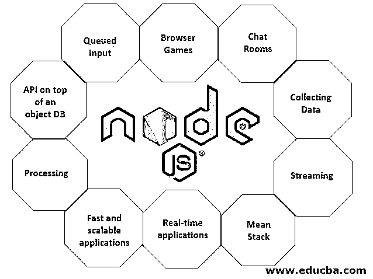

# Node.js 的使用

> 原文：<https://www.educba.com/uses-of-node-dot-js/>

## Node.js 使用简介

Node.js 是一种 javascript，便于用户在运行时在外部系统的环境中运行程序，而不是作为容器的浏览器。这种有利的 Node.js javascript 被广泛用于聊天室、实时应用、网络流选项、数据收集、数据处理、浏览器游戏、高速应用、期望最终可升级/可扩展的数据库、应用于数据库的应用程序接口、类似消息队列的排队应用等。这种类型的 javascript 是近年来大多数软件开发人员做出的广泛选择，因为它有助于推动对开发功能的限制。

### Node.js 是做什么的？

*   Node.js 动态生成动态页面内容。
*   Node.js 在服务器上创建、打开、读取、写入、删除和关闭文件。
*   Node.js 也收集表单数据。
*   Node.js 添加、删除、修改数据库中的数据。

### Node.js 的十大用法

Node.js 的常见用法如下:

<small>网页开发、编程语言、软件测试&其他</small>

#### 1.浏览器游戏

基于浏览器的游戏可能是实时网络最令人兴奋的应用。用户不再需要打开 Flash、Java 或其他程序如 Shockwave applet 来玩游戏。他们在浏览器中就能做到。 [Node.js 配合](https://www.educba.com/node-dot-js-alternatives/)使用 Socket.io 和 HTML 5，可以设计出丰富且令人印象深刻的实时浏览器游戏。其他游戏，如多人游戏，也可以使用相同的技术来创建。

#### 2.闲聊室

如今，大多数人确实使用基于手机的应用程序或社交媒体平台与朋友聊天。使用 Node.js 可以非常容易地创建聊天室。独立聊天室在今天的互联网上可能不太受欢迎，但这在网络游戏中被大量使用，当有聊天成分时会更有趣。

#### 3.收集数据

使用 node . js[可以收集大量数据并提高效率。大量数据进入数据库通常会造成瓶颈，因为数据库访问是一个阻塞操作。另一方面，Node.js 接收这些数据，然后以分段的方式将其发送到后端。这确保了在不破坏任何系统的情况下存储数据。](https://www.educba.com/events-in-node-js/)

#### 4.流动

视频和音频媒体内容文件被上传到 YouTube 或脸书等流媒体视频网站，必须对其进行处理，以供世界各地的用户观看或收听。这些文件的处理发生在它们被上传之后。使用 Node.js 的应用程序，这些视频可以在上传时进行处理。这节省了大量时间，并使媒体可以快速广泛地访问。除了视频和音频，实时输入和输出等其他数据类型也需要实时处理，以便与分布在世界另一端的同事一起处理项目。

#### 5.平均堆栈

平均堆栈都是用 JavaScript 编写的，因此值得一看。无论是从开发者的角度还是从设备的角度来看，Mean stack 都使开发变得简单而容易。装置也可以与其他模块集成。示例:–mongose 与 Node.js 一起使用，这使得与 MongoDB 的集成更加容易。实际上 Node.js 中的 N 代表 MEAN Stack 中的 N。

#### 6.实时应用

对于那些处理大量短消息并且要求低延迟的应用程序来说，使用 Node.js 是一个很好的选择。这样的系统可以很容易地用 Node.js 来开发。例如:–Trello，DropBox。

#### 7.快速和可扩展的应用

如果有大量的请求，Ruby on Rails 的速度可能不够快。在需要更快和更可伸缩的程序的情况下，Node.js 的使用证明是有用的。Node 能够处理许多请求，响应时间也很短，并且它在客户机和服务器之间共享诸如验证代码之类的东西。这使得 Node.js 的应用程序非常适合现代 web 应用程序。使用 node.js 可以在客户端执行大量处理。Node.js 是单页面应用程序站点和移动应用程序的流行选择，其中渲染在客户端完成，后端提供了一个 [JSON](https://www.educba.com/json-interview-questions/) API。

#### 8.处理

当要处理大量 IO 绑定请求时，Node.js 也非常有用。如果需要大量的 CPU 处理请求来为请求提供服务，那么效率将会很低。如果主要是考虑数据的移动，那么 node.js 将会非常有效。单个实例服务的请求比使用相同硬件的情况多得多。Node.js 相比通常的大而厚的应用程序更好，比如 rails。

#### 9.对象数据库之上的 API

尽管 Node.js 确实在实时应用程序中大放异彩，但它非常适合公开来自对象数据库(例如 MongoDB)的数据。JSON 存储的数据允许 Node.js 即使在没有阻抗不匹配和有数据转换时也能工作

#### 10.排队输入

如果接收到大量的并发数据，如上所述，数据库确实会成为瓶颈。但是，Node.js 的应用程序可以处理数据库并发连接。该系统即使在重负载下也能保持其响应能力，这一点特别有用

### 结论

JavaScript 越来越受欢迎，并给互联网和基于浏览器的编码带来了很多变化。今天的 Web 开发方法有了很大的不同，这要归功于 JavaScript 和 Node.js。通过在服务器上运行 JavaScript，我们可以在 web 上完成的事情有着巨大的范围和可能性。因此，学习和了解 node.js 是一项很棒的技能。学生应该学习它并实践动手编码。基于 Node.js 的问题也会在 web 开发面试中被问到。

### 推荐文章:

这是在现实世界中使用 Node.js 的指南。在这里，我们已经详细讨论了 Node.js 的介绍，以及 node.js 的 10 大流行用法。您也可以阅读以下文章，了解更多信息——

1.  [硒的用途](https://www.educba.com/uses-of-selenium/)
2.  [CSS 的用途](https://www.educba.com/uses-of-css/)
3.  [机器学习的用途](https://www.educba.com/uses-of-machine-learning/)
4.  [角度 JS 的用途](https://www.educba.com/uses-of-angular-js/)

