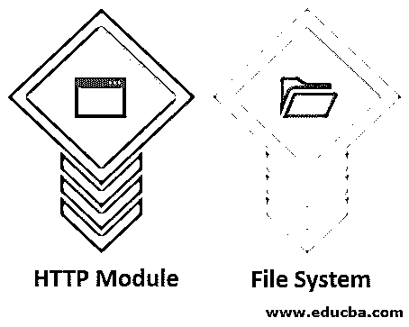
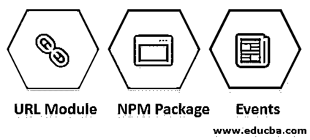
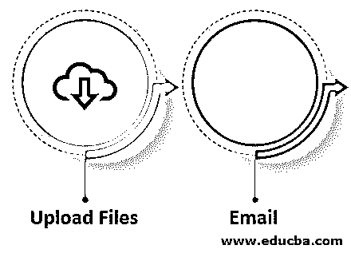

# 节点命令

> 原文：<https://www.educba.com/node-commands/>


## 节点命令简介

Node 是流行的开源平台之一，任何种类的 JavaScript 代码都可以在浏览器之外执行。节点被赋予一些特定的实用程序来编写一些服务器端 javascript 代码，这些代码在客户端代码执行之前执行，并在屏幕上显示动态内容。下面我们讨论节点命令。

### 基本节点命令

有许多节点命令，特别是用于运行或处理任何类型的客户端和服务器端 JavaScript 代码，并根据应用程序要求向最终用户提供动态或正确的输出。

<small>网页开发、编程语言、软件测试&其他</small>

下面提到了一些基本的节点命令:




#### 1.HTTP 模块

Node 的一个非常基本的模块是 HTTP 模块。这是任何一种节点应用程序的关键模块。该模块主要确保数据应该通过超文本传输协议(HTTP)进行传输。

在节点 JS 应用程序中包含 HTTP 模块；我们需要编写下面的代码:

```
Var http1 = require('http');
```

*   **网络服务器**

Node 的一个重要功能是监听相应的服务器端口，并将一些响应返回给特定的客户端。

这可以通过下面的代码来实现:

```
http.createServer1(function (req, res)){
res.write('Executing');
res.end();
}).listen(8082);
```

当任何用户试图通过端口 8082 访问一台特定的计算机时，就会执行这段代码。相同的代码可以在计算机的命令提示符下执行，也可以在浏览器中从特定链接执行(http://localhost:8082)。

*   **HTTP 头**

在 HTTP 模块的情况下，开发者能够通过使用 node JS 容易地添加一个 HTTP 头，它将在客户端系统和浏览器中运行。

```
Response.writeHead(200, {'content-type': 'text/html'});
Response.write("Messages….");
Response.end();
```

writeHead 方法包含响应代码(这里是 200，表示在 HTML 响应中一切正常)和响应头包含的对象的详细信息。

*   **查询字符串**

实际持有传入消息对象的 createServer 方法的请求参数。该对象有一个特定的属性名为“url”它保存查询字符串的全部信息，包括域名。

`Response.write(request.url);`

上面的代码总是提供将特定域名打印到屏幕上的输出。如果该域名还包含查询字符串的一些信息，它也会显示。

#### 2.文件系统

这个模块主要帮助开发者处理各种文件。它主要用于根据需要读取、创建、更新、删除或重命名文件。在我们的应用程序中使用文件系统的情况下，我们必须提到所需的文件系统。

`Var filesystem = require('fs');`

*   **读取文件**

Fs.readFile()是在一台计算机上用来读取文件的方法。

```
filesystem.readFile('somehtml.html', function(error, data){
response.writeHead(200, {'Content-Type': 'text/html'});
response.write(data);
response.end();
});
```

*   **创建文件**

有三种方法可以做到这一点，filesystem.appendFile()、filesystem.open()、filesystem.writeFile()。追加文件主要用于将一些文本追加到文件中。Open 用于打开文件；它通常包含一个名为“w”的参数；如果是' w '，那么文件已经被打开写入。写文件是用新内容替换现有内容的方法。

*   **更新文件**

它还使用相同的方法 appendFile 和 writeFile 来更新一个现有文件。

*   **删除文件**

filesystem.unlink()方法用于从文件系统中删除一个特定的文件。

*   **重命名文件**

filesystem.rename()用于相同的目的。

### 中间节点命令

开发人员还使用了其他几个流行的节点命令，它们不是非常基本的命令，但是更多地与节点命令一起工作来执行这些节点命令。下面提到了一些需要中间节点命令的类型:




#### 1.URL 模块

URL 模块主要帮助分割特定的网址，并提供可读格式的输出。为了应用 url 模块，require('url ')需要成为从 URL 获取数据的一个提示。

*   **url.parse()**

解析 URL 以查找主机、路径名或上下文根和查询搜索。

#### 2.NPM 套餐

NPM 是 NODE JS 环境中最受欢迎的包管理器之一。开发人员可以下载相同的包，并在应用程序中适当地突然使用它。

#### 3.事件

节点主要配置为作为事件驱动的应用程序工作。计算机上的任何活动都应该考虑一个事件。假设开发人员想要打开或创建一个文件，那么 readStream 对象事件会自动触发并提供 require 输出。该事件也可以被认为是节点 JS 的模块中的构建。这意味着开发人员可以使用 require('events ')在应用程序中加载事件对象。假设开发人员需要编写自己的事件处理程序，并将其分配给自己的性能事件，那么 EventEmitter 可能是正确的选择。Emit 方法已用于激发事件。

### 高级节点命令

尽管如此，一些关键任务需要由节点命令用户频繁完成。这些任务也有一些需要执行的高级命令，主要由一些管理人员使用，用于上传或管理一些关键文件或处理电子邮件传真实用程序等。这些高级类型的节点命令如下:




#### 1.上传文件

这是 Node JS 的关键模块之一。这个模块被称为强大的，主要用于文件上传和所有。在下载了相应的 NPM 包后，可以将 calendar 声明为' require(' calendar ')；'格式。

*   **上传表单创建**

```
response.writeHead(200, {'Content-Type': 'text/html'});
response.write('<form action="…." method="post" enctype="multipart/form-data">');
response.write('<input type="file" name="…."><br>');
response.write('<input type="UPLOAD">');
response.write('</form>');
return response.end();
```

*   **上传文件解析**

```
var formData = new formidable.IncomingForm();
formData.parse(request, function (err, fields, files) {
res.write('File uploaded successfully');
```

*   **上传文件保存**

```
var formData = new formidable.IncomingForm();
formData.parse(request, function (err, fields, files) {
var oldpath1 = files.filetoupload.path;
var newpath = '….' + files.filetoupload.name;
fileSystem.rename(oldpath1, newpath1, function (err) {
if (err) throw err;
response.write('Uploaded and Moved successfully');
}
```

#### 2.电子邮件

它主要由 nodemailer 模块处理。通过计算机发送邮件很容易使用。

```
Require('nodemailer');
```

### 使用命令的提示和技巧

一些经常使用节点命令的普通用户，他们通常会使用一些技巧和窍门来正确地使用节点命令输出。这些技巧通常解决一些特定于用户的查询，并显示执行输出，以便正确理解这些查询。

一些非常常用的关键技巧是:

*   **缓存过程:**在 Node 中引入缓存过程将是一个非常好的选择，可以加速应用程序并提高所需的性能。它基本上将修改过的或新的数据存储在服务器内存中。
*   **查询优化:**无论我们在客户端做什么，它总是依赖于一些服务器端的查询执行时间。因此，查询优化一直是 NODE JS 应用程序性能提升的关键点之一。

### 结论

Node 是目前流行的基于 javascript 的客户端以及服务器端编程逻辑之一，开发者使用非常频繁。对于那些服务器端和客户端都非常需要数据来表示的应用程序来说，这非常有用。

### 推荐文章

这是一个节点命令指南。这里我们已经讨论了基本、中级以及高级节点命令。您也可以阅读以下文章，了解更多信息——

1.  [HBase 命令](https://www.educba.com/hbase-commands/)
2.  [猪命令](https://www.educba.com/pig-commands/)
3.  [Sqoop 命令](https://www.educba.com/sqoop-commands/)
4.  [配置单元命令](https://www.educba.com/hive-command/)


