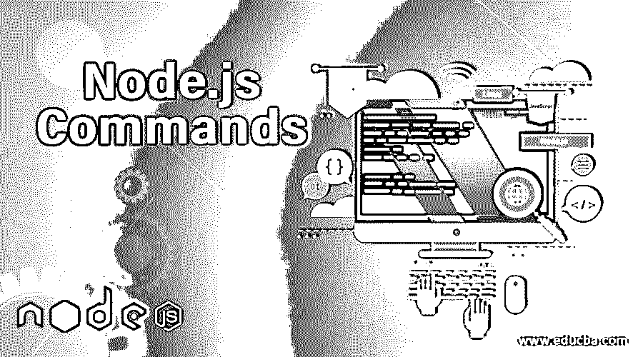

# Node.js 命令

> 原文：<https://www.educba.com/node-dot-js-commands/>




## Node.js 命令简介

Node.js 是一个跨平台、快速、精简的 JavaScript 运行时环境[，构建在 JavaScript 引擎](https://www.educba.com/cheat-sheet-javascript/)之上。Node.js 使用事件驱动的非阻塞 I/O，通过它我们可以实现低延迟和高吞吐量，并使它变得轻量级和高效。 [Node.js 对服务器](https://www.educba.com/node-dot-js-alternatives/)和桌面应用都很有用。Node.js 用 C/[c++](https://www.educba.com/uses-of-c-plus-plus/)+、JavaScript 编写，其包生态系统 NPM (node package manager)，包内包含大量开源库。Node.js 是 Ryan Dahl 在 2009 年为 Linux 和 Mac OS 推出的，现在可以在 Windows、UNIX、Linux、Mac OS X 等不同平台上运行。它在服务器上使用 JavaScript。现在我们将详细讨论 Node.js 命令。

### 基本 Node.js 命令

以下是 node.js 的一些基本命令:

<small>网页开发、编程语言、软件测试&其他</small>

#### 1.使用 Node.js 显示 hello world 的程序？

我们可以在 node.js 中写一个程序，如下图打印 hello world。我们需要创建一个名为“hello.js”的文件，并编写以下代码

**代码:**

```
var http = require('http');
http.createServer(function (req, res) {
res.writeHead(200, {'Content-Type': 'text/html'});
res.end('Hello World!');
}).listen(8080);
```

通过使用链接 http://localhost:8080/访问端口 8080，我们将看到 hello world。

**输出:**


#### 2.如何在 node.js 中创建用户模块并使用？

我们可以在 node.js 中创建自己的模型，如下所示。

```
exports.myDateTime = function () {
return Date();
};
```

现在，我们可以在代码中使用上述模块，并通过端口 8080 进行访问，如下所示:

```
var http = require('http');
var dt = require('./myfirstmodule');
http.createServer(function (req, res) {
res.writeHead(200, {'Content-Type': 'text/html'});
res.write("The date and time are currently: " + dt.myDateTime());
res.end();
}).listen(8080);
```

**输出:/夏季**


#### 3.如何在 node.js 中创建 web 服务器？

**代码:**

```
var http = require('http');
//create a server object:
http.createServer(function (req, res) {
res.write('Hello World!'); //write a response to the client
res.end(); //end the response
}).listen(8080); //the server object listens on port 8080
```

**输出:/夏季**


#### 4.node.js 中如何添加 HTTP 头，什么时候添加？

当服务器应该以 [HTML 格式](https://www.educba.com/uses-of-html/)显示内容时，我们需要添加 HTTP 头；然后我们可以使用包含我们需要的内容的 HTTP 头，如下所示:

**代码:**

```
var http = require('http');
http.createServer(function (req, res) {
res.writeHead(200, {'Content-Type': 'text/html'})**;**
res.write('Hello World!');
res.end();
}).listen(8080);
```

**输出:/夏季**


#### 5.如何读取 node.js 中的查询字符串？

为了读取 node.js 中的查询字符串，我们需要实现如下代码，其中 create-server()函数有一个请求参数/自变量，它将来自客户端的自变量表示为一个对象。

**代码:**

```
var http = require('http');
http.createServer(function (**req**, res) {
res.writeHead(200, {'Content-Type': 'text/html'});
res.write(req.url);
res.end();
}).listen(8080);
```

我们可以如下初始化:node demo_http_url.js

**输出:/夏季**


#### 6.如何拆分 node.js 中的查询字符串？

我们可以使用 URL 模块和代码在 [node.js 中分割查询字符串，如下所示。](https://www.educba.com/events-in-node-js/)

**代码:**

```
var http = require('http');
var url = require('url');
http.createServer(function (req, res) {
res.writeHead(200, {'Content-Type': 'text/html'});
var q = url.parse(req.url, true).query;
var txt = q.year + " " + q.month;
res.end(txt);
}).listen(8080);<
```

**输出:**


#### 7.如何读取 node.js 中的一个文件？

我们可以使用 readFile()方法读取 node.js 中的文件，如下所示。

**代码:**

```
var http = require('http');
var fs = require('fs');
http.createServer(function (req, res) {
fs.readFile('demofile1.html', function(err, data) **{**
res.writeHead(200, {'Content-Type': 'text/html'});
res.write(data);
res.end();
});
}).listen(8080);
```

**输出:**


#### 8.如何在 node.js 中使用 open 方法创建空文件？

我们可以使用 node.js 中的 open 方法创建一个空文件，如下所示。

**代码:**

```
var fs = require('fs');
fs.open('mynewfile2.txt', 'w', function (err, file) {
if (err) throw err;
console.log('Saved!');
});
```

**输出:**


#### **9。**如何更新 node.js 中已有的文件？

我们可以更新 node.js 中的现有文件，如下所示。

**代码:**

```
var fs = require('fs');
fs.appendFile('mynewfile1.txt', ' This is my text.', function (err) {
if (err) throw err;
console.log('Updated!');
});
```

**输出:**


#### 10.如何替换 node.js 中某个文件中的已有内容？

我们可以使用 writeFile()方法替换 node.js 中的[文件中的现有内容，如下所示。](https://www.educba.com/career-in-node-dot-js/)

**代码:**

```
var fs = require('fs');
fs.writeFile('mynewfile3.txt', 'This is my text', function (err) {
if (err) throw err;
console.log('Replaced!');
});
```

**输出:**


### 中间 Node.js 命令

以下是 node.js 的一些中间命令:

#### 1.node.js 致命错误如何触发报告？

我们可以使用命令行选项触发致命错误的报告

–致命错误诊断报告

上面的 node.js 命令启用关于致命错误的报告，终止应用程序，并且对于检查各种诊断非常有用。

#### 2.node.js 中的控制台类有什么用，怎么用？

[node.js 中的 console 类使用](https://www.educba.com/why-use-node-js/)作为类似于 JavaScript 中的调试控制台，node.js 中的 console 类有三个方法 console.log()、console.error()和 console.warn()用于写入任何 node.js 流。

#### 3.如何用实例在 node.js 中创建新控制台？

我们可以在 node.js 中创建新的控制台，如下所示:

```
const output = fs.createWriteStream('./stdout.log');
const errorOutput = fs.createWriteStream('./stderr.log');
const logger = new Console({ stdout: output, stderr: errorOutput });
const count =5;
logger.log(‘count:%d’,count);
```

#### 4.如何用实例证明 node.js 中的类？

我们可以在 node.js 中的 crypto 模块的帮助下使用 node.js 中的 certificate 类，因为它提供了 certificate 类，我们可以使用它来处理 SPKAC 数据，主要用于处理 HTML5 < keygen >元素的输出。

#### 5.如何在 node.js 中创建新的证书类实例？

可以使用 node.js 中的 new 关键字创建证书类的新实例，如下所示:

```
const crypto = require(‘crypto’);
const cert1 = new crypto.Certificate();
const cert2 = crypto.Certificate();
```

### 高级 Node.js 命令

以下是 node.js 的一些高级命令:

#### 1.如何在 node.js 中给 listener 函数传递参数？

我们可以将参数和这个关键字传递给监听器函数，如下所示:

```
const myEmitter = new MyEmitter();
myEmitter.on('event', (a, b) => {
console.log(a, b, this);
// Prints: a b {}
});
myEmitter.emit('event', 'a', 'b');
```

#### 2.解释 node.js 中的异步和同步调用？

在 node.js 中，EventEmitter 按照侦听器注册的顺序同步调用所有侦听器，因为保持正确的顺序以避免竞争情况非常重要，侦听器函数可以使用 setImmediate()或 process.nextTick()等方法切换到异步操作模式

```
myEmitter.on('event', (a, b) => {
setImmediate(() => {
console.log('this happens asynchronously');
});
});
myEmitter.emit('event', 'a', 'b');
```

### 使用 Node.js 命令的提示和技巧

*   使用异步代码，尽量避免使用同步代码。
*   始终检查错误——不要抛出任何错误，也不要错过捕捉错误的机会。
*   了解 npm 很有好处——您可以通过安装带有–S 和–D 选项的模块来了解。
*   仅在 package.json 中使用精确版本–默认情况下，npm 在使用选项–S 时会添加插入符号，我们需要手动编辑才能使用精确版本，而有了开源模块，我们可以直接使用。

### 结论

最后，总结了不同类型的 node.js 命令以及使用它们的一些技巧和诀窍。我希望你在读完这篇文章后，对 node.js 命令以及如何使用它们有一个很好的理解。

### 推荐文章

这是 Node.js 命令的指南。在这里，我们讨论了基本、中级和高级 Node.js 命令以及使用这些命令的提示和技巧。你也可以看看下面的文章来了解更多-

1.  [Node.js 文件系统](https://www.educba.com/node-dot-js-file-system/)
2.  [Node.js 缓冲区](https://www.educba.com/node-js-buffers/)
3.  [Node.js 子进程](https://www.educba.com/node-js-child-process/)
4.  [Node.js 路径](https://www.educba.com/node-js-path/)


