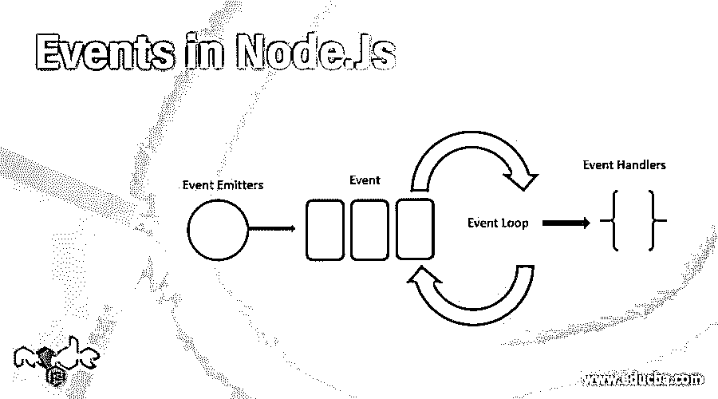
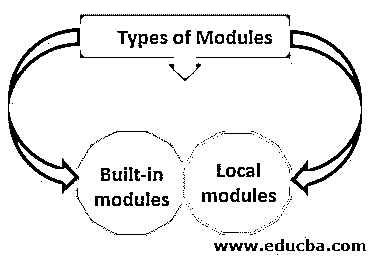

# 节点中的事件。射流研究…

> 原文：<https://www.educba.com/events-in-node-js/>




## Node.js 中事件的介绍

众所周知，Node.js 应用程序是事件驱动的。“事件”这个名称本身描述了它的含义，即“发生”或“发生”的事情。Node.js 中的事件类似于 Node.js 中回调函数的概念。唯一的区别是，一旦异步函数返回结果，回调函数就会执行，而事件是在其对应的事件处理程序上触发的。

今天我们将研究 Node.js 提供的 **"** Events **"** 模块，它由 **"** EventEmitter **"** 类组成，使我们能够实现事件驱动编程。我们将快速浏览 EventEmitter 类提供的各种方法，以及事件驱动编程如何使 Node.js 变得快速并提供高性能。

<small>网页开发、编程语言、软件测试&其他</small>

### Node.js 中的事件是如何工作的？

Node.js 事件遵循以下概念:

1.  因为 Node.js 应用程序是事件驱动的，所以事件在其关联的事件处理程序上触发。
2.  事件处理程序只不过是事件被触发时调用的回调函数。
3.  主循环监听事件触发器，然后调用相应的事件处理程序。

EventEmitter 类按照事件注册的顺序同步调用所有事件。它确保事件的正确顺序，并帮助我们避免逻辑错误。需要时，我们可以通过使用 setImmediate()或 process.nextTick()方法切换到异步。

激发事件的方法之一是属于 EventEmitter 类的 emit()。emit()方法将第一个参数作为事件的名称，接下来的参数用于传递数据。on()方法监听发出的事件并执行它。

让我们通过下面的代码片段来理解事件发射器类及其方法:

#### 步伐

**第一步:**导入“事件”。

**步骤 2:** 创建一个“EventEmitter”的实例

**步骤 3:** 使用 EventEmitter 类的实例实现 emit()方法，该方法在下面的代码中触发一个名为“messageLogged”的事件。emit()方法中的第一个参数是事件名称。

**步骤 4:** 使用 EventEmitter 类的同一个实例，通过 on()监听事件“messageLogged”。on()中的第一个参数是事件名称，第二个参数是事件的事件处理程序。

**代码片段:**

```
const EventEmitter = require('events') const emitter =
new EventEmitter() emitter.once('messageLogged',
function(){   console.log("Listening to the event messageLogged")
})
emitter.emit('messageLogged')
```

5.当执行上述代码片段时，我们会收到以下输出:


因此，上面的代码片段演示了使用 emit()引发事件，并通过 on()侦听事件。

**a.** 让我们来看看一次事件是如何处理的:

**代码片段:**

```
const EventEmitter = require('events') const
emitter = new EventEmitter() var n = 0
emitter.on('increment_number', function(){
console.log(++n)
})
emitter.emit('increment_number')
emitter.emit('increment_number')
```

在事件的实现中，当侦听器使用 emitter.on()方法注册时，该侦听器将在每次发出命名事件时被调用；在上面的例子中，事件名是“increment_number ”,它在 emit()方法的帮助下被发出两次，因此侦听器被调用两次。

在执行上述代码片段时，会收到以下输出:


在下面的代码中，我们将使用 emitter.once()方法。emitter.once()方法使我们能够注册一个针对特定事件最多调用一次的侦听器。一旦事件第一次发出，侦听器就会被注销，然后被调用。

**代码片段:**

```
const EventEmitter = require('events') const
emitter = new EventEmitter() var n = 0
emitter.once('increment_number', function(){
console.log(++n)
})
emitter.emit('increment_number')
emitter.emit('increment_number')
```

在上面的例子中，我们已经使用 once()方法注册了侦听器，该方法将只被调用一次。如下面的输出所示，它只输出 1，因为第二次发出事件时，侦听器被取消注册。所以只打印第一个 emit()方法的输出。


### 事件中的方法

*   **emit(事件，[arg1]，[arg2]，[arg3]，…。[]):** emit()用于引发事件。第一个参数 event 是事件的名称。

*   **on(event，listener):** on()监听事件并执行事件处理程序。侦听器是事件处理程序。

*   **once(事件，监听器):** once()添加一个一次性监听器。

*   **addListener(event，listener):** addListener()将一个侦听器添加到指定事件的侦听器数组的末尾。

*   **removeListener(event，listener):** removeListener()从指定事件的侦听器数组中删除一个侦听器。

*   **remove all listeners([event]):**remove all listeners()删除指定事件的所有侦听器。

*   **listeners(event):**listeners()返回指定事件的数组。

*   **setMaxListeners(n):** 如果超过 10 个侦听器被添加到事件中，EventEmitter 类默认给出一个警告。该函数允许增加侦听器的数量，为此，将该值设置为零表示无限制。

*   Node.js 中的模块:node . js 中的模块可以看作是我们希望包含在应用程序中的一组函数。它[类似于一组 JavaScript](https://www.educba.com/what-is-javascript/) 库。Node.js 中的每个模块都有自己的上下文，不能干扰任何其他模块。这些模块可以在 Node.js 应用程序中重用。我们需要使用 require()函数来包含带有模块名称的模块。

### 模块类型

以下是下面提到的模块类型




**1。内置模块:** Node.js 由各种内置模块组成，我们无需进一步安装即可使用。很少内置的模块是 HTTP(超文本传输协议)、URL、path、events、fs(文件系统)、querystring 等。

**2。本地模块:**本地模块是在 Node.js 应用程序中本地创建的模块。这些模块可以在单独的文件或文件夹中包含不同的功能，并且可以在整个 Node.js 应用程序中重用。要公开一个特定的模块或函数，我们可以使用**模块。出口**。模块。默认情况下，导出对象存在于每个 JS 文件中。****

 ****### 结论-节点中的事件。射流研究…

因此，我们研究了如何通过事件模块在 Node.js 中实现事件驱动编程。通过使用 EventEmitter 类及其方法，我们演示了事件的引发和监听，并查看了模块。

### 推荐文章

这是 Node.Js 中事件的指南，这里我们讨论事件在 Node.js 中是如何工作的？以及事件中模块和方法的类型。您也可以浏览我们推荐的其他文章，了解更多信息——

1.  [Node.js 备选方案](https://www.educba.com/node-dot-js-alternatives/)
2.  [Node.js 命令](https://www.educba.com/node-dot-js-commands/)
3.  [Node.js 流程](https://www.educba.com/node-dot-js-process/)
4.  [节点。JS DNS](https://www.educba.com/node-js-dns/)


****