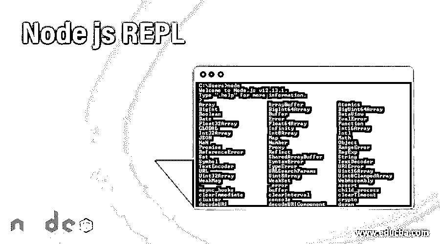
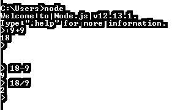
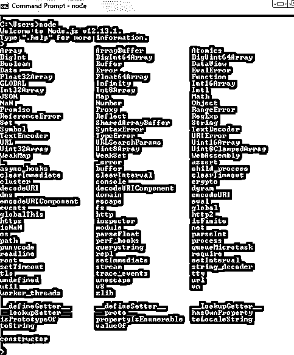
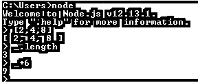

# 节点 js REPL

> 原文：<https://www.educba.com/node-js-repl/>

## 节点 js REPL 简介

Node.js REPL 代表读取-评估-打印-循环。这是用于测试或调试 node.js 代码的控制台。这是一个 node.js 的编译器，当我们安装 node.Js 时会下载它。正如我们所知，node.js 是服务器上 JavaScript 的运行时环境。我们也可以用它来测试 Javascript 代码，这与我们操作系统上的命令行界面是一样的，比如在 windows we one 命令提示符下。

### 如何从 Node.js REPL 开始？

以下是安装 node.js 和启动 REPL 的步骤。

<small>网页开发、编程语言、软件测试&其他</small>

*   **第一步:**访问网址:【https://nodejs.org T2】
*   **步骤 2:** 点击 node.js 的最新稳定版本进行安装
*   第三步:。exe 文件被下载。双击它
*   **步骤 4:** 同意协议，然后点击下一步，直到出现安装选项。
*   **第五步:**点击安装。

在这个过程之后，你已经在你的机器上安装了 REPL。打开命令提示符，只需编写 node 并按 enter 键。

如上所示，我们现在准备使用 REPL。

### Node.js REPL 的工作

使用 node.js REPL 非常简单。这些命令非常简单，可以帮助你学得更快。

*   **向上/向下键:**该命令显示了以前在 REPL 应用的命令。
*   **tab 键:**该命令显示所有命令的列表。
*   **。帮助:**命令显示了所有命令的帮助
*   **。load:** 命令显示了在当前节点 REPL 环境中加载所需文件的文件名。
*   **。save:** 命令显示了将当前节点 REPL 保存到文件中的文件名。
*   **。break:** 这个命令告诉我们从多行表达式中退出。
*   **ctrl + c:** 该命令显示我们终止当前命令。
*   **。clear:** 该命令显示我们从多行表达式中退出。
*   **ctrl + d:** 这个命令显示我们退出 REPL。
*   这个命令显示我们从 REPL 中退出。

进入后，您就可以使用这里的功能并进行测试。让我们从简单的操作开始，如加、减等。

如果你在上图中看到，我已经添加了两个字符串，并得到了预期的输出。同样，我们可以用数字来检查它。

#### 例子

试着用下面的例子来练习 REPL

*   **Ex1:** > 20 + 20
*   **Ex2:**>30–20
*   **Ex3:** > 20 * 20
*   **Ex4:** > 20 / 10
*   **Ex5:** >“你好”+“世界”
*   **ex6**T2】凡 x = 20，y = 40
*   > x + y
*   **ex7**T2】凡 x = 40，y = 30
*   > x–y
*   **ex8**T2】凡 x = 20，y = 40
*   > x * y
*   **ex9:**T2]凡 x = 40，y = 40
*   > x / y

### Node.js REPL 的优势

**1。**正如我们已经看到的命令。练习一下。按 Ctrl+C 终止当前命令。按 Ctrl + C 两次会导致 REPL 退出。

**2。**这个非常好用。在开始学习时，REPL 帮助你对语言有基本的了解。

**3。**要退出 REPL，请按 Ctrl+D。我们也有。当我们试图在当前窗口中获取现有 node.js 文件的输出时，load 是很有帮助的。为了更好的理解，你可以和 REPL 一起玩。毫无疑问，它就像我们正常的命令提示符一样工作。如果你熟悉普通的命令提示符，或者如果你在 Linux 操作系统上工作过，那么你会对这个控制台更加熟悉。

**4。**在上下箭头键的帮助下，可以查看命令历史，修改之前的命令。

如果我们按 tab 键来查看所有命令的列表。如果你输入一个字符，然后按 tab 键，它会显示以输入字符开始的所有关键字、函数和变量的列表。

**5。**REPL 可以处理多行表达式。让我们看看它到底是如何工作的。你可以写一个有开始和结束的表达式或函数。

**6。**如果你能看到三个连续的点。我们能够用 REPL 写出多行表达式。

**7。**REPL 也给了我们一个特殊的变量 _(下划线),用于提取最后一个表达式的结果。为了更清楚地理解这一点，我们需要在我们的终端中编写下面的代码。

在这个例子中，我们声明了一个数组，它的值是 2，4 和 6，然后我们得到了这个数组的长度。然后在下划线的帮助下，我们把 6 加到数组中。

### 结论

REPL 是接触 node.js 的首选方式。在用 node.js 编程时，我们需要习惯它的基本概念。REPL 通过在控制台上直接给我们输出来解决我们的问题。

### 推荐文章

这是一个节点 js REPL 指南。在这里，我们讨论安装 node.js 和启动 REPL 的步骤，它是如何工作的例子，并了解其好处。您也可以浏览我们的其他相关文章，了解更多信息——

1.  [Node.js 流程](https://www.educba.com/node-dot-js-process/)
2.  [Nodejs 体系结构](https://www.educba.com/nodejs-architecture/)
3.  [如何使用 Node.js](https://www.educba.com/how-to-use-node-js/)
4.  [node . js 的特性](https://www.educba.com/features-of-node-js/)

