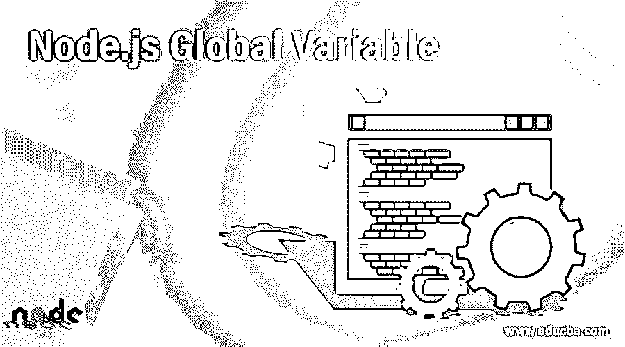

# Node.js 全局变量

> 原文：<https://www.educba.com/node-dot-js-global-variable/>

## Node.js 全局变量简介

全局变量是在代码中全局声明的，可以在代码中的任何地方访问。同时 node.js 有一些全局对象，是全局可用的。这些对象有助于编码。一些功能已经全局地写在节点 js 中。所以我们可以通过这些全局变量直接访问它。这些对象帮助程序员在更短的时间内编写所需的代码。全局变量或对象只不过是程序员必须完成的重复性任务。Global 本身表明这是语言中内置的，任何人都可以使用。在本主题中，我们将学习 Node.js 全局变量。

### Node.js 中的全局变量是如何工作的？

Node js 有全局对象可以使用，但是是在文件级。这个文件只是节点 js 中的一个独立模块。

<small>网页开发、编程语言、软件测试&其他</small>

我们知道，为了获得任何变量或对象的输出，或者出于调试目的，我们通常使用 console.log()语句。或者像 setTimeOut()这样的函数。那么如何才能在任何 nodejs 程序中毫无问题地使用这个语句呢？你想过这个吗？如果不用担心。这是一个全局对象。这是它帮助我们的方式。我们还有许多其他的对象和函数，可以在 nodejs 中全局使用。

如果你熟悉 javascript，那么你一定知道我们有一个窗口对象。这是全局对象，一些变量和函数是在这个下全局定义的。例如，我们已经看到了 console.log()语句。但是在 node，我们有一个不同的场景。节点是服务器端 JavaScript 运行环境。这意味着窗口对象是特定于浏览器的。所以对节点 js 没有帮助。所以在节点 js 中，我们有一个对象叫做 global。所以不管我们在 nodejs 中使用什么函数而没有创建它们，都是来自这个全局对象。

这里需要注意的一点是，如果我们在 nodejs 中声明任何变量，那么它不会被添加到它的全局作用域中。那么如何才能做到这一点呢？在节点 js 中，我们有一个文件系统。每个变量或函数的作用域都仅限于该文件。我们在这里用 node js 创建的每个文件都被称为 node js 中的一个模块。无论我们在那个模块中写了什么，都仅限于那个模块。

### 如何在 node js 中全局使用 var 或函数？

以下是我们在节点 js 中的一些全局对象。当然还有很多，但最 imp 和应用最广泛的如下图。我们还会看到其中一些例子。现在让我们来看看这个特殊的定义，它是做什么的。

*   **流程:**流程是 Nodejs 中的一个模块，提供节点版本和当前节点流程的详细信息。因为这是全局的，所以不需要节点 js 应用程序**中的函数就可以使用。**流程是 EventEmitter 的一个实例。

如果您在 node js 命令提示符下键入 process 并按 enter 键，那么您将获得关于该对象的更多信息。

*   **require() :** 这个函数我们大多用在 node js 中。这用于在当前模块中导入模块。模块可以从节点模块导入。
*   **模块:**我们可以说它的工作原理与需求完全相反。该对象用于导出模块。我们可以使用 module.export 来导出任何模块。Module.exports 也可以由导出使用。这对每个模块都是局部的。
*   **exports:** 这是对 module.exports 的引用，exports 是使用 module.exports 的一种更简短的方式，我们必须知道什么时候使用什么。这也是文件级范围。
*   **__dirname:** 我们会看到这样的例子。但是现在，只要记住我们可以得到文件的目录。对于动态使用 envirom 特定的文件位置，这是一个非常有用的模块。
*   **__filename:** 与 __dirname 模块相同，我们用来获取文件名和目录。

### Node.js 全局变量的示例

下面提到了不同的例子:

#### 示例#1

`__dirname:`

假设我们有一个文件，想知道这个文件位于哪个目录，那么 node js 中的这个 __dirname 全局变量会帮助我们。

打开一个文件，并在其中写入以下代码。并用一个合适的名字保存它。js 扩展。我们用 global1.js 保存它

`Console.log(__dirname);`

通过以下命令运行该文件

**命令:**

`node global.js`

之后，运行下面的命令

**命令:**

`node global1`

**输出:**

#### 实施例 2

现在，如果我们想知道文件名，我们有 __filename 作为全局变量。这将显示文件名和路径。

我们将在上面的同一个文件中编写代码，即 global1.js。我们将按照相同的过程运行它。

**语法:**

`console.log( __filename);`

**命令:**

`node global1`

**输出:**

如果您仔细观察了输出，我们还得到 filename，即 global1。

现在，如果您仔细观察输出，您会注意到文件名也被打印出来了。所以，试着复制相同的代码运行它。

#### 实施例 3

假设我们想在当前的应用程序中使用文件系统模块。然后，您可以用所需的方法导入它，如下例所示。

`const fs = require(“FileSystem”);`

我们也可以用这个语句导入本地文件。

**举例:**

`const fileOne = require(‘./path/myfolder/fileOne’)`

### 优势

*   主要的好处是可重用性
*   当其他模块需要某些功能时，我们可以很容易地将其导出，然后导入到我们的模型中。
*   编程的简易性使得处理不同需求的方式更加顺畅。
*   它通过使用现成的功能减轻了程序员的负担。
*   它提供了一种在不同环境中使用动态方法的简单方法。
*   它提供了编写程序的灵活性。

### 结论

每种语言都有自己声明和使用变量的方式，nde 也是如此。这确实是一个优势，但并不总是如此。Node js 有一个基于模块的方法来处理全局对象。它在 nodejs 中更有帮助。一旦你理解了它们的工作方式，这对 node js 初学者来说将是一个优势。

### 推荐文章

这是 Node.js 全局变量的指南。这里我们讨论如何在节点 js 中全局使用 var 或函数，以及输出的例子。您也可以看看以下文章，了解更多信息–

1.  [Node.js 缓冲区](https://www.educba.com/node-js-buffers/)
2.  [Node.js 文件系统](https://www.educba.com/node-dot-js-file-system/)
3.  [Node.js 路径](https://www.educba.com/node-js-path/)
4.  [Nodejs 体系结构](https://www.educba.com/nodejs-architecture/)

