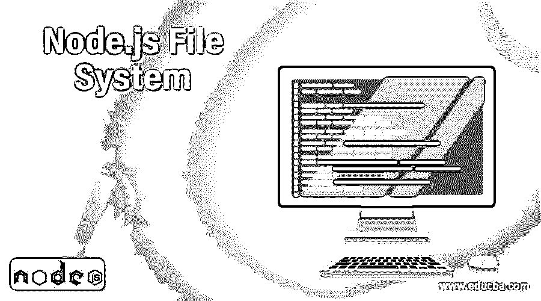

# Node.js 文件系统

> 原文：<https://www.educba.com/node-dot-js-file-system/>

## Node.js 文件系统是什么？

每种编程语言都有文件系统。Node.js 也有自己的模块文件系统来处理与文件相关的操作。node.js 中的文件系统支持一个简单的 API，我们可以用它来处理文件。我们可以用同步和异步两种方式处理文件系统。如果你熟悉同步和异步编程方式，那么你会更容易掌握。每次我们根据 node.js 的要求导入其他模块时，我们也必须导入文件系统。FS 使得处理 node.js 中的文件变得非常简单

### 如何在 Node.js 中打开文件？

为了使用 node.js 中的任何模块，我们需要安装它。npm(节点程序包管理器)程序包中提供了文件系统模块。只要在你的命令提示符下运行下面的命令，它就会被安装到你的机器上。

<small>网页开发、编程语言、软件测试&其他</small>

`npm install fs --save`

**node . js 中导入 fs 模块的语法:**

`var fs = require("fs");`

在 FS 模块中，我们可以使用几个操作。让我们从本模块的第一个操作开始。大多数情况下，我们使用异步方式打开文件。

用于打开文件的 open()方法。该方法有几个参数，如文件名、对该文件执行的操作模式，因为我们在寻找异步代码，所以我们将给出一个回调函数，如果出错，该函数将抛出一个错误。

**语法:**

`fs.open(path, mode of operation, callback function);`

**举例:**

`var fileSystem = require("fs");
var dir = "c:\\Users\\Public\\Two.txt";
fileSystem .open(dir, "w+", function(error, data) {
if (error) {
console.error("The error is " + error.message);
} else {
console.log("The respective file is opened at " + dir);
}
});`

**输出:**

### 如何读取文件？

在继续讨论所有文件操作之前，让我们首先理解 node.js 中的同步和异步编写方法的含义，这对于理解我们为什么考虑这两种不同的代码编写方法非常重要。同步编写代码的方式意味着它将一步一步地执行你的代码。完成一个语句后，它将进入另一个。

另一方面，如果您不想等待进一步的语句执行，或者在执行任何函数时有延迟，那么您可以异步调用该方法。与异步编写代码的方式相比，这有助于我们获得更好的性能。如果你仍然想知道它到底是如何工作的，那么你需要检查 JavaScript ES5 和上面的版本来了解更多。文件系统的下一个操作是读取 node.js 中的文件，读取文件有一个方法叫做 readFile()。这个方法有三个参数。首先是要读取的文件的名称。第二个参数是知道我们必须以哪种模式读取给定的文件。第三个是回调函数。这个回调函数用来抛出一个错误(如果有的话)。

**语法:**

`fs.readFile(Name of the file, [mode of the file], callback function)`

**举例:**

`var fileSystem = require('fs');
fileSystem.readFile('two.txt', 'utf-8',function (error, data){
if (error) throw error;
console.log(data);
});`

用相同的名称保存上面的文件。我们将读取已经创建的 two.txt 文件。

**输出:**

readfile 只是读取 two.txt 文件中的内容。现在我们将看到读取文件的同步方式。这里我们不给出回调函数。

**举例:**

`var fileSystem = require('fs');
var fileContent = fileSystem.readFileSync('two.txt', 'utf-8');
console.log(fileContent);`

**输出:**

### Node.js 中如何写文件？

这里，我们使用异步方式编写代码。

**举例:**

`var fileSystem = require("fs");
console.log("This example to open file in write mode");
fileSystem.open('two.txt', 'w+', function(error, callback) {
if (error) {
return console.error(error);
}
console.log("File has been opened in write mode successfully!");
});`

**输出:**

如果你仔细观察了上面的程序，我们正在写文件。W+是我们传递的参数，告诉编译器把内容写到文件中。如果该文件不存在，则创建新文件并将内容写入其中。所以我们在这里创建了两个. txt 文件，并成功地编写了其中的内容。

### Node.js 中文件系统的各种标志

Node.js 中文件系统的各种标志如下:

*   **答:**我们使用这个标志将数据添加到文件中。如果没有创建该文件，它将创建该文件并添加指定的数据。
*   ax: 和旗子一样，但是它只能使用一次。
*   **a+:** 打开文件进行读取和追加。如果文件不存在，则创建该文件。
*   ax+: 我们可以像' a+'一样追加和读取，但只能以独占方式打开。
*   该标志用于以写模式打开一个文件。如果没有创建现有文件，则创建该文件。
*   我们正在以独占方式打开此文件进行写入。它确保文件是新创建的。
*   **w+:** 用于读写。它创建的文件如果不存在的话。如果文件已经存在，则删除该文件。
*   **wx+:** 它像“w+”一样工作，但是如果文件已经存在，它就会失败。
*   **r+:** 打开文件进行读写。如果给定的文件不存在，那么它抛出一个错误。
*   **rs:** 该标志用于以同步读取模式打开文件。
*   此标志用于打开文件进行读取。如果文件不存在，它会获取错误。
*   **rs+:** 该标志用于读写。这适用于同步操作。

### 推荐文章

这是 Node.js 文件系统指南。在这里，我们还将讨论简介和语法，以及如何在 node.js 中打开文件？.您也可以看看以下文章，了解更多信息–

1.  [卡夫卡节点](https://www.educba.com/kafka-node/)
2.  [Node.js 子进程](https://www.educba.com/node-js-child-process/)
3.  [Node.js 路径](https://www.educba.com/node-js-path/)
4.  [节点 js REPL](https://www.educba.com/node-js-repl/)

