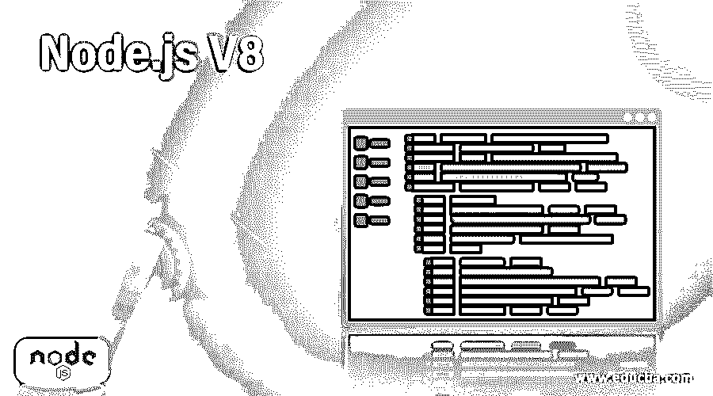
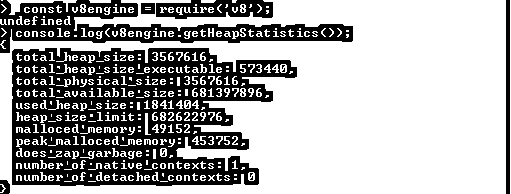
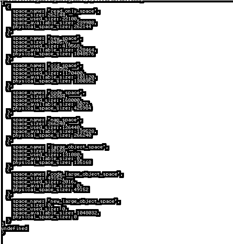

# Node.js V8

> 原文：<https://www.educba.com/node-js-v8/>

## Node.js V8 简介

Nodejs 是跨平台、开源的 javascript 运行时环境。nodejs v8 是一个 javaScript 引擎。Nodejs 是在 v8 发动机上开发的。Nodejs 有 v8 模块。这个模块公开了用 nodejs 二进制构建的 API。V8 是一个开源的 JavaScript 引擎。基本上它是用 JavaScript 写的。这在许多方面都是有用的。我们在 nodejs 中有一个模块叫 v8。nodejs 中的这个模块主要关注事件和接口。这个模块包含了各种方法。作为其他模块，我们需要在节点 js 中导入 v8 来使用它。有许多技术利用 v8 模块。我们将详细了解本模块。

**语法:**

<small>网页开发、编程语言、软件测试&其他</small>

为了在我们的项目中使用这个模块，我们需要导入它。正如我们所知，我们可以用 require 方法导入节点 js 中的模块。更多细节请看下面的语法。

`const v8 = require('v8');`

以上语法帮助我们在节点 js 程序中导入 v8 模块。

### V8 在 Node.js 中是如何工作的？

正如我们已经看到的，v8 模块帮助我们处理事件和接口。我们也有获取记忆信息的方法。在这种情况下，我们讨论的是堆内存。为了在 v8 中使用任何方法，我们需要用上面显示的语法在 nodejs 中导入那个模块。

根据系统的不同，V8 有一些内存限制。像在 32 位上它有 512mb。在 64 位上为 1gb。我们可以根据需要增加内存限制。我们可以通过下面的命令最大化极限。

`setting --max-old-space-size`

*   对于 32 位，我们可以增加到 1gb 对于 64 位，我们可以增加到 1.7 GB。没有 v8，nodejs 的当前二进制文件就无法工作。
*   Nodejs 已经使用了谷歌 chrome 浏览器 v8 引擎。这个版本有很多版本。V8 第 5 版和之前的版本有两个编译器。chrome 引擎在实现其引擎时使用了 c++。使用节点 js 时，V8 是一个非常重要的因素。
*   V8 是一个 javascript 引擎。这个 javascript 引擎用于将 javascript 代码解释成机器代码。根据浏览器的不同，存在许多不同的引擎。比如 chrome 的 V8，IE 的 Chakra，网景的蜘蛛猴等等。

### Node.js V8 方法

对于 node.js 中的堆内存，我们有以下两种方法

#### 1.getHeapStatistics()

getHeapStatistics()函数返回关于堆内存的所有细节。看看下面的例子:

**鳕鱼**T2】鹅:

`const v8engine = require('v8');
console.log(v8engine.getHeapStatistics());`

**输出:**

#### 2.getHeapSpaceStatistics()

这是用来了解堆中空间细节的方法。这个方法以对象数组的形式给出信息。每个对象都给出了不同值的详细信息，如名称、空间大小、可用操作系统空间、物理空间大小、已用空间大小等。我们将通过下面的例子来详细了解这一点。

**代码:**

`const v8engine = require('v8');
console.log(v8engine.getHeapSpaceStatistics());`

**输出:**

还有一些其他的方法。其中一个就是 v8.getHeapSnapshot()。

**1。v8.getHeapSnapshot():** 这个方法返回 v8 堆快照的可读流。该方法生成当前堆的快照，并返回可读流以使用 JSON 数据表示。该快照采用 json 格式，与版本无关。

**代码:**

`const v8StreamData = v8.getHeapSnapshot();
v8StreamData.pipe(process.stdout);`

这个命令返回长数据流。因此无法在屏幕截图中显示。请在 node js 命令提示符下键入上述命令，并查看输出。现在，这里的时间是看到一个更多的关于节点 js 中 v8 模块的功能。

**2。V8 . setflagsfromstring(flags):**每个方法都有其重要的作用，现在让我们来看看这个方法。该方法以编程方式为 v8 设置命令行标志。使用这种方法时，我们需要谨慎。任何不确定性都可能导致数据丢失。它可能表现得不可预测或使系统崩溃。也是无所事事。看下面这个例子。我们将使用上述函数来生成事件。

**代码:**

`const v8engine = require('v8');
v8engine.setFlagsFromString('--trace_gc');
setTimeout(() => { v8engine.setFlagsFromString('--notrace_gc'); }, 60e3);`

上面的方法已经生成了事件。在 nodejs 控制台中尝试一下。

**3。writeHeapSnapshot([文件名]):** 我们又多了一个处理 node js v8 模块的方法。这个方法就是 V8 . writeheapsnapshot([文件名])。此方法用于查找堆的快照。使用以下模式保存 v8 堆的快照。

**代码:**

`filename<string>`

如果没有指定，则生成带有某种模式的文件名，其中包含 PID 和线程 ID。然后 writeHeapSnapshot 将从节点 js 工作线程 id 中调用。

这个过程将返回字符串格式的文件名。这会生成快照并写入 json 文件。我们经常看到这个文件在浏览器 devtool 中使用，就像我们在 chrom 浏览器中使用的一样。不同版本的 v8 模块有不同的文件，每个版本都不一样。

### 结论

Node js v8 是 Node js 中的模块。nodejs 本身也是它的顶层。chrom 浏览器中的 V8 引擎建立在 c++之上。每个浏览器都有自己的引擎。就像 chrome 浏览器有 v8，查克拉的 IE，蜘蛛猴的网景等..需要了解 nodejs v8 模块的工作原理。试着练习一下这个模块，它在编程的各个方面都很有用。

### 推荐文章

这是 Node.js V8 的使用指南。这里我们讨论 Node.js V8 的介绍，语法，它是如何工作的编程例子。您也可以浏览我们的其他相关文章，了解更多信息——

1.  [Node.js 缓冲区](https://www.educba.com/node-js-buffers/)
2.  [节点。JS DNS](https://www.educba.com/node-js-dns/)
3.  [Node.js 路径](https://www.educba.com/node-js-path/)
4.  [Node.js 工具](https://www.educba.com/node-dot-js-tools/)

