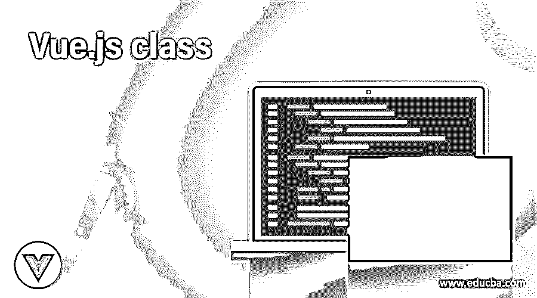

# view . js class-检视. js 类别

> 原文：<https://www.educba.com/vue-dot-js-class/>

## Vue.js 类简介

像其他编程语言一样，我们可以在类内部定义我们的逻辑；这就是商业逻辑。我们可以通过使用@component 注释使这个类充当一个组件。这样，我们也可以绑定数据来进行 API 调用。要在 Vue.js 中定义一个普通的类，我们需要在类名后面加上“export”关键字，就像我们在 Agular 中创建类一样。

### 句法

下面是使用“export”关键字在 Vue.js 中定义类的语法；此外，我们需要扩展 Vue 类，同时在 Vue.js 中创建任何自定义类。下面我们可以看到 Vue.js 中的类和组件类的语法:

<small>网页开发、编程语言、软件测试&其他</small>

#### 1.定义一个类

**语法:**

`import Vue from 'vue'
export scop_of_class class Name extends Vue {}`

在上面几行代码中，我们使用的是 vue 库中的 Vue 类；为此，我们需要像上面那样导入“Vue”。在下一行中，我们使用了“export”关键字，后跟默认的类范围。之后，我们定义类的名称，这反过来又扩展了库中的 Vue 类。为了更好地理解，我们将看到一个实践示例；

`Export class Demo extends Vue {}`

#### 2.要使用组件类

**语法:**

`import Component from 'vue-class-component'
import Vue from 'vue'
@Component
export scope class name extends Vue {}`

这里我们使用@component 使我们的类作为一个组件。关于这一点，我们将在下一节讨论。

### Vue.js 中的 class 是如何工作的？

到目前为止，我们知道我们使用“export”和“class”关键字来定义 Vue.js 中的任何类，这个类包含了从服务器获取用户数据的所有逻辑。我们整个应用程序的行为将依赖于这个类结构，或者我们可以说我们在这里写的业务逻辑可以是任何类型的逻辑。现在我们在 Vue.js 中的类也包含了成员函数、类变量、构造函数等。我们还可以在任何地方将自定义类导入到我们的应用程序中。

#### 1.构造器

我们可以像在另一种面向对象编程语言中一样定义构造函数。下面是初学者在 Vus.js 类中定义构造函数的一个例子。在构造函数中，我们可以编写当类的对象被创建时我们想要执行的逻辑。

**举例:**

`export default class Demo extends Vue {
public constructor() {
console.log("called !!")
}
}`

#### 2.类别变量

这可以称为类数据。我们可以通过使用后跟类型和值的任何名称来定义我们的局部变量。更多的理解，请看下面的例子；

**举例:**

`variable_name = value_here`

像上面一样，我们可以定义我们的成员变量或者说类的数据成员。这个变量只对这个类是局部的。

#### 3.方法

像任何其他特性一样，我们也可以定义自己的功能。该函数包含业务逻辑或 API 调用，它将调用服务器并获取我们将要显示的数据。我们也可以重用函数。

**举例:**

`name_function(){
// logic will goes here.
}`

使用上面的语法，我们可以定义我们的语法函数，我们只需指定函数的名称和参数，如果有的话。

现在我们将看到一个定义 Vue.js 中使用的类和组件类的示例:

**举例:**

`import Vue from 'vue'
export default class Demo extends Vue {
msg = "hello world !!"
}
<template>

{{ msg }}

</template>`

在上面的例子中，这将打印消息“hello world！!'.我们可以定义变量，并在模板中使用它们来获取值。这称为单向绑定。

### Vue.js 类组件

为了让我们的类充当组件，我们可以在我们的类上面使用@Component。要使用它，我们需要从 vue 类组件库中导入组件。它是一个库，只让普通的类语法充当样式。这与我们在 angular 中创建组件是一样的，但是我们使用 angular 核心来导入它。

通过使用类组件，我们可以实现同样的事情，如创建构造函数、方法和定义我们的函数来调用服务和执行逻辑。

**举例:**

`import Vue from 'vue'
import Component from 'vue-class-component'
@Component
export default class Demo extends Vue {
msg = "hello world !!"
}
<template>

{{ msg }}

</template>`

上面的例子将把消息打印成“hello world！!'我们还可以在这里执行许多不同的操作。它们基本上只是一个 typescript 类，进一步扩展了 Vue 类，我们可以使用这里的所有 typescript 选项来使我们的应用程序更简单，并在 stable 下编码。

### Vue.js 类的示例

下面提到了不同的例子:

#### 示例#1

这是初学者理解组件类流程的一个非常基本的例子。比如只做一个函数，通过一个函数绑定变量值。

**vus . js 文件代码:**

`import Vue from 'vue'
import Component from 'vue-class-component'
@Component
export default class DemoComponent extends Vue {
msg = ""
showMsg() {
console.log("msg is ")
this.msg  = "Hello! Demo for class component."
}
}`

【HTMl 文件代码:

`

<button v-on:click="showMsg">Click Here</button>
{{msg}}

`

**输出:**

#### 实施例 2

在这个例子中，我们正在制作一个类组件并使用它；我们试图在点击按钮时执行值的递增和递减。

**vus . js 文件代码:**

`import Vue from 'vue'
import Component from 'vue-class-component'
@Component
export default class DemoComponent extends Vue {
//defining variable here local to class.
i = 0;
msg = "value "
//defining functions called from html file
valPlus() {
this.msg = "";
console.log("here vale would be increase by 1")
this.msg = this.msg + "got increase"
this.i++
}
//defining functions called from html file
valSub() {
this.msg = "";
console.log("here vale would be decrease by 1")
this.msg = this.msg + "got decrease"
this.i--
}
}`

【Html 文件代码:

`

<button v-on:click="valSub">Decrese value</button>
<button v-on:click="valPlus">Increase Value</button>
{{ i }}
{{msg}}

`

**输出:**

### 结论

类是用来编写逻辑和面向对象编程语言的主要方面之一。我们可以添加@component 注释，使我们的类与 html 更具交互性，而没有混乱的代码结构。此外，它有助于将业务逻辑从模板中分离出来，这使得我们的代码更易于阅读和维护。所以现在，它是制作任何 web 应用程序的一个强烈推荐的方法。

### 推荐文章

这是一个 Vue.js 类的指南。在这里，我们讨论了类在 Vue.js 中是如何工作的，并给出了代码和输出。您也可以看看以下文章，了解更多信息–

1.  [Node.js 文件系统](https://www.educba.com/node-dot-js-file-system/)
2.  [HTML 中的 Alt 标签](https://www.educba.com/alt-tag-in-html/)
3.  [HTML 图标签](https://www.educba.com/html-figure-tag/)
4.  [HTML 中的滚动条](https://www.educba.com/scrollbar-in-html/)

