# vue . js 自动完成

> 原文：<https://www.educba.com/vue-dot-js-autocomplete/>

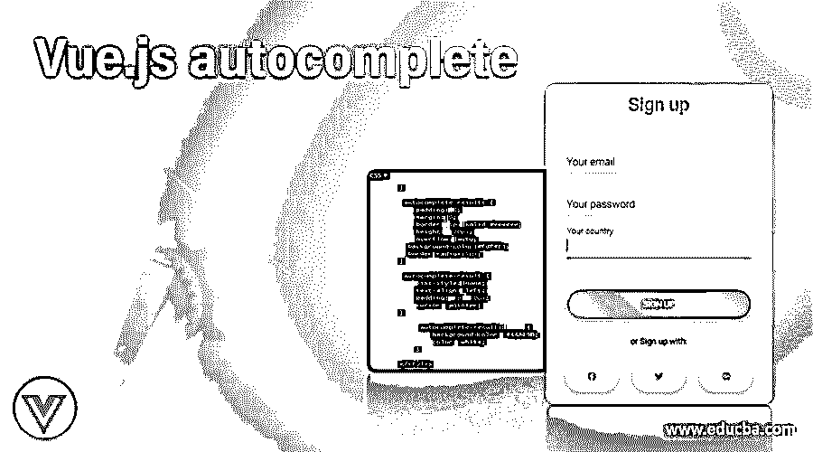

## Vue.js 自动完成简介

vue.js autocomplete 被定义为一个免费 CSS 的 vue.js 组件，因此允许通过任何框架定制 vue 应用程序的外观或外观，其中还包括支持数据绑定、过滤、可访问性、分组和许多其他功能。这个 vue.js autocomplete 也被定义为一个 textbox 组件，它具有上述全部相同的特性，以及一个建议列表，供用户从用户类型中进行选择。这个组件需要安装，也可以作为指令 v-autocomplete 使用，里面包含各种道具。

### 在 vue 应用程序中使用 vue.js 自动完成功能

在本文中，我们将看到在 v-autocomplete 指令中提供灵活的提前键入功能的 autocomplete a vue.js 组件，该组件用于从 API 中搜索大量信息或数据，并且该组件还提供对过滤、绑定、分组等各种功能的支持。以及诸如允许溢出、附加图标、附加、自动选择优先、源、方法、输入类、名称等各种属性。要在 vue.js 应用程序中安装自动完成组件，我们必须运行以下命令:

<small>网页开发、编程语言、软件测试&其他</small>

`npm install vuejs-auto-complete –save`

在本文中，我们将看到 autocomplete 组件主要是一个 CSS free，主要用于允许用户通过输入来轻松地从冗长的列表中进行选择。建议使用 autocomplete，而不仅仅是下拉菜单，简单地说，autocomplete 组件将通过提供各种功能(如绑定、分组、过滤等)来帮助用户选择他们正在键入的内容，而不是在给定的列表中进行搜索。

因此，一般来说，通过上面的部分，我们可以说 vue.js 应用程序的自动完成功能被用作一种高级输入元素，用户可以在输入框中键入搜索建议。

在 vue.js apps autocomplete 组件中，它支持搜索建议功能，如数据绑定，其中它帮助用户使用数据管理器来管理大量的数据，并具有处理所请求数据的定制选项以及适当的数据处理；过滤，其中有一个内置的过滤选项，再次定制的选项，如过滤类型，过滤文本转换，过滤最少的字符，等等；分组也是 autocomplete 组件支持的另一个功能，主要用于排列或分组搜索特定数据的逻辑；该组件还支持一个自定义属性 allow custom，必须启用该属性才能帮助用户指定带有任何自定义值的输入，这意味着这些值不需要出现在定义的值集或指定的给定列表中。默认情况下，该属性处于启用状态，这些自定义值将在表单即将提交时发送到处理程序，还有其他属性，如弹出高度和弹出宽度也是自定义的，默认情况下，它将根据自动完成输入框进行调整。因此，这个 autocomplete 组件支持许多不同的功能，用于设计带有高级输入文本框的 vue.js 应用程序，该文本框可以在冗长的给定数据列表中搜索数据。

现在我们将看到如何在 html 文件中定义自动完成组件。在 html 文件中，我们知道我们使用

标签来设计任何模板，所以在这里我们也可以使用 <auto-complete></auto-complete> 标签来定义自动完成组件，它被写成

`
 …..</auto-complete>

So to define this component in the javascript we can write the code as below:
Vue.component(‘auto-complete’, {
new Vue ({
….
autocompleteVaule:….
)}
}`

让我们考虑一个例子，其中 vue.js 应用程序被设计为输入用户的详细信息以及他们的国家名称，以便用户如何输入国家名称，它将自己搜索并给你直接的国家名称，而不是你在给定的下拉列表中搜索。但是，首先，让我们看一下这样一个表单的样例快照。

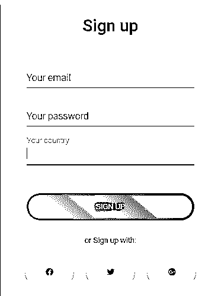

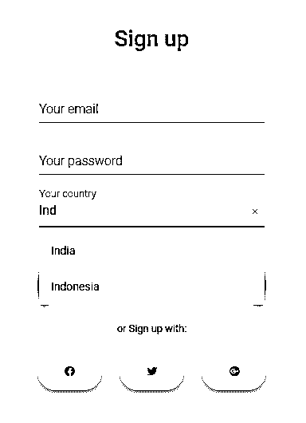

所以在上面的截图中，我们可以看到在国家名称字段“your country”中没有输入任何内容的表单，所以当我们键入国家名称时，它会自动搜索类似的名称并显示列表供用户选择，我们在第二个截图中看到，当我们键入国家名称“Ind”时，它会给出一个以相同字母开头的国家名称列表，列表中有“India”和“Indonesia”，因此我们可以轻松地选择“India”。这就是我们在设计 vue.js 应用程序时如何使用自动完成组件帮助用户轻松搜索建议。

这是一个示例，展示了我们如何在下面的代码中创建一个带有自动完成组件的 vue.js 应用程序。

因此，我们必须创建 html 文件，其中使用脚本标签，我们必须导入 vue.js 库，如 vue.js 和 Axios 库，这可以写成

`
`

然后在同一个 html 文件中，我们还必须在一个带有自动完成标记的 div 标记中创建一个带有自动完成组件的前端，这可以写成

`

<autocomplete>
…..
</autocomplete>

`

因此，html 文件看起来像下面的截图

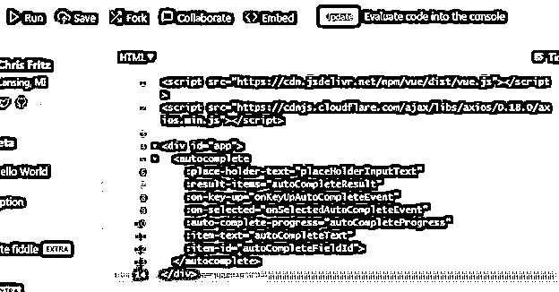

然后我们要创建一个 vue.js 文件来编写 vue.js 自动完成组件，可以写成如下

`var autocompleteComponent = Vue.component(‘autocomplete’, {
……
});`

然后，我们还必须在 vue.js 文件中声明用于自动完成组件的方法和一些数据变量，并编写它们；我们必须编写如下代码:

`var app = new Vue({
…..
})`

所以 vue.js 文件看起来像下面的截图。

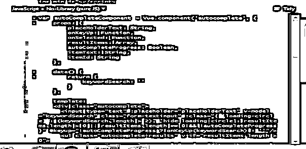

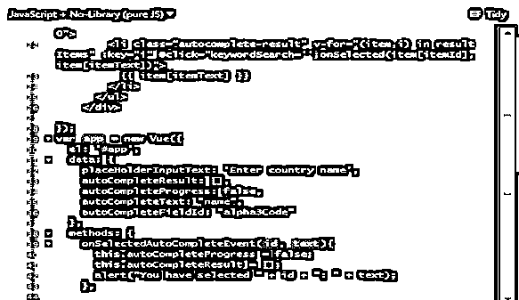

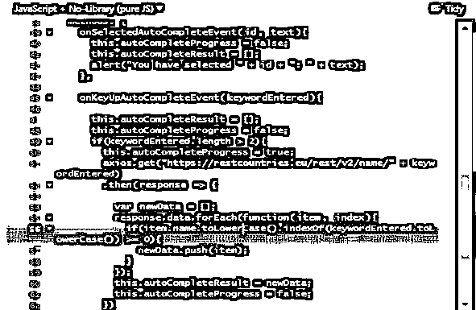

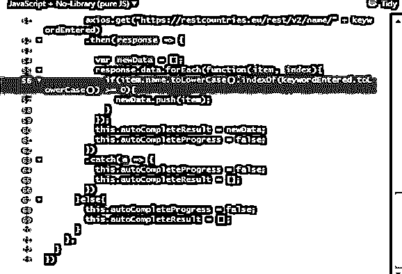

然后，对于样式，我们使用 css，所以我们知道要编写 CSS 代码，我们必须使用样式标签，然后编写样式属性以及样式标签内的要求。

``

所以 css 文件看起来像下面的截图:

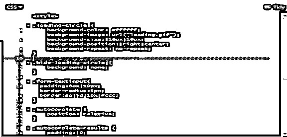

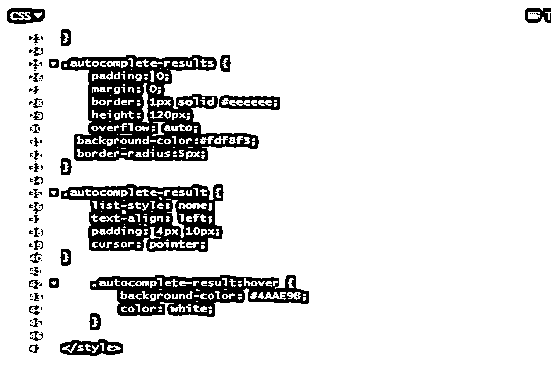

完整的代码如下所示

**HTML 文件**

`

<autocomplete
:place-holder-text="placeHolderInputText"
:result-items="autoCompleteResult"
:on-key-up="onKeyUpAutoCompleteEvent"
:on-selected="onSelectedAutoCompleteEvent"
:auto-complete-progress="autoCompleteProgress"
:item-text="autoCompleteText"
:item-id="autoCompleteFieldId">
</autocomplete>

`
T2】

vista . js 文件

`var autoCompleteComponent = Vue.component('autocomplete', {
props: {
placeHolderText: String,
onKeyUp: Function,
onSelected: Function,
resultItems: Array,
autoCompleteProgress: Boolean,
itemText: String,
itemId: String
},
data() {
return {
keywordSearch: ''
}
},`

**模板**:`模板

`

<input type="text" :placeholder="placeHolderText" v-model="keywordSearch" class="form-textinput" :class="{ 'loading-circle' : (keywordSearch.length > 2), 'hide-loading-circle': resultItems.length > 0 || resultItems.length == 0 && !autoCompleteProgress  }" @keyup="!autoCompleteProgress ? onKeyUp(keywordSearch) : ''"/>
<ul class="autocomplete-results" v-if="resultItems.length > 0">
<li class="autocomplete-result" v-for="(item,i) in resultItems" :key="i" @click="keywordSearch='';onSelected(item[itemId], item[itemText])">
{{ item[itemText] }}
</li>
</ul>

`
});
var app = new Vue({
el: '# autocompleteapp,
data: {
placeHolderInputText: 'Enter country name',
autoCompleteResult: [],
autoCompleteProgress: false,
autoCompleteText: "name",
autoCompleteFieldId: "alpha3Code"
},
methods: {
onSelectedAutoCompleteEvent(id, text){
this.autoCompleteProgress = false;
this.autoCompleteResult = [];
alert("You have selected " + id + ": " + text);
},
onKeyUpAutoCompleteEvent(keywordEntered){
this.autoCompleteResult = [];
this.autoCompleteProgress = false;
if(keywordEntered.length > 2){
this.autoCompleteProgress = true;
axios.get("https://restcountries.eu/rest/v2/name/" + keywordEntered)
.then(response => {
var newData = [];
response.data.forEach(function(item, index){
if(item.name.toLowerCase().indexOf(keywordEntered.toLowerCase()) >= 0){
newData.push(item);
}
});
this.autoCompleteResult = newData;
this.autoCompleteProgress = false;
})
.catch(e => {
this.autoCompleteProgress = false;
this.autoCompleteResult = [];
})
}else{
this.autoCompleteProgress = false;
this.autoCompleteResult = [];
}
},
}
})`

**CSS 文件**

``

因此，输出如下所示:

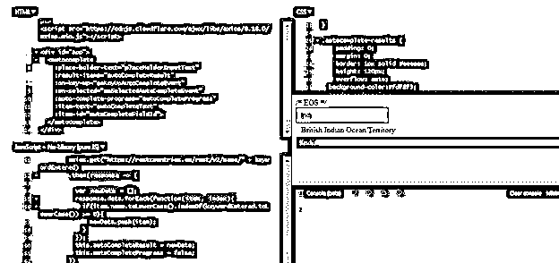

这样，你就可以用自动完成组件创建你的 vue.js 应用了。上面的代码只是一个示例代码，用于理解在哪里写哪些标记，以及如何使用 to autocomplete 组件及其标记来获取 autocomplete textbox。之后，我们可以自己创造相应的其他功能。

### 结论

在本文中，我们得出结论，vue.js autocomplete 组件被定义为具有免费 CSS 的组件，用于处理应用程序中的搜索建议，使用户可以轻松地在给定的冗长列表中搜索数据。在本文中，我们看到了应用程序在搜索数据时的样子，它产生直接的搜索结果，而不是用户搜索整个列表。本文还介绍了 autocomplete 组件支持的特性，如数据绑定、分组、过滤等。

### 推荐文章

这是 Vue.js 自动完成的指南。这里我们讨论 vue 应用程序中 vue.js 自动完成的工作方式以及自动完成组件支持的特性。您也可以看看以下文章，了解更多信息–

1.  [Vue.js 已计算](https://www.educba.com/vue-js-computed/)
2.  [JavaScript elseIf](https://www.educba.com/javascript-elseif/)
3.  [JavaScript 转换成 JSON](https://www.educba.com/javascript-convert-to-json/)
4.  [JSON 解析数组](https://www.educba.com/json-parse-array/)

