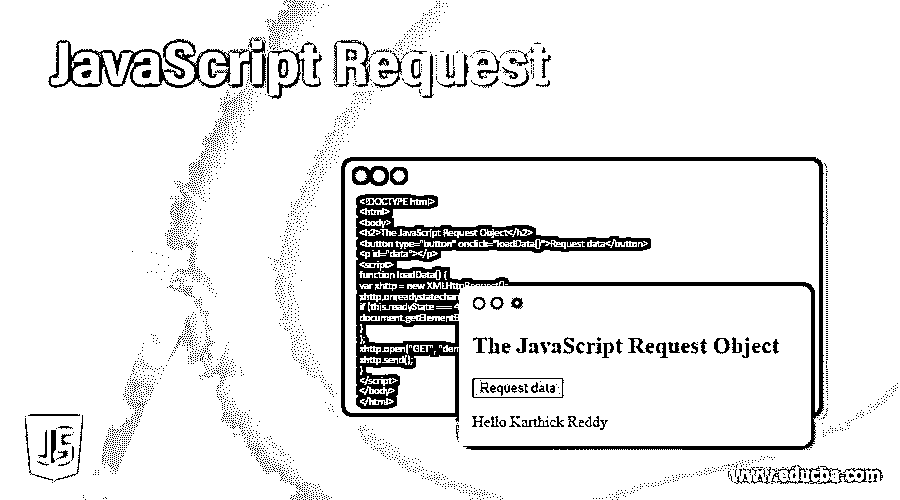
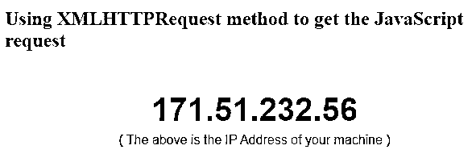
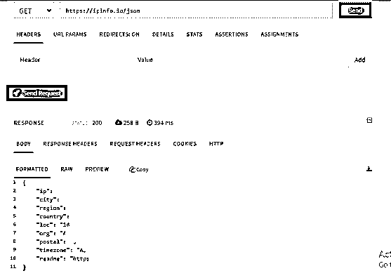
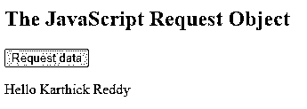

# JavaScript 请求

> 原文：<https://www.educba.com/javascript-request/>




## JavaScript 请求简介

JavaScript 请求函数用于从服务器端资源交换数据。request 函数通过发出 HTTP 请求来发送和接收来自服务器的数据。这些请求与获取函数一起执行，以获得响应。这些术语“请求”、“获取”和“响应”是对“XMLHTTPRequest”的替换。因特网是由许多互连的计算机组成的，浏览网页和浏览网页就像你请求浏览器把服务器上的信息发给你一样。在本文中，我们将研究几种发送 JavaScript 请求函数的方法。

### JavaScript 请求的语法

下面是提到的语法:

<small>网页开发、编程语言、软件测试&其他</small>

```
var request = new Request(sample_url: String, [init: Object]);
```

*   **sample_url:** 它包含你要从请求中获取的响应的直接 url，是对象创建的副本，
*   **init:** 对象，可以包含自定义设置的申请请求。下面列出了一些可能的选项:
*   **方法:**我们有两个请求方法，‘GET’，‘DELETE’和‘POST’，默认为‘GET’
*   **body:** 'Blob '，' FormData '，' ReadableStream '，或您要添加到请求中的任何人。
*   **模式:**请求模式，如“cors”、“no-cors”或“navigate”。默认为“cors”。
*   **缓存:**用于请求的缓存模式。
*   **凭证:**发送用于请求的凭证。省略'，'同源'。默认为“同源”。
*   **重定向:**用于请求的模式:错误、跟随或手动。默认为“跟随”。
*   **完整性:**涉及请求的子资源完整性值。
*   **推荐人:**默认推荐人是关于:客户
*   **headers:** 要设置的 HTTP 头的键值对象

GET 和 POST 的区别:

*   GET 请求比 POST 方法更简单、更快。
*   POST 请求用于更新服务器上的文件或数据库。
*   POST 还用于发送没有大小限制的大量数据
*   POST 方法比 GET 方法更加健壮和安全；输入可能包含未知字符。

### JavaScript 请求的示例

以下是 JavaScript 请求的示例:

#### 示例#1

JavaScript 请求 fetch()方法来获取机器的 IP 地址。**代码:**

```
<!DOCTYPE html>
<html>
<head>
<title>Display IP Address</title>
<h2> Using fetch method to get the JavaScript request</h2>
<style>
body {
background-color: #CCBBFF;
}
h1 {
font-family: sans-serif;
text-align: center;
padding-top: 40px;
font-size: 40px;
margin: -10px;
}
p {
font-family: sans-serif;
color: #000000;
text-align: center;
}
</style>
</head>
<body>
<h1 id=ipAddress></h1>
<p>( The above is the IP Address of your machine )</p>
<script>
fetch("https://ipinfo.io/json")
.then(function (response) {
return response.json();
})
.then(function (ipJson) {
document.querySelector("#ipAddress").innerHTML = ipJson.ip;
})
.catch(function (error) {
console.log("Error: " + error);
});
</script>
</body>
</html>
```

为了确保安全，我们隐藏了 IP 地址。


Fetch()方法将从 URL“https://ipinfo . io/JSON”中获取机器的 IP 地址。

#### 实施例 2

使用 XMLHTTPRequest 的 JavaScript 请求函数获取 IP。上面的例子使用 fetch()方法，这里我们使用 XMLHTTPRequest()。

**代码:**

```
<!DOCTYPE html>
<head>
<title>Display IP Address</title>
<h2> Using XMLHTTPRequest method to get the JavaScript request</h2>
<style>
body {
background-color: #CCBBFF;
}
h1 {
font-family: sans-serif;
text-align: center;
padding-top: 40px;
font-size: 40px;
margin: -10px;
}
p {
font-family: sans-serif;
color: #000000;
text-align: center;
}
</style>
</head>
<body>
<h1 id=ipAddress></h1>
<p>( The above is the IP Address of your machine )</p>
<script>
let IPxhr = new XMLHttpRequest();
IPxhr.open('GET', "https://ipinfo.io/json", true);
IPxhr.send();
IPxhr.onreadystatechange = processRequest;
function processRequest(e) {
if (IPxhr.readyState == 4 && IPxhr.status == 200) {
let response = JSON.parse(IPxhr.responseText);
document.querySelector("#ipAddress").innerHTML = response.ip;
}
}
</script>
</body>
</html>
```

**输出:**




**使用 API 测试工具检查来自 URL“https://ipinfo . io/JSON”的数据。**




我们使用 GET 方法来获取数据；JSON 有' ip '，' city '，' region '，' country '，' loc '，' org '，postal '，timezone '，' readme '。我们使用 response.ip 只显示了 ip。

让我们看看 JavaScript 请求函数是如何工作的。但是，首先，我们应该编写一些代码来了解请求函数是如何工作的。

#### 实施例 3

**代码:**

```
<!DOCTYPE html>
<html>
<head>
<title>JavaScript Request POST</title>
</head>
<script>
var request = new Request('/', {
method: 'POST',
body: 'This text will be posted on the console' });
request.blob().then(function(blob) {
var reader = new FileReader();
reader.onload = function() {
document.write(reader.result);
};
reader.readAsText(blob);
});
</script>
</html>
```

**输出:**


#### 实施例 4

带有 POST 方法的 JSON

**代码:**

```
<!DOCTYPE html>
<html>
<head>
<title>JavaScript Request POST JSON</title>
</head>
<script>
var request = new Request('/', {
method: 'POST',
body: '{ "name": "Saideep", "age": 23, "city": "Vizag", "region": "India" }'
});
request.json().then(function(json) {
document.write(json.name + "<br />");
document.write(json.age+ "<br />");
document.write(json.city+ "<br />");
document.write(json.region+ "<br />");
});
</script>
</html>
```

**输出:**


#### 实施例 5

从 asp 页获取数据，并将值作为 fname 和 lname 传递给。asp 页面。

**代码:**

```
<!DOCTYPE html>
<html>
<body>
<h2>The JavaScript Request Object</h2>
<button type="button" onclick="loadData()">Request data</button>
<p id="data"></p>
<script>
function loadData() {
var xhttp = new XMLHttpRequest();
xhttp.onreadystatechange = function() {
if (this.readyState === 4 && this.status === 200) {
document.getElementById("data").innerHTML = this.responseText;
}
};
xhttp.open("GET", "demo_get2.asp?fname=Karthick&lname=Reddy", true);
xhttp.send();
}
</script>
</body>
</html>
```

**输出:**





值 fname 和 lname 被发送到。asp 文件，上面的按钮从。asp 页面。

### 结论

至此，我们可以结束今天的主题“JavaScript 请求”。首先，我们已经看到了什么是 JavaScript 请求方法，并且列出了一些方法。接下来，我们使用 fetch()方法、XMLHTTPRequest()方法以及最后的 JavaScript Request 方法查看了示例，以了解所有这些方法的区别。编写可以发出 HTTP 请求并返回数据的代码是 JavaScript 中最容易做到的事情之一。您在网站上看到的大部分数据都是请求命中服务器并获取 API 响应的结果。我希望这篇文章给你留下了好印象。

### 推荐文章

这是一个 JavaScript 请求指南。这里我们讨论 Javascript 事件监听器的例子以及代码和输出。您也可以看看以下文章，了解更多信息–

1.  [JavaScript exec()](https://www.educba.com/javascript-exec/)
2.  [JavaScript JSON](https://www.educba.com/javascript-json/)
3.  [JavaScript 大写](https://www.educba.com/javascript-uppercase/)
4.  [JavaScript 绑定](https://www.educba.com/javascript-bind/)


