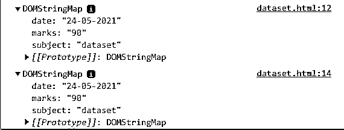

# 数据集 JavaScript

> 原文：<https://www.educba.com/dataset-javascript/>


## 数据集 JavaScript 的定义

*   数据集 JavaScript 是一个面向文档的模块(DOM)属性，用于访问数据属性并在 JavaScript 元素上设置它。
*   它是一个 DOM 接口，使用 JavaScript 语言在应用程序上设置数据元素。
*   它是一个属性，提供对数据属性的只读访问，但不直接访问写属性。
*   它设置属性中的数据，并使用 JavaScript 事件读取这些数据。
*   data 属性的一个功能是使用 JavaScript 技术以只读方式私有存储数据。
*   属性访问并设置多个数据属性，但属性名称不能相同。
*   它提供了“DOMString 映射”来访问每个属性，并将任何数据转换为字符串。

**语法:**

基本语法如下所示。

<small>网页开发、编程语言、软件测试&其他</small>

```
<body>
<div id = "id_name" data-tagName = "value" data-tagName1 = "value">
Display Data
</div>
<script>
const variable_name = document.getElementById('id_name');
console.log(variable_name.dataset);
</script>
</body>
```

**描述:**

*   您可以在 HTML 标记中初始化该值。
*   在输出元素中使用 dataset 属性。
*   控制台显示给定的值。
*   您可以在控制台中读取只读值。

设置额外值的语法如下所示。

```
<body>
<div id = "id_name" data-tagName = "value" data-tagName1 = " ">
Display Data
</div>
<script>
const variable_name = document.getElementById('id_name');
variable_name.dataset.tagName1 = "value";
</script>
</body>
```

**描述:**

*   数据集将设置值转换为字符串值。
*   如果标记值为空，则数据集设置值。

基本命名语法如下所示。

```
<body>
<div id = "id_name" data-tagname = "value" data-tag-number = "value">
Display Data
</div>
<script>
const variable_name = document.getElementById('id_name');
variable_name.dataset.tagname = "value";
variable_name.dataset.tagNumber = "value";
</script>
</body>
```

**描述:**

*   该名称要求数据集属性中有“data-”。
*   如果标记名是“数据标记名”，那么数据集属性使用“数据集.标记名”。
*   如果标记名是“数据标记名”，那么数据集属性使用“数据集.标记名”。

带有删除不需要的数据集语法的 javascript 中的基本数据集如下所示。

```
<body>
<div id = "id_name" data-tagName = "value" data-tagName1 = "value">
Display Data
</div>
<script>
const variable_name = document.getElementById('id_name');
delete variable_name.dataset.tagName;
</script>
</body>
```

**描述:**

*   删除数据集属性需要“delete”关键字。
*   该关键字在数据集属性之前工作。

### JavaScript 中数据集是如何工作的？

*   为数据集 JavaScript 创建 HTML 文件。

文件名:dataset.html

*   创建 HTML 标记并以所需的格式初始化数据集值。

```
<div id = "student" data-phone = "9814567890" data-name >
Student
</div>
```

*   添加 JavaScript 事件元素并与 HTML 标记互连。

```
const student = document.getElementById('student');
```

*   如果要用数据集属性设置值。

```
student.dataset.name = 'Adam';
```

*   如果要删除带有数据集属性的值。

```
delete student.dataset.name;
```

*   读取 html 页面的控制台日志中的数据集值。

```
console.log(student.dataset);
```

*   在 JavaScript 中组合数据集的工作流程。

```
<!DOCTYPE html>
<html>
<body>
<div id = "student" data-phone = "9814567890" data-name = "student"> student </div>
<script>
const student = document.getElementById('student');
console.log(student.dataset);
</script>
</body>
</html>
例子
Let us discuss the examples.
示例 JavaScript 示例中的基本数据集和输出如下所示
<!DOCTYPE html>
<html>
<head>
<title> dataset in JavaScript</title>
</head>
<body>
<div id = "student" data-phone = "9814567890" data-name = "student"> dataset javascript </div>
<script>
const student = document.getElementById('student');
console.log(student.dataset);
</script>
</body>
</html>
```

**输出:**

浏览器显示了以下输出。


**输出:**

控制台显示了以下输出。


#### 示例 2:在 JavaScript 示例中设置数据集值，输出如下所示

```
<!DOCTYPE html>
<html>
<head>
<title> dataset in JavaScript</title>
</head>
<body>
<div id = "online" data-marks = "90" data-subject = "dataset" data-date>
dataset javascript
</div>
<script>
const online = document.getElementById('online');
console.log(online.dataset);
online.dataset.date = '24-05-2021';
console.log(online.dataset);
</script>
</body>
</html>
```

**输出:**

浏览器显示了以下输出。


**输出:**

控制台显示了以下输出。




#### 示例 JavaScript 示例中的删除数据集值和输出如下所示

```
<!DOCTYPE html>
<html>
<head>
<title> dataset in JavaScript</title>
</head>
<body>
<div id = "online" data-marks = "90" data-subject = "dataset" data-date>
dataset javascript
</div>
<script>
const online = document.getElementById('online');
online.dataset.date = '24-05-2021';
delete online.dataset.date,
console.log(online.dataset);
</script>
</body>
</html>
```

**输出:**

浏览器显示了以下输出。


**输出:**

控制台显示了以下输出。


#### 示例 JavaScript 示例和输出中带有数据集的多数据属性如下所示

```
<!DOCTYPE html>
<html>
<head>
<title> dataset in JavaScript</title>
</head>
<body>
<div id = "student" data-phone = "9814567890" data-name = "student"> student information </div>
<div id = "student" data-address = "Pune" data-country = "India"> student Address </div>
<script>
const student = document.getElementById('student');
console.log(student.dataset);
</script>
</body>
</html>
```

**输出:**

浏览器显示了以下输出。


**输出:**

控制台显示了以下输出。


**描述:**

*   在这里，您可以在浏览器中看到两个数据集。
*   所有的标签在 HTML 和 JavaScript 中都有相同的名字。
*   控制台仅显示前几个值。

#### 示例 JavaScript 示例中的多个数据集和输出如下所示

```
<!DOCTYPE html>
<html>
<head> <title> dataset in JavaScript</title> </head>
<body>
<div id = "student" data-phone = "9814567890" data-name = "student"> student information </div>
<div id = "student1" data-address = "Pune" data-country = "India"> student Address </div>
<script>
const student = document.getElementById('student');
console.log(student.dataset);
const student1 = document.getElementById('student1');
console.log(student1.dataset);
</script>
</body>
</html>
```

**输出:**

浏览器显示了以下输出。


**输出:**

控制台显示了以下输出。


**描述:**

*   在这里，您可以在浏览器中看到两个数据集。
*   每个标签在 HTML 和 JavaScript 中都有不同的名称。
*   控制台同时显示这两个值。

### 结论

*   数据集是一个面向文档的模块属性，用于使用 JavaScript 元素访问和设置数据属性。
*   它是一个创建、删除、处理和维护应用程序数据的接口。
*   它提供对数据属性的只读访问，但您可以修改写入属性。
*   它创建用户友好、安全和受保护的 web 应用程序。它有助于保持应用程序的私有和受保护的数据。

### 推荐文章

这是数据集 JavaScript 的指南。这里我们分别讨论定义、语法、数据集如何在 JavaScript 中工作、代码实现的例子。您也可以看看以下文章，了解更多信息–

1.  [JavaScript 图像滑块](https://www.educba.com/javascript-image-slider/)
2.  [二叉树 JavaScript](https://www.educba.com/binary-tree-javascript/)
3.  [JavaScript 计算器](https://www.educba.com/javascript-calculator/)
4.  [JavaScript 下划线](https://www.educba.com/javascript-underscore/)


