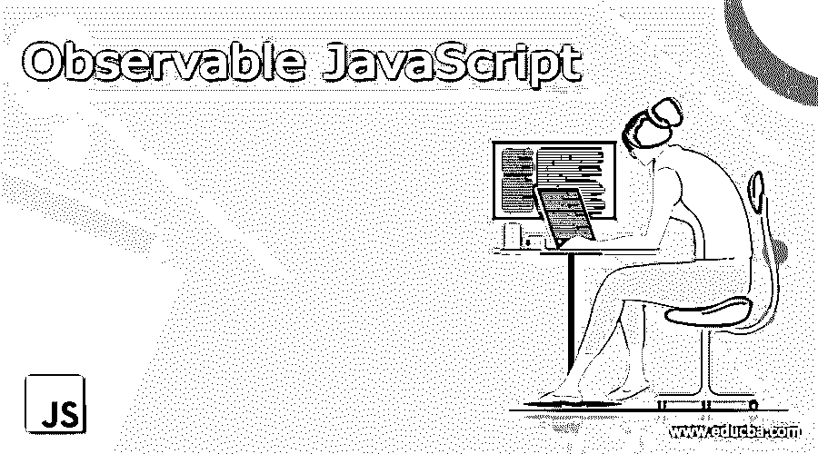
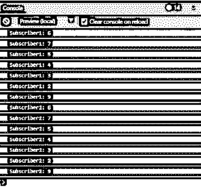
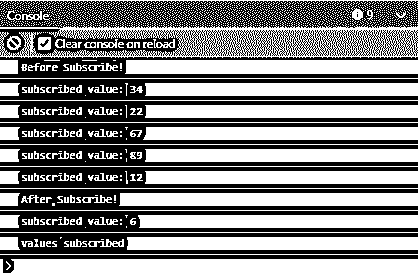

# 可观察的 JavaScript

> 原文：<https://www.educba.com/observable-javascript/>




## 可观察 JavaScript 简介

Observable JavaScript 代表了一种处理事件、异步活动和 JavaScript 中多个值的渐进方式。这些可观察对象只是抛出值的函数，而作为观察者的对象订阅定义回调函数(如 error()、next()和 complete()的值。这些对象作为参数传递给可观察的函数，这些可观察的函数基于 HTTP 请求、事件等调用观察者方法。这允许观察者“倾听”由可观察函数发出的状态变化。在这里，我们将通过几个例子深入了解它是如何实现的。

**语法:**

<small>网页开发、编程语言、软件测试&其他</small>

Observable JavaScript 没有任何特定的语法，它是 JavaScript 的 RxJS 库中定义的一个类，导入如下:

```
import { Observable } from 'rxjs';
```

JavaScript 中的可观察对象就像回调和承诺，它们负责处理异步请求。RxJS 库引入了 Observables。因此，在理解什么是可观察之前，我们需要知道两种沟通模式，即推和拉。

这两个协议都是关于数据生产者如何与数据消费者通信的概念。

推模型:在这里，生产者决定何时将数据发送给客户，而客户不知道何时会收到数据。
拉模式:在这种模式下，消费者决定何时从生产者那里接收数据，而生产者不知道数据何时会被交付。

Observables 基于可观察设计模式创建发布子系统，这使得可观察设计模式在所有现代 JavaScript 框架(如 React 和 Angular 库)中的异步编程中很流行。

不像 Promises，Observables 在 JavaScript 中不被继承，因此，React 和 Angular 依赖 RxJS 库来实现这样的 observables。RxJS 被称为 JavaScript 的反应式扩展，这个库定义了 Observable 类以及其他反应式编程的支持方法。

### 例子

让我们讨论一下可观察 JavaScript 的例子。

#### 示例 1:在 JavaScript 中调用 Observable

```
import { Observable } from 'rxjs';
let observable = new Observable(observer => {
setTimeout(() => {
observer.next('Hi This will invoke Observables')
},5000)
console.log('Observables invoked!');
});
observable.subscribe();
```

**输出:**


这里，由于 observables 是 RxJS 的一部分，上面的编程显示了超时 5 毫秒的 Observables 的调用。

#### 示例 2:将数组包装成可观察对象的可观察 JavaScript

```
import { Observable } from 'rxjs';
const ArrayToObservableWrap = array => {
return new Observable(subscriber => {
for (let i of array) {
subscriber.next(i);
}
});
};
const arrVal = [6, 7, 5, 4, 3, 2, 9];
const observable = ArrayToObservableWrap(arrVal);
observable.subscribe(value => console.log('Subscriber1: ' + value));
observable.subscribe(value => console.log('Subscriber2: ' + value));
```

**输出:**




按照上面的输出，函数()ArrayToObservableWrap 将数组作为一个参数，并将数组包装成一个可观察对象。

#### 示例 3:使用 Subscribe 调用 Observables 并打印值

```
import { Observable } from 'rxjs';
const obs = new Observable(subscriber => {
subscriber.next(34);
subscriber.next(22);
subscriber.next(67);
subscriber.next(89);
subscriber.next(12);
setTimeout(() => {
subscriber.next(6);
subscriber.complete();
}, 2000);
});
console.log('Before Subscribe!');
obs.subscribe({
next(i) { console.log('subscribed value: ' + i); },
error(error) { console.error('There is something error in the code: ' + error); },
complete() { console.log('values subscribed'); }
});
console.log('After Subscribe!');
```

**输出:**




可观测量就像没有参数的函数，但会归纳为具有多个值。我们将通过一个例子来看可观察量是如何起作用的，

#### 示例 JavaScript 中作为函数的可观察对象

```
import { Observable } from 'rxjs';
const obs = new Observable(subscriber => {
console.log('Observable can act as functions in JavaScript using RxJS');
subscriber.next(32);
});
obs.subscribe(i => {
console.log(i);
});
obs.subscribe(j => {
console.log(j);
});
```

**输出:**


所以这里 Observable 的用法类似于 JavaScript 中的函数。

可观测量以同步或异步方式传递值。Observable 和函数的主要区别在于，Observable 可以返回多个值，不像函数。

### 在 JavaScript 中处理可观察的执行

因为可观察的执行是无限的，并且观察者通常在有限的时间内中止任何执行，为此需要 API 来取消执行。

每次执行都是由单个观察器独占的，一旦观察器接收完值，就必须有一种方法来停止执行，以避免计算能力或内存资源的浪费。

使用 Observables 的主要原因是为了更安全，更适合操作者。

### 结论

至此，我们将结束“可观察的 JavaScript”这个主题。我们已经看到了什么是可观察的 JavaScript 以及它意味着什么。我们还看到了它是如何成为 RxJS 库的一部分，以及如何被导入到 JavaScript 程序中。我们已经通过几个例子看到了这种可观测量的实现，还讨论了在 JavaScript 中处理可观测量以节省内存。谢谢！快乐学习！!

### 推荐文章

这是一个可观察 JavaScript 的指南。这里我们分别讨论介绍，语法，代码实现的例子。您也可以看看以下文章，了解更多信息–

1.  [JavaScript 图像滑块](https://www.educba.com/javascript-image-slider/)
2.  [二叉树 JavaScript](https://www.educba.com/binary-tree-javascript/)
3.  [Sprintf JavaScript](https://www.educba.com/sprintf-javascript/)
4.  [JavaScript 下划线](https://www.educba.com/javascript-underscore/)


